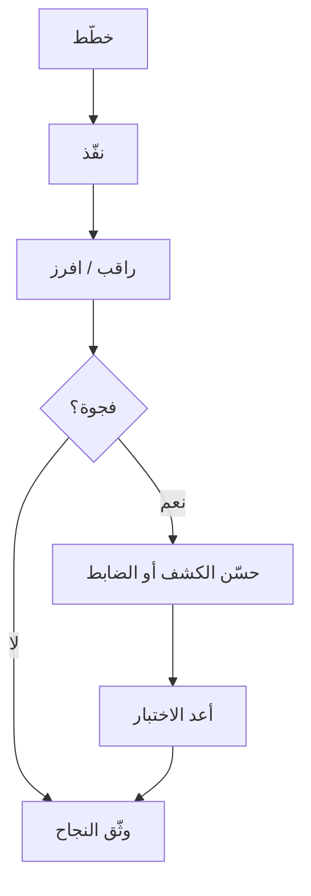

# المسار 5 · المرحلة 5.5 — حلقة الفريق البنفسجي

## لماذا هذه المرحلة مهمة

الفريق البنفسجي هو التعاون المنضبط بين المحاكاة المصرح بها (أحمر) والكشف/الاستجابة (أزرق). الحلقة بسيطة: خطط ← نفّذ ← اكتشف (أو لاحظ الفجوة) ← حسّن الكشف أو الضوابط ← أعد الاختبار. في المختبر يمكنك تشغيل هذه الحلقة في ساعات بدلاً من أسابيع، وبناء عادة التحسين المشترك بدلاً من التمرين العدائي.

---

## أهداف التعلم

بنهاية هذه المرحلة ستكون قادراً على:

- تشغيل حلقة فريق بنفسجي مصغّرة واحدة باستخدام نشاط من المراحل 5.2–5.4
- تسجيل ما كان يجب أن يُكتشف مقابل ما اكتُشف فعلاً
- اقتراح تحسين كشف أو مراقبة واحد ملموس
- إعادة اختبار التحسين عندما يكون ذلك ممكناً
- توثيق الحلقة لتقرير المشروع النهائي

---

## المتطلبات السابقة

- إكمال المراحل 5.1–5.4
- أدلة من الوصول الأولي والاكتشاف و/أو الاستمرارية
- وصول إلى سجلات أو كشوفات من المسار 2 أو مراقبة المسار 3 إن وُجدت

---

## نقطة تحقق السلامة

1. تبقى الحلقة بأكملها داخل قواعد الاشتباك المختبرية.
2. لا «تحسينات» تضعف دفاعات أنظمة غير مختبرية.
3. أعد تأكيد النطاق قبل أي إعادة اختبار.

---

## المفاهيم الأساسية

### 1. الحلقة

```
خطط (قواعد اشتباك + تكتيكات) ← نفّذ (وصول / اكتشاف / استمرارية)
    ← راقب (ماذا نُبّه؟ ماذا فُقد؟) ← حسّن (قاعدة، عتبة، مصدر سجل)
    ← أعد الاختبار ← وثّق
```

### 2. فجوة مقابل نجاح

| النتيجة | المعنى |
|---------|--------|
| اكتُشف كما هو متوقع | الكشف يعمل؛ سجّل الدليل |
| اكتُشف جزئياً | عتبة أو سياق ناقص؛ مرشّح ضبط |
| لم يُكتشف | فجوة حقيقية؛ صمّم أو فعّل مصدراً/قاعدة |

### 3. تحسينات ملموسة

- قاعدة عتبة جديدة لفشل المصادقة
- تنبيه على إنشاء مهمة مجدولة
- تفعيل مصدر سجل كان مظلماً
- تشديد عتبة موجودة بعد إيجابية كاذبة

---

## خريطة توضيحية: حلقة الفريق البنفسجي



---

## جولة مختبرية تفصيلية

1. اختر نشاطاً واحداً من 5.2 أو 5.3 أو 5.4.
2. سجّل ما توقعته أن يُكتشف.
3. راجع السجلات/التنبيهات الفعلية.
4. صنّف: نجاح / جزئي / فجوة.
5. نفّذ تحسيناً واحداً صغيراً إن وُجدت فجوة (أو وثّق لماذا لا).
6. أعد تشغيل النشاط إن أمكن وتحقق.
7. اكتب ملخص حلقة من صفحة واحدةحدة.

---

## الأخطاء الشائعة

- تشغيل نشاط دون توقع مكتوب لما يجب أن يُرى.
- تحسينات غامضة («مراقبة أفضل») دون تغيير ملموس.
- تخطي إعادة الاختبار.
- إلقاء اللوم بدلاً من تحسين الضوابط.

---

## أفضل الممارسات

- توقعات مكتوبة قبل التنفيذ.
- تغيير واحد لكل حلقة عندما يكون ذلك ممكناً.
- أعد الاختبار دائماً بعد التحسين.
- شارك النتائج بلغة تكتيكات ATT&CK المشتركة.

---

## تمرين عملي

1. شغّل حلقة فريق بنفسجي مصغّرة واحدة.
2. وثّق التوقع والملاحظة والفجوة/النجاح والتحسين وإعادة الاختبار.
3. احفظ ملخص الحلقة للمشروع النهائي.

---

## أسئلة المراجعة

1. ما خطوات حلقة الفريق البنفسجي؟
2. لماذا يُعد التوقع المكتوب قبل التنفيذ مهماً؟
3. أعطِ مثالاً على تحسين ملموس بعد فجوة.
4. كيف تساعد تسميات ATT&CK في مناقشات الفريق البنفسجي؟
5. ماذا تفعل إن بقيت فجوة بعد التحسين؟

---

## الملخص

- الفريق البنفسجي تعاون منظم حول محاكاة قابلة للملاحظة.
- الحلقة تحوّل الفجوات إلى كشوفات أو ضوابط أفضل.
- ملخص الحلقة الموثّق هو قلب تقرير المشروع النهائي.

---

## المصادر وقراءات إضافية

- المسار 2 (تصميم الكشف والفرز)
- المرحلة 5.1–5.4
- أدبيات تمارين الفريق البنفسجي (مفاهيمية)

يبقى كل العمل العملي مقيّداً ببيئات مختبرية مصرح بها فقط.
