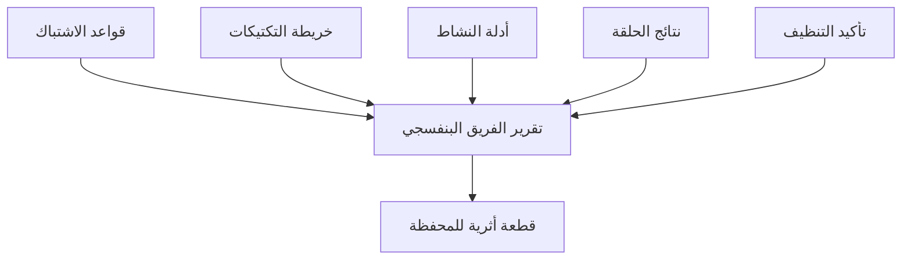

# المسار 5 · المرحلة 5.6 — تقرير الفريق البنفسجي الختامي

## لماذا هذه المرحلة مهمة

تقرير الفريق البنفسجي هو القطعة الأثرية التي تُثبت أن المحاكاة المصرح بها والكشف والتنظيف حدثت كنظام منضبط. يجمع قواعد الاشتباك، والنشاط المنفَّذ، والأدلة، ونتائج الكشف، والتحسينات، وتأكيد التنظيف في وثيقة واحدة للمحفظة.

---

## أهداف التعلم

بنهاية هذه المرحلة ستكون قادراً على:

- تسليم تقرير فريق بنفسجي كامل لسيناريو مختبري واحد
- تضمين قواعد الاشتباك وخريطة التكتيكات والأدلة ونتائج الحلقة
- تأكيد أن المختبر استُعيد وأن الاستمرارية أُزيلت
- تقديم التقرير بلغة مهنية وقابلة للتكرار

---

## المتطلبات السابقة

- إكمال المراحل 5.1–5.5
- كل الأدلة والملخصات من المراحل السابقة
- المختبر ما زال تحت سيطرتك

---

## نقطة تحقق السلامة

1. التقرير يصف فقط نشاطاً مختبرياً مصرحاً به.
2. لا بيانات اعتماد حية أو أدوات هجومية خارج النطاق في الملحقات.
3. التنظيف مؤكد قبل التسليم.
4. لا يُفسَّر التقرير أبداً كتفويض لنشاط في العالم الحقيقي.

---

## هيكل المخرج المطلوب

### 1. العنوان والنطاق

- العنوان والتاريخ
- معرّف المختبر
- بيان «محاكاة مختبرية مصرح بها فقط»

### 2. قواعد الاشتباك (ملخص أو مرفق)

- الأنظمة داخل النطاق
- التقنيات المسموحة / المحظورة
- ظروف التوقف
- تأكيد الالتزام

### 3. خريطة التكتيكات

- 2–4 تكتيكات ATT&CK مُمارسة
- ربط قصير بكل نشاط

### 4. النشاط المنفَّذ

- الوصول الأولي (نمط، دليل)
- الاكتشاف (أوامر، دليل)
- الاستمرارية (إن وُجدت: إنشاء، دليل، إزالة)

### 5. نتائج الكشف / الحلقة

- ما كان متوقعاً مقابل ما لوحظ
- فجوات وتحسينات
- نتيجة إعادة الاختبار إن وُجدت

### 6. تأكيد التنظيف

- اللقطات مستعادة أو الحالة مُتحقَّق منها نظيفة
- الاستمرارية أُزيلت
- الحسابات أو الملفات المؤقتة أُزيلت

### 7. الدروس والخطوات التالية

- ما نجح
- ما سيُحسَّن في الجولة التالية
- أي كشوفات يجب أن تبقى دائمة في المختبر

---

## شريط الجودة

يجب أن يتمكن قارئ من:

- فهم الحدود الدقيقة للتمرين
- إعادة إنتاج النشاط من الوصف والأدلة
- رؤية أن الكشف نُوقش وحُسّن حيث لزم
- الثقة بأن المختبر تُرك نظيفاً

---

## خريطة توضيحية: تجميع التقرير

---

## المخرج العملي

1. جمّع كل الأقسام من ملاحظات المراحل 5.1–5.5.
2. املأ أي فجوات بأدلة إن لزم.
3. أكّد التنظيف.
4. احفظ التقرير النهائي في مجلد محفظتك.

---

## فحص ذاتي قبل التسليم

- [ ] قواعد الاشتباك مضمّنة أو ملخصة
- [ ] التكتيكات مربوطة
- [ ] أدلة الوصول الأولي / الاكتشاف / الاستمرارية موجودة
- [ ] نتائج الحلقة موثّقة
- [ ] التنظيف مؤكد
- [ ] لا أسرار في الوثيقة

---

## الملخص

- تقرير الفريق البنفسجي يثبت محاكاة مصرح بها منضبطة وتعاوناً في الكشف.
- النطاق والأدلة والحلقة والتنظيف معاً تُظهر الكفاءة المهنية في بيئة مختبرية.
- التقرير قطعة محفظة؛ النشاط الذي يصفه يبقى داخل المختبر فقط.

---

## المصادر وقراءات إضافية

- كل مراحل المسار 5 السابقة
- المسار 2 (الكشف)
- قواعد سلامة المختبر في الطور 2

يبقى كل العمل العملي مقيّداً ببيئات مختبرية مصرح بها فقط. إكمال هذا المسار لا يُخوّل أي محاكاة خصم أو اختبار ضد أنظمة خارج اتفاق مختبرك المكتوب.
