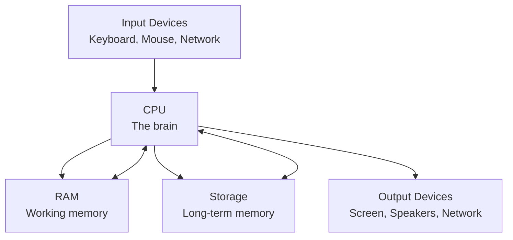

# Phase-0 · Computer Basics

This module gives absolute beginners the essential mental model of how a computer works. Everything later in cybersecurity rests on these ideas.

---

## 1. Computer Architecture (Simple View)

A computer is a machine that follows instructions. At the highest level it has four main parts:

- **CPU (Central Processing Unit)** — executes instructions one after another.
- **RAM (Random Access Memory)** — fast temporary workspace. Contents disappear when power is off.
- **Storage** — permanent (or semi-permanent) place for programs and data (SSD, HDD, USB, etc.).
- **Input / Output** — ways the computer talks to the outside world.

Everything you do on a computer eventually becomes instructions that the CPU executes while using RAM and Storage.

---

## 2. How the CPU, RAM and Storage Work Together

### CPU
- Fetches an instruction from memory.
- Decodes what the instruction means.
- Executes it (math, comparison, moving data, etc.).
- Moves to the next instruction.

Modern CPUs can do billions of these tiny steps per second and have multiple cores that work in parallel.

### RAM
- Extremely fast compared with storage.
- Holds the operating system, running programs, and the data they are currently using.
- Limited in size. When it fills up, the system becomes slow or starts using storage as emergency overflow (which is much slower).

### Storage
- Keeps data even when the computer is turned off.
- Much slower than RAM.
- Comes in different technologies (SSD is faster than traditional hard disks).

**Everyday analogy**  
Think of the CPU as a chef, RAM as the kitchen counter (quick access to ingredients currently being used), and Storage as the pantry and refrigerator (lots of space but slower to reach).

---

## 3. Operating System and Processes

The **Operating System (OS)** is the master program that manages all hardware and software. Popular examples: Windows, Linux (Ubuntu, Debian, etc.), macOS.

Main jobs of an OS:
- Start and stop programs.
- Decide which program gets to use the CPU and for how long.
- Manage RAM and Storage.
- Provide a consistent way for programs to talk to hardware.
- Enforce security rules (who can do what).

A **process** is a running instance of a program.  
One program (for example a web browser) can have multiple processes. Each process has its own memory space and is isolated from others for stability and security.

---

## 4. Files and Privileges

Everything on a computer is ultimately stored as **files** (documents, programs, configuration, logs, etc.).

**Privileges** (also called permissions) decide:
- Who can read a file.
- Who can change a file.
- Who can run a program.
- Who can delete something.

Without proper privileges, even a legitimate user may be blocked from performing certain actions. This is one of the foundations of security.

---

## 5. Users and Groups

- A **user** is an identity that can log in and own files and processes.
- A **group** is a collection of users that share the same permissions.

Instead of giving permissions to every individual user, administrators assign permissions to groups. Users are then placed into the appropriate groups. This scales much better in real organizations.

Special accounts:
- **Administrator / root** — has full control (very powerful, should be used carefully).
- **Service accounts** — used by programs rather than humans.

---

## 6. Services and Ports

A **service** is a program that runs in the background and waits to do useful work (web server, database, file sharing, printing, etc.).

Services often listen on **ports**. A port is a numbered endpoint on a computer (0–65535).  
Think of the computer’s IP address as the street address of a building and the port as the apartment number.

Common examples (for conceptual understanding only):
- Web traffic → ports 80 / 443
- Remote administration → various ports depending on the tool

Knowing which services are running and which ports are open is fundamental for both defense and assessment work.

---

## 7. Client / Server Model

Most networked applications follow the **client–server** pattern:

- The **server** waits for requests and provides a service.
- The **client** initiates the request and consumes the service.

Examples:
- Web browser (client) ↔ Web server
- Email client ↔ Mail server
- Mobile app ↔ Backend API

Understanding who is the client and who is the server helps you reason about trust, authentication, and where security controls should sit.

---

## 8. Virtual Machine Basics

A **Virtual Machine (VM)** is a complete computer simulated in software that runs on top of a real physical computer (the host).

Benefits relevant to security learning and work:
- You can run different operating systems side-by-side.
- You can create isolated environments for testing.
- Snapshots let you return to a clean state quickly.
- Damage inside a VM is usually contained and does not affect the host.

Virtualization is heavily used in modern data centers and cloud computing, and also by security professionals for safe experimentation.

---

**Key takeaway**  
A computer is CPU + RAM + Storage managed by an Operating System that runs Processes under the identity of Users, stores everything as Files with Privileges, and exposes Services on Ports. Client/Server and Virtual Machines are the two most common ways we organize and isolate these pieces in the real world.

These concepts appear again and again in Linux, Windows, Networking, and every cybersecurity topic that follows.