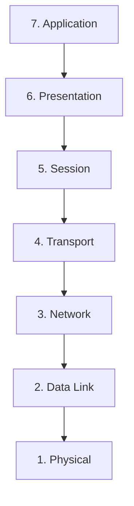

# Phase-0 · Networking Fundamentals

Networking is how computers talk to each other. Almost every cybersecurity topic eventually involves network communication.

---

## 1. OSI Model

The **OSI model** is a conceptual framework that divides network communication into seven layers. It helps us talk about where problems and controls sit.

| Layer | Name | Simple job |
|-------|------|------------|
| 7 | Application | What the user or program sees (HTTP, DNS, etc.) |
| 6 | Presentation | Data formatting, encryption (TLS often sits here conceptually) |
| 5 | Session | Managing conversations |
| 4 | Transport | Reliable or fast delivery (TCP / UDP) |
| 3 | Network | Addressing and routing (IP) |
| 2 | Data Link | Local delivery, MAC addresses, switching |
| 1 | Physical | Cables, radio waves, electrical signals |

You do not need to memorize every detail. Knowing which layer a technology belongs to helps reasoning about security controls.

---

## 2. TCP/IP Model

In practice the industry uses the simpler **TCP/IP model** (four layers):

- Application
- Transport
- Internet
- Network Access

Most real-world discussion uses a mix of OSI and TCP/IP vocabulary.

---

## 3. IPv4 and IPv6

**IP addresses** identify devices on a network.

- **IPv4** — 32-bit addresses written as four numbers (e.g. `192.168.1.10`). Address space is exhausted, so private ranges and NAT are widely used.
- **IPv6** — 128-bit addresses, vastly larger space, written in hexadecimal with colons.

Both can coexist. Security tools and controls must handle both.

---

## 4. MAC Addresses

A **MAC address** is a hardware identifier burned into a network interface (48 bits, usually written as six pairs of hex digits).  
It is used at the Data Link layer for local delivery on a network segment.

---

## 5. ARP

**ARP (Address Resolution Protocol)** maps an IP address to a MAC address on a local network so that frames can be delivered.  
It is a fundamental local-network mechanism and also a classic point of interest for both attackers and defenders.

---

## 6. DNS

**DNS (Domain Name System)** translates human-friendly names (`www.example.com`) into IP addresses.  
It is hierarchical and distributed. Compromise or manipulation of DNS can redirect users to malicious destinations, which is why DNS security and monitoring are important.

---

## 7. DHCP

**DHCP (Dynamic Host Configuration Protocol)** automatically assigns IP addresses and other network settings (gateway, DNS servers, etc.) to devices when they join a network.  
It greatly simplifies administration but also means a malicious DHCP server can give clients dangerous settings.

---

## 8. TCP and UDP

**Transport-layer protocols**:

| Protocol | Characteristics | Typical use |
|----------|------------------|-------------|
| **TCP** | Connection-oriented, reliable, ordered, has handshakes and acknowledgements | Web, email, file transfer, most applications that need reliability |
| **UDP** | Connectionless, unreliable, low overhead | Video/audio streaming, DNS queries, gaming, anything that prefers speed over perfect delivery |

Security controls often treat TCP and UDP differently because their behavior and attack surface differ.

---

## 9. HTTP and HTTPS

- **HTTP** — the application protocol of the web. Requests and responses are normally readable.
- **HTTPS** — HTTP protected by TLS. The content is encrypted in transit and the server’s identity is authenticated via certificates.

Most modern web traffic is HTTPS.

---

## 10. TLS

**TLS (Transport Layer Security)** provides encryption, integrity, and authentication for data in transit.  
It is the successor to the older SSL. HTTPS, secure email submission, VPNs, and many other protocols rely on TLS.

---

## 11. SSH

**SSH** provides encrypted remote administration and file transfer. It is the standard secure alternative to older clear-text protocols.

---

## 12. FTP

**FTP (File Transfer Protocol)** is an older protocol for transferring files. Classic FTP sends credentials and data in clear text; secure variants (FTPS, SFTP) exist and should be preferred.

---

## 13. SMTP

**SMTP (Simple Mail Transfer Protocol)** is the standard protocol for sending email between servers. It is often combined with other protocols for retrieval and with TLS for protection.

---

## 14. NAT

**NAT (Network Address Translation)** allows many private devices to share a smaller number of public IP addresses. It is extremely common in home and enterprise networks. NAT changes the visible source address of traffic and has both operational and security implications.

---

## 15. VLAN

**VLAN (Virtual LAN)** logically separates devices that share the same physical network infrastructure.  
Properly used VLANs improve segmentation and limit the blast radius of incidents.

---

## 16. Routing

**Routing** is the process of deciding the path packets take between networks. Routers exchange information (via routing protocols) and forward packets toward their destination.  
Security devices often sit at routing boundaries.

---

## 17. Switching

**Switches** forward frames within a local network based on MAC addresses. Modern switches support VLANs, port security, and other controls that matter for network hygiene.

---

## 18. Firewalls

A **firewall** enforces rules about which traffic is allowed to pass.  
Firewalls can operate at different layers and can be hardware appliances, software on hosts, or cloud services. They are one of the oldest and still most important security controls.

---

## 19. VPN

A **VPN (Virtual Private Network)** creates an encrypted tunnel over a less trusted network (usually the Internet).  
It is used for remote access and for connecting sites securely. The traffic inside the tunnel is protected by cryptography (commonly IPsec or TLS-based).

---

**Key takeaway**  
Networking is layered. Addresses exist at different layers (MAC, IP, ports). Core protocols (TCP, UDP, DNS, HTTP/HTTPS, TLS, etc.) each have distinct security properties. Segmentation (VLANs, firewalls, NAT) and encrypted tunnels (VPN, TLS, SSH) are fundamental defensive building blocks. These concepts reappear in almost every later security discussion.