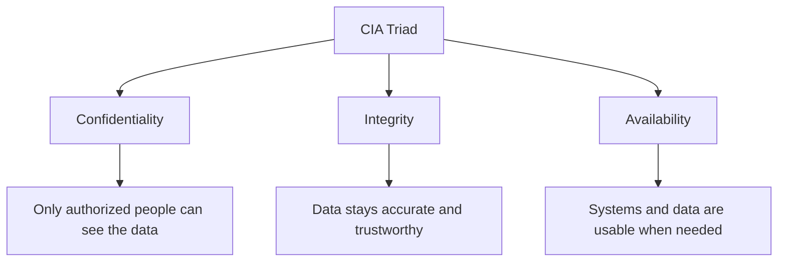

# Stage 2: The CIA Triad and Core Security Concepts

## The Three Fundamental Goals

Almost every security control, policy, or technology exists to support one or more of three goals. Together they are called the **CIA Triad**:

- **Confidentiality**
- **Integrity**
- **Availability**

These are the north stars of cybersecurity.

### 1. Confidentiality

**Meaning:** Information is accessible only to people (or systems) who are authorized to see it.

**Everyday analogy:** Sealed letters, private conversations, locked diaries, medical records that only doctors and the patient should see.

**Examples of protecting confidentiality:**
- Passwords and multi-factor authentication
- Encryption (turning readable data into unreadable code)
- Access rules that limit who can open certain files
- Privacy screens and clean-desk policies

**What happens when confidentiality fails:**  
Sensitive data is exposed — personal details, trade secrets, financial information, etc.

### 2. Integrity

**Meaning:** Information remains accurate, complete, and trustworthy. It has not been altered in an unauthorized way.

**Everyday analogy:** A bank statement that correctly shows every transaction, or a medical prescription that has not been changed by anyone except the doctor.

**Examples of protecting integrity:**
- Checksums and digital signatures that detect if a file has been modified
- Version control and audit logs
- Write-protection on important records
- Input validation (checking that data entered into a system is reasonable)

**What happens when integrity fails:**  
Decisions are made on wrong information. Money can be moved incorrectly, medical treatment can be based on altered records, or software can behave unpredictably.

### 3. Availability

**Meaning:** Authorized users can access systems and data when they need them.

**Everyday analogy:** A store that is open during business hours, or a bridge that remains usable for traffic.

**Examples of protecting availability:**
- Backups and recovery plans
- Redundant systems (extra servers or power supplies)
- Protection against overload (both accidental and deliberate)
- Regular maintenance and patching

**What happens when availability fails:**  
People cannot do their work, customers cannot reach services, emergency systems may be unreachable.

## Why the Triad Matters

Security is almost always a balancing act among these three goals.

- Making a system *extremely* confidential (many locks, complex encryption, limited access) can reduce availability.
- Making a system *extremely* available (open to everyone, always online) can reduce confidentiality and integrity.
- Strong integrity controls can sometimes slow systems down.

Good security design finds an appropriate balance for the specific situation. A public website has different priorities from a military intelligence database.

## Additional Important Concepts

### Non-repudiation
The ability to prove that a particular person performed a particular action and cannot later deny it. Digital signatures and detailed audit logs support this.

### Authentication vs. Authorization
- **Authentication** answers: “Who are you?” (proving identity)
- **Authorization** answers: “What are you allowed to do?” (permissions)

You must usually authenticate before authorization can be applied.

### Defense in Depth
The idea of using multiple layers of protection so that if one fails, others still stand. Like having a fence, a locked door, an alarm, and a safe inside a house.

## Summary

| Goal | Core Question | Failure Looks Like |
|------|---------------|--------------------|
| Confidentiality | Who can see it? | Unauthorized disclosure |
| Integrity | Has it been changed? | Unauthorized modification |
| Availability | Can I use it when I need it? | System or data unavailable |

Everything you learn later in this series ultimately serves one or more of these three goals.

---

**Next stage:** How threats, vulnerabilities, and risk fit together.