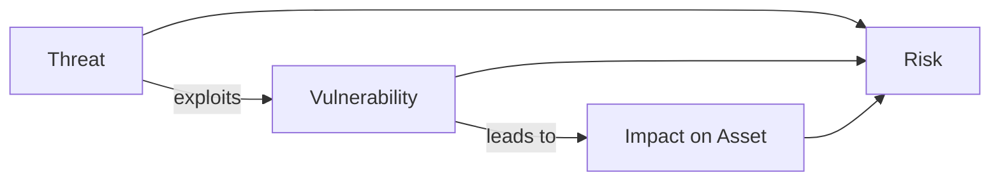

# Stage 3: Threats, Vulnerabilities, and Risk

## The Basic Relationship

Security professionals constantly think in terms of three linked ideas:

- A **threat** is a potential cause of harm.
- A **vulnerability** is a weakness that makes harm possible.
- An **asset** is the valuable thing that could be harmed.
- **Risk** is the combination of how likely the harm is and how severe the impact would be.

A simple formula often used conceptually is:

> **Risk ≈ Likelihood × Impact**

(There are more sophisticated ways to calculate risk, but this captures the core idea.)

## Threats

A threat is anything that could cause damage. Threats can be:

| Category | Examples |
|----------|----------|
| **Human (malicious)** | Cybercriminals, insider employees acting with bad intent, nation-state actors |
| **Human (accidental)** | Someone clicking a bad link, misconfiguring a system, losing a laptop |
| **Technical** | Software bugs, hardware failures, power outages |
| **Environmental / Natural** | Floods, fires, earthquakes affecting data centers |
| **Organizational** | Poor processes, lack of training, unclear responsibilities |

Important: Not every threat is a “hacker.” Many serious incidents start with ordinary mistakes or natural events.

## Vulnerabilities

A vulnerability is a weakness that a threat can take advantage of.

Examples (described at a high level only):

- Software that has not been updated
- Weak or reused passwords
- Systems left with default settings
- Missing encryption on sensitive data
- Employees who have not been trained to recognize social engineering
- Physical access that is too easy

Vulnerabilities exist in technology, processes, and people.

## Assets

Anything of value that the organization (or individual) wants to protect:

- Data (customer records, intellectual property, financial information)
- Systems and devices
- Services and applications
- Reputation and customer trust
- Physical facilities that support digital operations

Different assets have different levels of importance. Protecting a public marketing website is usually less critical than protecting a database of medical records.

## Risk

Risk brings the pieces together. It asks:

1. What could go wrong? (threat + vulnerability)
2. How likely is it?
3. If it happens, how bad would the consequences be?

Risk is never zero. The practical goal is to reduce risk to a level the organization is willing to accept (this is called **risk appetite** or **risk tolerance**).

### Risk Treatment Options

Once risk is understood, organizations choose one or more of these approaches:

- **Avoid** — stop doing the activity that creates the risk
- **Mitigate / Reduce** — add controls to lower likelihood or impact
- **Transfer** — shift the risk to someone else (e.g., insurance, contracts)
- **Accept** — knowingly live with the remaining risk because further reduction is not practical

## Why This Model Matters

Every security decision can be traced back to these questions:

- What are we protecting? (assets)
- What could harm it? (threats)
- What weaknesses exist? (vulnerabilities)
- How serious is the combination? (risk)
- What should we do about it? (controls / treatment)

This thinking is the foundation of risk management, which is the professional backbone of cybersecurity programs.

---

**Next stage:** How computer networks work and why that matters for security.