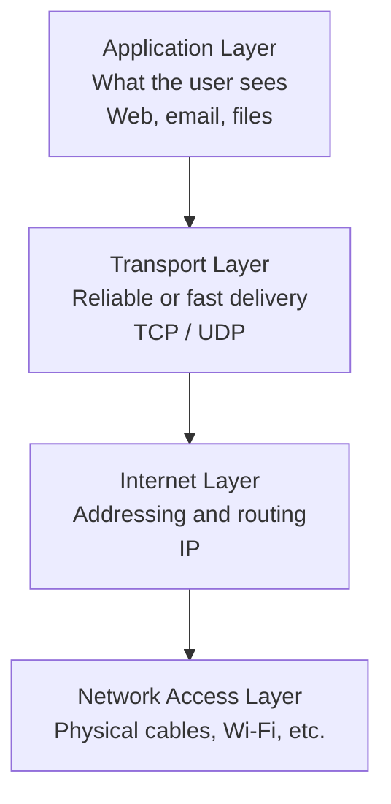

# Stage 4: Networking Fundamentals (Security Perspective)

## Why Networks Matter for Security

Almost every modern system is connected to other systems. Connection creates both value and risk. To understand security, you need a basic mental model of how data moves from one place to another.

## The Simplest Picture

When two computers want to communicate:

1. Data is broken into small pieces called **packets**.
2. Each packet is labeled with source and destination information.
3. Packets travel across one or more networks.
4. The receiving computer puts the packets back together.

This happens for web pages, email, video calls, file transfers, and almost everything else.

## Key Building Blocks

### IP Address
A numerical label that identifies a device on a network (similar to a street address).  
Example form: `192.168.1.10` (IPv4) or longer strings for IPv6.

### Domain Name
A human-friendly name (e.g., `example.com`) that is translated into an IP address by the Domain Name System (DNS).

### Ports
Think of ports as numbered doors on a computer. Different services listen on different ports.  
Common examples (for conceptual understanding only):
- Web traffic often uses port 80 or 443
- Email has its own traditional ports

Knowing which ports are open helps defenders understand what services are exposed.

### Protocols
Agreed-upon rules for communication. The most important family is **TCP/IP**.  
- **TCP** provides reliable, ordered delivery.
- **UDP** is faster but less reliable.
- Higher-level protocols (HTTP, HTTPS, etc.) sit on top of these.

## A Layered View (Simplified)

Networks are often described in layers. A very simplified version useful for security thinking:

Security controls can be applied at different layers.

## Local Networks vs. the Internet

- **Local Area Network (LAN)** — devices in the same building or home, usually trusted more.
- **Wide Area Network (WAN) / Internet** — the global public network. Traffic crossing it is generally considered untrusted.

A common defensive pattern is to place weaker or public-facing systems in a semi-isolated zone and keep the most sensitive systems deeper inside.

## Why This Matters for Security

- Attackers and defenders both care about **what is reachable** from where.
- Many attacks involve sending unexpected or malicious data across the network.
- Understanding normal traffic patterns helps detect abnormal ones.
- Network design decisions (segmentation, filtering, encryption in transit) directly affect confidentiality, integrity, and availability.

You do not need to become a network engineer. You only need enough vocabulary to understand where security controls sit and why certain designs are safer than others.

---

**Next stage:** How we decide who is allowed to do what — access control and identity.