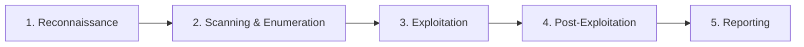

# Stage 9: Penetration Testing Methodology

## What a Penetration Test Is

A **penetration test** (often shortened to “pentest”) is a authorized, time-bounded assessment that simulates the actions of a real attacker in order to discover and demonstrate security weaknesses.

Its purpose is **not** to cause damage. Its purpose is to give the organization a realistic picture of risk so that weaknesses can be fixed before a real adversary finds them.

This stage describes the classic high-level process. It stays at the conceptual and methodological level only.

## The Classic Five Phases

Most professional penetration tests follow a structured lifecycle. While exact names and boundaries vary slightly between methodologies, the following five phases are widely recognized:

### Phase 1: Reconnaissance (Information Gathering)

**Goal:** Learn as much as possible about the target environment using both public and authorized sources.

**High-level activities (conceptual):**
- Collect publicly available information about the organization, its technologies, and its online presence.
- Identify potential entry points and technologies in use.
- Map the apparent structure of the target (domains, related companies, public services, etc.).

**Why it matters:** Real adversaries also begin by learning about their targets. Understanding what is visible from the outside helps prioritize later work and reveals information that should perhaps not be public.

**Important note:** In a professional engagement this phase is limited by the agreed scope and rules of engagement. Open-source (public) information is usually fair game; active probing of systems may or may not be allowed at this stage depending on the contract.

### Phase 2: Scanning and Enumeration

**Goal:** Discover live systems, services, and potential points of interest within the authorized scope.

**High-level activities (conceptual):**
- Identify which systems respond on the network.
- Determine what services appear to be running.
- Gather more detailed information about those services and the software versions in use (still at a discovery level).

**Why it matters:** You cannot assess what you cannot see. This phase builds a clearer map of the attack surface that is actually reachable.

**Defensive parallel:** Organizations perform similar discovery continuously as part of asset management and vulnerability management programs.

### Phase 3: Exploitation

**Goal:** Determine whether identified weaknesses can actually be used to gain unauthorized access or achieve other unauthorized effects — within the strict limits of the rules of engagement.

**High-level nature of the phase:**
- Testers attempt to demonstrate impact in a controlled, non-destructive way whenever possible.
- The emphasis is on proving that a weakness is real and understanding what an attacker could achieve.
- Many potential findings stop at the “proof-of-concept” stage rather than full compromise, especially when the goal is risk demonstration rather than maximum damage.

**Critical constraints:**
- Only techniques and targets listed in the rules of engagement are allowed.
- Care is taken to avoid harming production systems or data.
- Anything that looks likely to cause outage or data loss is usually discussed with the client first or avoided.

This phase is where the ethical and legal boundaries discussed in Stage 8 are most important.

### Phase 4: Post-Exploitation

**Goal:** Understand the potential impact after an initial foothold has been gained (again, strictly within authorization).

**High-level questions the tester explores:**
- How far could an attacker move from the initial point of entry?
- What sensitive data or systems become reachable?
- Are there opportunities to maintain access or escalate influence?
- What would be required for the organization to detect and respond?

**Purpose:** To show business impact rather than just technical vulnerability. A single weak service is more concerning if it leads to the organization’s crown-jewel data.

**Note:** In many engagements this phase is carefully limited. Full “domain dominance” exercises are reserved for specific red-team or adversary-simulation engagements with broader authorization.

### Phase 5: Reporting

**Goal:** Communicate findings clearly so the organization can understand risk and take action.

A professional report typically includes:

- Executive summary written for non-technical leadership
- Detailed technical findings with evidence
- Risk ratings (often based on likelihood and impact)
- Clear remediation recommendations
- Scope, methodology, and limitations of the test
- Positive observations (what was done well)

The report is the primary deliverable. A test that discovers important issues but fails to communicate them usefully has limited value.

## Supporting Activities Across the Lifecycle

- **Planning and scoping** happen before Phase 1. Clear written agreement on targets, timing, allowed techniques, emergency contacts, and success criteria is essential.
- **Communication** continues throughout. Testers and client contacts stay in touch, especially if something unexpected or high-impact is discovered.
- **Cleanup** occurs at the end: any temporary accounts, files, or changes made during testing are removed, and the environment is returned to its prior state as far as possible.

## Different Types of Tests (Conceptual Spectrum)

| Type | Knowledge Given to Testers | Typical Use |
|------|---------------------------|-------------|
| Black-box | Almost none | Simulates an external attacker with little prior knowledge |
| Grey-box | Partial information (e.g., some credentials or architecture diagrams) | Balanced realism and efficiency |
| White-box | Extensive information (source code, diagrams, credentials) | Thorough coverage, often used for applications |

There are also specialized variants (web application tests, mobile tests, wireless tests, physical tests, social-engineering tests, red-team exercises, etc.). All still rest on the same ethical foundation: authorization and clear rules.

## How This Fits the Earlier Stages

- **CIA Triad** — findings are evaluated by their effect on confidentiality, integrity, and availability.
- **Risk** — each finding is placed in a risk context (likelihood × impact).
- **Attack surface** — the test explores the authorized portion of the attack surface.
- **Ethics and law** — every phase is constrained by permission and professional responsibility.

## Final Perspective

Penetration testing is a structured, authorized form of adversarial thinking. When performed professionally it is one of the most effective ways for an organization to learn how its defenses hold up against realistic pressure.

It is not magic, it is not unlimited, and it is never a substitute for continuous security practices (secure design, patching, monitoring, training, etc.). It is one important tool in a larger security program.

---

## End of the Series

You have now walked from the most basic definitions of cybersecurity through the core principles, the language of risk, the building blocks of networks and cryptography, the concept of attack surface, the ethical and legal boundaries, and finally the high-level methodology of a professional penetration test.

This foundation prepares you to understand more advanced material, professional discussions, and further formal training — always within legal and ethical bounds.