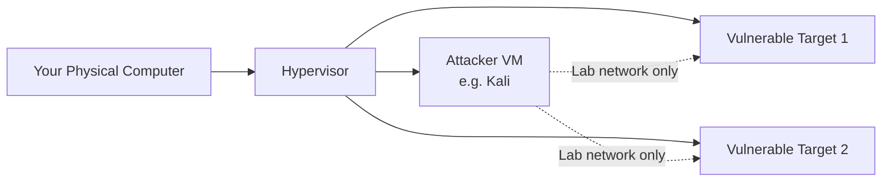

# Stage 1: Lab Setup and Safety

## Why This Stage Comes First

In Phase-1 you learned *what* cybersecurity is and *why* professionals work the way they do.  
In Phase-2 you will begin using real tools. Before any tool is installed or any packet is sent, you must have a **safe, isolated laboratory** and a clear understanding of the legal and ethical boundaries.

Working without a proper lab is the fastest way to make dangerous mistakes — scanning the wrong network, affecting production systems, or crossing legal lines without realizing it.

This stage gives you the foundation that every later practical exercise depends on.

---

## Learning Objectives

By the end of this stage you will be able to:

- Explain why an isolated lab is mandatory for practical security learning
- List the core components of a minimal safe home laboratory
- Choose and install a hypervisor
- Create and configure virtual machines for attack and target roles
- Apply basic network isolation so lab traffic stays inside the lab
- State the non-negotiable legal and ethical rules that govern every exercise
- Recognize “Safety Checkpoint” warnings and know how to respond to them

---

## 1. What Is a Security Lab?

A **security laboratory** (or “home lab”) is a collection of virtual machines and networks that you fully control. It exists so you can:

- Practice reconnaissance, scanning, analysis, and defensive techniques
- Break things intentionally and then fix them
- Make mistakes without harming real users, real data, or real organizations

Think of it as a closed workshop. Everything that happens inside stays inside.



The key idea: the attacker machine can talk to the target machines, but neither of them should be able to reach (or be reached from) the public internet in ways that could cause harm.

---

## 2. Recommended Minimal Lab Stack

You do not need expensive hardware. A modern laptop with 16 GB of RAM (8 GB minimum) and a decent amount of free disk space is enough to start.

| Component | Recommended choice | Purpose |
|-----------|--------------------|---------|
| **Hypervisor** | VirtualBox (free) or VMware Workstation Player | Runs the virtual machines |
| **Attacker machine** | Kali Linux (or Parrot Security OS) | Contains the tools you will learn |
| **Target machines** | Metasploitable 2/3, DVWA, OWASP Juice Shop, or similar intentionally vulnerable VMs | Safe systems designed to be probed and tested |
| **Optional blue-team** | A simple logging stack or Security Onion (later) | For detection and log-analysis exercises |

All of the recommended targets are **intentionally vulnerable**. They are published specifically for training. Using them inside your isolated lab is appropriate and expected.

---

## 3. Installing the Hypervisor

1. Download VirtualBox (or VMware Workstation Player) from the official website.
2. Install it using the normal installer for your operating system.
3. After installation, open the hypervisor and confirm it starts without errors.

**Tip:** Enable virtualization support in your computer’s BIOS/UEFI if the hypervisor complains that hardware acceleration is unavailable. The exact steps depend on your motherboard manufacturer.

---

## 4. Creating the Virtual Machines

### Attacker machine (Kali)

- Download the official Kali Linux virtual machine image or ISO from the Kali website.
- Create a new virtual machine and allocate:
  - At least 2 GB RAM (4 GB preferred)
  - 20+ GB disk space
  - Two network adapters (explained below)
- Install or import Kali and complete the initial setup.
- Take a **snapshot** immediately after the first successful boot. This lets you return to a clean state later.

### Target machines

- Download one or more intentionally vulnerable images (Metasploitable, DVWA appliance, Juice Shop, etc.).
- Import or create each as a separate virtual machine.
- Give each target modest resources (1–2 GB RAM is usually enough).
- Take a snapshot of each target while it is still in its original vulnerable state.

**Important:** Never expose these vulnerable machines directly to the public internet.

---

## 5. Network Isolation (Critical)

By default many hypervisors give virtual machines access to the same network as your physical computer. For a security lab this is usually undesirable.

Recommended simple configuration:

| Adapter | Type | Purpose |
|---------|------|---------|
| Adapter 1 (Attacker) | NAT or NAT Network | Allows the attacker VM to download updates and tools |
| Adapter 2 (Attacker) | Host-Only or Internal Network | Private network shared only with the target VMs |
| Target VMs | Host-Only or Internal Network (same as Adapter 2) | Can be reached by the attacker, cannot reach the internet |

With this layout:

- The attacker can update itself and reach the targets.
- The targets cannot initiate connections to the outside world.
- Your home network and the public internet stay protected from accidental scans or misconfigurations.

Always verify isolation before beginning any active exercise.

---

## 6. Legal and Ethical Rules (Non-Negotiable)

These rules apply to every exercise in Phase-2 and beyond:

1. **Only systems you own or have explicit written permission to test**  
   Your lab VMs are fine. Your neighbor’s Wi-Fi, a company’s public website, or a cloud server you do not control are not.

2. **Never scan or attack systems on the public internet** as part of these lessons  
   Even “just checking” can be interpreted as unauthorized access under many laws.

3. **Authorization is required**  
   In professional work this is a signed Rules of Engagement document. In your lab the authorization is the fact that you own and control the virtual machines.

4. **When in doubt, stop**  
   If you are unsure whether an action is allowed, do not perform it. Ask a mentor, instructor, or legal professional.

5. **Document what you do**  
   Keep notes of the systems you tested, the dates, and the scope. This habit becomes essential in professional engagements.

Unauthorized access to computer systems is a crime in virtually every jurisdiction. The skills you are learning are powerful; the responsibility that comes with them is equally large.

---

## 7. Safety Checkpoints

Throughout the remaining stages of Phase-2 you will see sections marked **Safety Checkpoint**.

A Safety Checkpoint means:

- Pause.
- Confirm you are working only against systems inside your isolated lab.
- Confirm the network configuration has not changed.
- Confirm you understand what the next commands will do.

Never skip a Safety Checkpoint. Treat it as a mandatory stop sign.

---

## 8. Lab Notebook Habit

Start a simple notebook (digital or paper) and record:

- Date and time of each session
- Which virtual machines were running
- Commands you ran and the output you observed
- Anything unexpected
- Questions that arise

This notebook becomes valuable when you later write reports or prepare for certifications. It also helps you notice patterns and progress.

---

## Common Mistakes to Avoid

| Mistake | Why it is dangerous | Better approach |
|---------|---------------------|-----------------|
| Connecting vulnerable targets to the internet | Real attackers can find and compromise them | Keep targets on host-only / internal networks |
| Scanning your home router or ISP equipment | May violate terms of service or local law | Restrict all active testing to lab VMs |
| Skipping snapshots | One mistake can force a full reinstall | Snapshot before every major change |
| Using the lab while tired or distracted | Increases chance of targeting the wrong system | Work only when focused; double-check IP addresses |
| Sharing lab screenshots that contain real external IPs | Can accidentally reveal personal or organizational information | Redact or use only lab-internal addresses |

---

## Best Practices

- Take snapshots liberally. Disk space is cheaper than rebuilding a lab.
- Keep the attacker machine updated, but freeze the target machines in their vulnerable state.
- Use clear VM names (e.g. `Kali-Attacker`, `Metasploitable-Target`, `JuiceShop-Web`).
- Shut down VMs cleanly when finished for the day.
- Periodically verify that host-only / internal networks are still isolated.
- Never store real credentials, personal data, or production keys inside the lab VMs.

---

## Hands-on Exercise

## Practical code (Codes/)

| Script | Purpose |
|--------|---------|
| `Codes/Bash/01_lab_setup/lab_snapshot_reminder.sh` | Print the pre-change safety checklist |
| `Codes/Bash/01_lab_setup/check_lab_connectivity.sh` | Ping + quick TCP probes to a lab IP |
| `Codes/Python/01_lab_setup/check_lab_ports.py` | Check common ports on a lab target |

```bash
chmod +x Codes/Bash/01_lab_setup/*.sh
./Codes/Bash/01_lab_setup/lab_snapshot_reminder.sh
./Codes/Bash/01_lab_setup/check_lab_connectivity.sh 192.168.56.10
python3 Codes/Python/01_lab_setup/check_lab_ports.py 192.168.56.10
```

Replace `192.168.56.10` with an IP that belongs to **your** laboratory network only.


1. Install a hypervisor if you have not already done so.
2. Create one attacker virtual machine and one intentionally vulnerable target virtual machine.
3. Configure networking so the attacker can reach the target on a private network while the target has no direct internet access.
4. Take a snapshot of both machines.
5. From the attacker machine, confirm you can ping the target’s lab IP address.
6. Write a short entry in your lab notebook describing the setup and the IP addresses you used.

**Success criteria:** You can reach the target from the attacker, the target cannot reach the public internet, and you have working snapshots.

---

## Review Questions

1. Why must practical security exercises be performed inside an isolated laboratory?
2. What is the purpose of a host-only or internal network adapter in a security lab?
3. Name three intentionally vulnerable systems that are appropriate for a training lab.
4. What should you do if you are unsure whether a particular system is in scope?
5. Why are snapshots recommended before major changes or new exercises?
6. What is a Safety Checkpoint and how should you treat it?

---

## Summary

- A safe, isolated laboratory is the foundation of all practical work in Phase-2.
- The minimal stack is a hypervisor + attacker VM + one or more intentionally vulnerable targets.
- Network isolation keeps lab traffic inside the lab.
- Legal and ethical rules are non-negotiable: only systems you own or have explicit permission to test.
- Safety Checkpoints and a lab notebook are habits that protect you and improve learning.
- Once the lab is ready, you can move confidently to the next stages.

**Next stage:** Intermediate Linux skills for security practitioners — the operating system most security tools run on.
