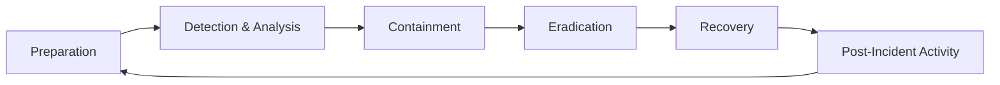

# Stage 10: Incident Response Fundamentals

## Why This Stage Matters

Detection is only useful if someone knows what to do next. Incident response (IR) is the structured process of handling a confirmed or suspected security incident — limiting damage, restoring operations, and learning from what happened.

This stage gives you the classic IR lifecycle and the mindset required to participate in or support a response, even if you are not yet a full-time incident responder.

---

## Learning Objectives

By the end of this stage you will be able to:

- Describe the major phases of a typical incident response lifecycle
- Explain the goals of containment, eradication, and recovery at a conceptual level
- Recognize the importance of evidence preservation and chain-of-custody thinking
- Participate in a simple tabletop discussion using a lab-derived scenario
- Connect IR activities back to logging, detection, and the technical skills built earlier in Phase-2
- Keep all practical exercises inside authorized laboratory or discussion-only contexts

---

## Safety Checkpoint

Incident response techniques that involve isolation, evidence collection, or system changes must be practiced only on laboratory systems you own, or discussed hypothetically.

Never attempt to “respond” to activity on systems you do not control.  
Never destroy or alter potential evidence on systems outside your authorization.

---

## 1. What Is an Incident?

A security **incident** is a suspected or confirmed event that threatens the confidentiality, integrity, or availability of systems or data, or that violates security policy.

Not every alert is an incident. The transition from “interesting event” to “incident” usually involves human judgment, additional context, and sometimes escalation criteria defined by the organization.

---

## 2. Classic Incident Response Lifecycle

Many organizations adapt the NIST or similar model. A common high-level sequence:



### Preparation
- Policies, playbooks, contact lists, tooling, and training exist *before* an incident.
- Lab equivalent: having snapshots, documented network layout, and known-good baselines.

### Detection & Analysis
- Alerts or human observations are investigated.
- Scope, severity, and nature of the activity are assessed.
- Lab equivalent: using the logging and detection skills from Stage 9.

### Containment
- Short-term: stop the bleeding (isolate a host, block an IP, disable an account).
- Long-term: keep the attacker out while investigation continues.
- Decision factors include business impact and evidence preservation needs.

### Eradication
- Remove the attacker’s presence and the root cause (malware, compromised accounts, vulnerable services, etc.).
- Lab equivalent: restoring a clean snapshot or removing a test artifact you deliberately introduced.

### Recovery
- Return systems to normal operation.
- Monitor closely for re-compromise.
- Validate that business functions work.

### Post-Incident Activity (Lessons Learned)
- What happened, what worked, what did not, what should change.
- Updates to playbooks, detections, architecture, and training.
- Often the highest long-term value phase.

---

## 3. Evidence Awareness

Even in a laboratory you should practice treating interesting artifacts carefully:

- Prefer copying disk images, memory captures, or log exports rather than working on the only copy.
- Note dates, times, systems, and actions taken.
- Avoid actions that unnecessarily alter timestamps or overwrite volatile data if you are simulating forensic care.

In real investigations, formal chain-of-custody procedures and legal requirements may apply. The lab is where you build the habit of careful handling.

---

## 4. Roles and Communication

Incidents are rarely handled by one person in isolation. Typical concerns include:

- Who needs to be informed (technical leads, management, legal, communications)?
- What can be said externally, and when?
- How are decisions documented?

Even a simple tabletop exercise benefits from assigning roles and practicing clear, factual updates.

---

## 5. Tabletop Exercise Concept

A **tabletop** is a discussion-based exercise. Participants walk through a scenario without necessarily touching live systems.

Example lab-oriented scenario outline:

1. A detection fires: repeated failed logons followed by a successful logon on a lab Windows host, then an unusual outbound connection.
2. What logs would you examine first?
3. What short-term containment options exist inside the lab?
4. How would you confirm whether the activity was malicious or a false positive?
5. What would you restore from, and how would you verify recovery?
6. What detection or configuration improvement would you recommend afterward?

Working through such questions in writing or with a partner solidifies the lifecycle better than memorizing phase names alone.

---

## 6. Linking IR to the Rest of Phase-2

| Earlier stage | Contribution to IR |
|---------------|--------------------|
| Lab setup & safety | Clean snapshots and isolation make containment and recovery practical |
| Linux / Windows skills | Live response and log analysis on the affected hosts |
| Network analysis | Understanding traffic related to the incident |
| Recon & vulnerability concepts | Understanding how the attacker may have entered |
| Web & crypto | Interpreting application and TLS-related evidence |
| Logging & detection | The source of the initial alert and ongoing visibility |

Incident response is the discipline that uses nearly every skill developed so far.

---

## Common Mistakes

| Mistake | Consequence | Better practice |
|---------|-------------|-----------------|
| Jumping straight to eradication without understanding scope | Incomplete removal; repeated incidents | Analyze before major changes when possible |
| Destroying evidence in the rush to recover | Lost opportunity to learn and to support later investigation | Capture first, then remediate |
| Treating every alert as a full incident | Exhaustion and poor prioritization | Use severity and confidence criteria |
| Skipping lessons learned | Same failures recur | Schedule and protect time for the post-incident review |
| Practicing IR techniques on unauthorized systems | Legal and ethical violations | Lab systems or pure discussion only |

---

## Best Practices

- Maintain known-good snapshots of important lab VMs so recovery is fast and reliable.
- Write short playbooks for the scenarios you care about most (compromised web app, brute-force success, etc.).
- Practice factual, timed notes during exercises (“T+0: alert received; T+5: host isolated…”).
- Separate containment decisions from blame; focus on stopping harm and restoring service.
- Treat every lab incident exercise as a chance to improve detections and documentation.

---

## Hands-on Exercise

## Practical code (Codes/)

| Script | Purpose |
|--------|---------|
| `Codes/Bash/10_incident_response/collect_basic_evidence.sh` | Collect process list, sockets, addresses, auth tail into a dated folder |
| `Codes/Python/10_incident_response/timeline_template.py` | Print a markdown IR timeline template for lab notes |

```bash
chmod +x Codes/Bash/10_incident_response/collect_basic_evidence.sh
./Codes/Bash/10_incident_response/collect_basic_evidence.sh
python3 Codes/Python/10_incident_response/timeline_template.py > lab_ir_timeline.md
```

These helpers support learning workflows; they are not a full forensic toolkit.


1. Choose or invent a simple lab scenario (e.g. successful brute-force followed by a new process or outbound connection).
2. Write a short timeline of how you would move through Detection → Containment → Eradication → Recovery → Lessons Learned inside your lab.
3. List the specific log sources and host commands you would use for analysis.
4. Identify at least one piece of evidence you would preserve and how.
5. Propose one concrete improvement (detection rule, configuration change, or process) that would result from the lessons-learned phase.
6. Record everything in your lab notebook.

**Success criteria:** You have a written, phase-by-phase response outline for a lab scenario, including concrete technical steps and one improvement action.

---

## Review Questions

1. Name the main phases of a typical incident response lifecycle.
2. What is the difference between short-term and long-term containment?
3. Why is evidence preservation important even when the priority is recovery?
4. What is a tabletop exercise?
5. How do logging and detection skills from Stage 9 support incident response?
6. Why must practical IR actions stay inside authorized laboratory systems?

---

## Summary

- Incident response is the structured handling of security incidents through preparation, detection/analysis, containment, eradication, recovery, and lessons learned.
- Evidence awareness and clear communication are part of the discipline.
- Tabletop exercises build decision-making skill without requiring live compromise.
- Nearly every technical skill from Phase-2 feeds into effective response.
- Practice remains confined to laboratory systems or discussion-only scenarios.

**Next stage:** Safe Lab Projects and Capstone — integrating the skills from Stages 1–10 into guided end-to-end exercises.
