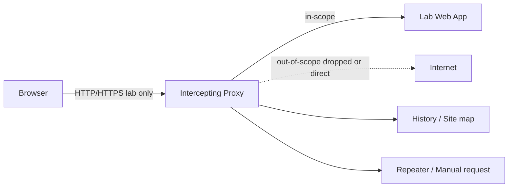

# Track 1 · Stage 1.2 — Mapping and Proxy Workflow

## Why this stage matters

You cannot assess or defend what you have not mapped. Systematic mapping turns a vague “there is a web application” into a concrete inventory of pages, parameters, roles, and entry points. Without that inventory, injection tests, access-control checks, and hardening recommendations are incomplete and often miss the most interesting surfaces.

An intercepting proxy is the primary tool that lets you see and, when appropriate, modify the traffic between your browser and the laboratory application. Used correctly and scoped only to lab targets, it accelerates understanding. Used carelessly, it can leak traffic or create false confidence.

This stage teaches a disciplined mapping mindset and a safe proxy workflow so that later stages (injection, XSS, access control, APIs) rest on a solid site map rather than ad-hoc clicking.

---

## Learning objectives

By the end of this stage you will be able to:

- Build both an anonymous and an authenticated site map for a laboratory web application
- Configure an intercepting proxy (OWASP ZAP or Burp Suite Community) so that only laboratory traffic is intercepted
- Identify and list interesting parameters, forms, file-upload endpoints, and role-restricted areas
- Distinguish passive observation from active content discovery and apply each appropriately inside the lab
- Export a simple sitemap and parameter inventory suitable for later assessment notes

---

## Prerequisites

- Stage 1.1 completed (you can already observe login flows and cookies)
- Laboratory application running and reachable from your attacker/analysis VM
- OWASP ZAP or Burp Suite Community installed (or ready to install)
- Browser configured to trust the proxy’s CA certificate *only for lab work*

---

## Safety checkpoint

1. Bind the proxy listener to `127.0.0.1` or a lab-only interface—never to an interface that faces the public Internet.
2. Define a strict scope (hostname or IP of the lab application only). Out-of-scope requests should be dropped or passed without interception.
3. Disable intercept (or close the proxy) when browsing any non-lab site.
4. Prefer passive mapping and light spidering on fragile training applications; aggressive recursive discovery can crash low-resource lab VMs.
5. Do not use the proxy to attack or map any system outside your written laboratory agreement.

If scope is unclear, stop and re-confirm the target IP/URL.

---

## Core concepts

### 1. Content discovery mindset

Mapping is not “brute-forcing the Internet.” It is the disciplined collection of:

- Visible links and forms
- JavaScript-driven routes (especially in single-page applications)
- Parameters that appear in URLs, bodies, or cookies
- Authenticated versus anonymous surfaces
- Administrative or high-privilege endpoints
- File-upload and other state-changing functions

The goal is completeness inside the authorized target, not speed or noise.

### 2. Passive versus active mapping

| Approach | What it does | When to use in the lab |
|----------|--------------|------------------------|
| **Passive** | Records traffic generated by normal browsing | Always; zero risk of breaking the app |
| **Active spider / crawl** | Follows links automatically | After passive baseline; keep depth and threads low |
| **Forced browsing / wordlists** | Requests common paths not linked | Only on robust training apps; never on production |

### 3. Intercepting proxy workflow

A typical safe loop:

1. Configure browser proxy settings (or system proxy) to the laboratory proxy port.
2. Install and trust the proxy CA certificate so HTTPS lab traffic can be decrypted.
3. Set scope to the lab hostname/IP.
4. Browse the application normally (passive mapping).
5. Turn intercept on only when you deliberately want to pause and inspect a request.
6. Forward, drop, or send to Repeater / Intruder-style tools *only against the lab target*.
7. Turn intercept off again before continuing ordinary browsing.

### 4. What to record

For every interesting endpoint note:

- Method and path
- Parameters (name, location: query / body / header / cookie)
- Authentication requirement (anonymous / any authenticated user / specific role)
- Response status and content-type
- Any obvious security headers or missing flags (cross-reference Stage 1.1)

---

## Illustrative map: proxy-scoped traffic flow



The proxy must never become a general gateway for non-lab traffic.

---

## Detailed explanation of a practical mapping session

### Step 1 — Baseline passive map

1. Start the proxy with intercept off.
2. Browse the laboratory application as an anonymous user: home page, login page, public product or challenge pages, help, about, etc.
3. In the proxy’s history or site-map view, expand the tree. You now have an anonymous baseline.

### Step 2 — Authenticated map

1. Log in with a standard laboratory user account.
2. Visit every reachable menu item, profile page, and feature.
3. If the application has multiple roles (user / admin), repeat with the higher-privilege laboratory account and note differences.
4. Export or screenshot the site map. Mark which nodes appear only after authentication.

### Step 3 — Parameter inventory

From the history, extract every unique parameter name. Group them:

- Identifiers (`id`, `userId`, `orderId`, `file`)
- Search / filter terms
- Action flags (`action=delete`, `mode=edit`)
- Tokens or CSRF fields

These become the primary candidates for later injection and access-control testing.

### Step 4 — Light active discovery (optional)

On a robust training target such as Juice Shop you may enable a low-intensity spider. Limit concurrent requests and recursion depth. Review any newly discovered paths and add them to the map. On fragile targets (older DVWA installs) prefer pure passive mapping.

### Step 5 — Document

Produce a short markdown or spreadsheet entry:

```
Target: http://192.168.56.101:3000 (Juice Shop)
Date: YYYY-MM-DD
Accounts used: demo@user, admin@juice.sh
Anonymous nodes: …
Authenticated nodes: …
Interesting parameters: id, productId, …
Admin-only paths observed: …
```

---

## Practical example — Juice Shop or DVWA

**Juice Shop (recommended for modern mapping):**

- Start the application in your lab.
- Configure ZAP or Burp with scope `localhost:3000` or the lab IP.
- Browse all public challenges and the “About” / “Score Board” pages.
- Log in, visit the basket, order history, and any admin-looking routes that appear.
- Note the heavy use of API calls (`/rest/…`, `/api/…`)—these will be revisited in Stage 1.6.

**DVWA:**

- Map the classic menu structure (Brute Force, Command Injection, SQL Injection, XSS, etc.).
- Observe that many pages are reachable only after login and that the security level (low/medium/high) changes behavior.
- Record the `PHPSESSID` and any security-level cookie.

In both cases the deliverable is the same: a site map plus a parameter list that you will reuse in later stages.

---

## Companion tooling

- OWASP ZAP — free, scriptable, good site-map and HUD features
- Burp Suite Community — excellent Repeater and history; scope tools are clear
- Browser DevTools Network panel — always available for quick passive checks
- Future Track-1 scripts under `Codes/Python/Track-1-Web/` may assist with sitemap export or header collection

---

## Common mistakes

- Leaving the proxy intercepting all traffic and then visiting banking or email sites.
- Running aggressive spider settings against a low-memory lab VM and crashing it.
- Treating the proxy history as a complete map when JavaScript-rendered routes were never exercised.
- Forgetting to re-authenticate after the laboratory application expires the session mid-mapping.
- Exporting a site map that still contains real credentials or session tokens (redact before sharing).

---

## Best practices

- Define scope before the first request.
- Prefer passive mapping; add active discovery only when needed and with rate limits.
- Keep separate proxy projects or named configurations per laboratory target.
- Redact session tokens and passwords from any exported map before placing it in a portfolio.
- Revisit the map after every major stage; new findings often reveal previously missed parameters.

---

## Hands-on exercise

1. Choose one laboratory application (Juice Shop preferred).
2. Configure ZAP or Burp with a strict scope for that host only.
3. Produce an anonymous site map by normal browsing.
4. Log in and produce an authenticated site map; highlight differences.
5. Extract a parameter inventory (at least 10 unique names if the application is rich).
6. Export or screenshot both maps and save them with the target URL and date.
7. Write three sentences: (a) what surprised you, (b) which area looks most interesting for later injection or access-control tests, (c) any proxy configuration lesson learned.

---

## Review questions

1. What is the difference between passive mapping and active content discovery, and why does the distinction matter for laboratory safety?
2. Why must the proxy’s listen address and scope be restricted?
3. Name three categories of information that should appear in a good laboratory site map.
4. How does mapping an SPA (single-page application) differ from mapping a classic multi-page application?
5. After mapping, you notice an `/admin` path that returns 403 for a normal user. What is the next responsible step inside the lab?

---

## Summary

- Mapping turns an opaque application into an inventory of surfaces and parameters.
- An intercepting proxy is powerful only when strictly scoped to laboratory targets.
- Passive observation first, light active discovery second, documentation always.
- The site map and parameter list produced here become the foundation for Stages 1.3–1.7 and the capstone report.

---

## Sources and further reading

- OWASP Testing Guide — Information Gathering
- OWASP ZAP Getting Started and Scope documentation
- Burp Suite documentation — Target scope and Proxy intercept
- Phase-2 Stage 7 (web fundamentals) and Stage 5 (reconnaissance concepts)

All practical work remains restricted to authorized laboratory environments.
