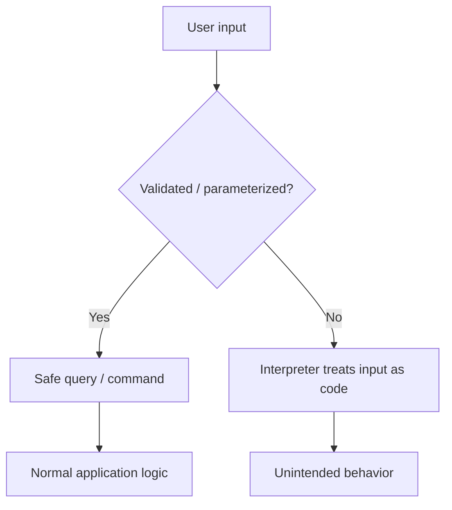

# Track 1 · Stage 1.3 — Injection in the Lab

## Why this stage matters

Injection flaws remain one of the most frequently exploited classes of vulnerability. They occur when untrusted data is concatenated into a command, query, or interpreter context and is therefore treated as code rather than pure data. The classic examples are SQL injection and OS command injection; related patterns appear in LDAP, XPath, template engines, and NoSQL queries.

Training applications such as DVWA and OWASP Juice Shop exist so that learners can observe the failure mode, measure impact, and practice remediation thinking **without** ever directing payloads at real systems. This stage stays strictly inside those intentional laboratories.

Understanding injection also sharpens defensive skills: parameterized queries, allow-lists, least-privilege database accounts, and proper output encoding all become more concrete once you have watched a laboratory application break.

---

## Learning objectives

By the end of this stage you will be able to:

- Explain the root cause of injection (failure to keep data and code separate)
- Demonstrate a designated SQL-injection and (where available) command-injection challenge on an intentional laboratory application
- Classify impact categories (data disclosure, authentication bypass, data modification, command execution)
- Describe the primary mitigations: parameterized queries / prepared statements, allow-lists, least privilege, and escaping when parameterization is impossible
- Document a laboratory finding with request, payload class, result, and plain-language remediation advice

---

## Prerequisites

- Stages 1.1 and 1.2 completed (you can already observe traffic and have a basic site map)
- Laboratory application with intentional injection challenges (DVWA low/medium, Juice Shop, WebGoat, etc.)
- Intercepting proxy optional but useful for precise request modification
- Ability to snapshot the target before and after experiments

---

## Safety checkpoint

1. Only intentional vulnerable pages inside applications you control or that are explicitly designed for training.
2. Prefer the built-in low or medium difficulty levels; they are engineered to demonstrate the issue clearly.
3. Do not scan, fuzz, or inject into forms on the public Internet, employer systems, or any third-party site.
4. Avoid destructive payloads (DROP TABLE, mass deletion, recursive file system commands) even inside the lab unless the challenge explicitly requires them and you have a fresh snapshot.
5. Record the exact URL, challenge name, and laboratory account so that results are reproducible.

If the page is not clearly labeled as a training challenge, do not test it.

---

## Core concepts

### 1. Trust boundary

Every injection vulnerability is a failure at a trust boundary: data that should be treated as opaque is instead interpreted by a language engine (SQL parser, shell, LDAP server, etc.). The corrective principle is simple:

> User-controlled data must never be allowed to change the *structure* of a query or command.

### 2. SQL injection (conceptual)

A typical vulnerable pattern (never write this in real code):

```sql
SELECT * FROM users WHERE name = '" + userInput + "' AND active = 1;
```

If `userInput` contains a single quote and additional SQL, the meaning of the statement changes. Classic demonstrations include:

- Authentication bypass (`' OR '1'='1`)
- Union-based data extraction
- Error-based or boolean-based inference
- (In extreme cases) stacked queries or file system interaction—only on systems deliberately configured to allow it

**Primary defense:** parameterized queries / prepared statements. The SQL structure is fixed; user data is supplied separately and never parsed as SQL.

Secondary defenses: least-privilege database accounts, input allow-lists for known-safe characters, and storing only the minimum data required.

### 3. OS command injection (conceptual)

A vulnerable pattern:

```bash
ping -c 1 " + userInput
```

If `userInput` contains shell metacharacters (`;`, `|`, `&&`, backticks, etc.), additional commands can be executed under the privileges of the web-server process.

**Primary defenses:** avoid shelling out when possible; if external programs must be called, use language-level libraries that accept argument arrays (no shell), and apply strict allow-lists for any user-influenced portion.

### 4. Impact categories you will observe in the lab

| Category | Example laboratory observation |
|-----------|---------------------------------|
| Authentication bypass | Login succeeds without valid credentials |
| Data disclosure | Extra rows or columns appear in results |
| Data modification | Records can be updated or deleted outside intended flow |
| Command execution | Output of `id`, `whoami`, or `cat` appears in the response |
| Denial of service | Long-running or resource-intensive payloads (avoid in shared labs) |

### 5. Why input validation alone is insufficient

Black-list filters are brittle; new encodings and edge cases continually appear. Allow-lists for expected formats (e.g., numeric IDs) are useful, but the structural defense (parameterization) remains essential. Defense in depth combines both.

---

## Illustrative map: injection trust boundary



The entire goal of secure coding is to keep the left path.

---

## Detailed laboratory walkthrough

### SQL injection on DVWA (low security)

1. Set DVWA security to low.
2. Navigate to the SQL Injection challenge page.
3. Observe the normal request (usually a GET or POST with a user ID parameter).
4. Using the browser or proxy, replace the ID value with a classic laboratory payload such as `1' OR '1'='1` (exact syntax depends on the challenge; follow the application’s own hints if present).
5. Note the response: additional user records typically appear.
6. Document:
   - Exact request (method, URL, parameter)
   - Payload class (boolean / union / etc.)
   - Observable impact
   - Suggested fix in plain language: “Use a prepared statement so the user ID is bound as data, never concatenated into the SQL string. Also restrict the database account to SELECT-only on the necessary tables.”

### Command injection (DVWA or similar)

1. Locate the Command Injection challenge.
2. Supply a host name that is valid, then append a laboratory metacharacter sequence that the low-security version will execute (for example a harmless `whoami` or `id`—confirm the exact syntax on your instance).
3. Observe the additional command output in the response.
4. Document the same four items as above, emphasizing least privilege for the web-server process and avoidance of shell invocation.

### Juice Shop injection challenges

Juice Shop presents injection issues in a more modern, often API-driven form. Use the score board or challenge list to locate the relevant tasks. The same documentation discipline applies: request, payload class, result, remediation advice.

---

## Practical example — documentation template

```markdown
### Finding: SQL Injection in User Lookup (Lab only)

- **Target:** http://192.168.56.101/dvwa/vulnerabilities/sqli/
- **Date:** YYYY-MM-DD
- **Account:** admin (lab)
- **Request:** GET ...?id=1' OR '1'='1
- **Observable result:** All user records returned
- **Impact category:** Data disclosure / authentication-adjacent
- **Remediation:** Replace string concatenation with a parameterized query.
  Grant the application database user only the minimum privileges required.
- **Evidence:** screenshot or proxy history excerpt (redacted)
```

---

## Companion code and tools

- Proxy Repeater (ZAP / Burp) for precise, repeatable laboratory requests
- Browser DevTools for quick parameter changes
- Future Track-1 helper scripts may assist with safe laboratory payload encoding; never point them outside the lab

---

## Common mistakes

- Treating a successful laboratory payload as a “weapon” to be reused against real systems.
- Using destructive SQL (DROP, DELETE without WHERE) on a shared laboratory instance without a snapshot.
- Stopping at “it worked” without writing the remediation advice.
- Assuming that client-side JavaScript validation prevents injection (it does not; the server must enforce).
- Testing injection on pages that are not part of the intentional challenge set.

---

## Best practices (defensive)

- Prefer parameterized queries / prepared statements for every database interaction that includes external data.
- Use allow-lists when the expected input format is known (numeric IDs, fixed enumerations).
- Run the application database account with the least privilege necessary.
- Avoid spawning a shell; if external programs are required, pass arguments as an array.
- Log unusual query patterns or repeated syntax errors for later detection work (Track 2).
- Treat every user-controlled value as hostile until proven otherwise by the application’s own validation and parameterization.

---

## Hands-on exercise

1. Select one SQL-injection and, if available, one command-injection challenge on your laboratory application.
2. Complete each challenge using the lowest security setting first.
3. For each, produce a notebook entry following the template above (request, payload class, result, remediation).
4. Raise the security level one step (if the application supports it) and note how the behavior changes.
5. Write two additional sentences: (a) how parameterization would have prevented the issue, (b) what least-privilege restriction would have limited impact even if the injection had occurred.

Save the entries with date and target identifiers.

---

## Review questions

1. Why does input validation alone often fail as the sole control against injection?
2. What is the defensive role of least privilege on the database account used by the web application?
3. Explain the difference between a parameterized query and simply escaping special characters.
4. In a laboratory demonstration of command injection, why is it preferable to run a non-destructive command such as `id` rather than a file-deletion command?
5. How can the presence of injection vulnerabilities in a laboratory application inform detection rules you might later write in Track 2?

---

## Summary

- Injection is the consequence of allowing untrusted data to change the structure of a query or command.
- Intentional laboratory applications let you observe impact safely and practice remediation thinking.
- Parameterization, allow-lists, and least privilege form the core defensive toolkit.
- Clear documentation of laboratory findings prepares you for professional assessment reports (Stage 1.8).

---

## Sources and further reading

- OWASP Injection Prevention Cheat Sheet
- OWASP SQL Injection Prevention Cheat Sheet
- OWASP Testing Guide — Injection
- PortSwigger Web Security Academy — SQL Injection (conceptual sections)
- Phase-2 Stage 7 and the broader OWASP Top 10 discussion

All practical work remains restricted to authorized laboratory environments. No techniques demonstrated here authorize testing of systems outside your lab agreement.
