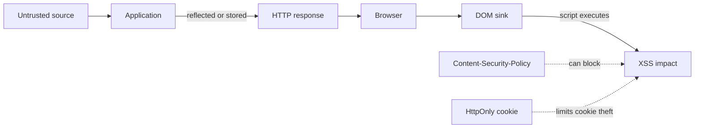

# Track 1 · Stage 1.4 — XSS and Client-Side Issues

## Why this stage matters

Cross-Site Scripting (XSS) allows an attacker to execute script in the context of a victim’s browser. Because the browser trusts the origin that delivered the page, the injected script can read cookies (unless HttpOnly), modify the DOM, perform actions as the user, or exfiltrate data. XSS remains one of the most commonly discovered web vulnerabilities and is a frequent component of larger attack chains.

Training applications provide safe, intentional XSS challenges so you can observe the three classic categories—reflected, stored, and DOM-based—without ever planting scripts on real users or production sites. Understanding XSS also clarifies why output encoding, Content-Security-Policy (CSP), and the `HttpOnly` cookie attribute matter.

---

## Learning objectives

By the end of this stage you will be able to:

- Distinguish reflected, stored, and DOM-based XSS at a conceptual level
- Trigger intentional XSS laboratory challenges safely and document the source and sink
- Explain output encoding / escaping and Content-Security-Policy as primary defenses
- Describe how the `HttpOnly` attribute limits the impact of XSS even when a script executes
- Write plain-language remediation advice for a laboratory finding

---

## Prerequisites

- Stages 1.1–1.3 completed
- Laboratory application with XSS challenges (DVWA, Juice Shop, WebGoat, etc.)
- Browser developer tools; proxy optional
- Ability to clear cookies and storage between tests

---

## Safety checkpoint

1. Only trigger XSS on intentional training pages inside applications you control.
2. Do not plant persistent scripts on shared laboratory instances that other learners use without coordination, and never on any production or third-party site.
3. Prefer the built-in low/medium challenge levels; they are designed to demonstrate the issue clearly.
4. Avoid payloads that attempt to leave the laboratory environment or contact external servers unless the challenge explicitly requires a controlled callback you host inside the lab.
5. Snapshot before testing stored XSS so you can restore a clean state.

---

## Core concepts

### 1. The three classic categories

| Type | How the payload reaches the sink | Typical laboratory observation |
|------|----------------------------------|--------------------------------|
| **Reflected** | Payload is returned in the immediate response to the request that contained it | Search box or error page echoes the input as HTML |
| **Stored** (persistent) | Payload is saved by the application and later served to other users | Comment, profile field, or message is rendered without encoding |
| **DOM-based** | Payload never needs to reach the server; client-side JavaScript reads an untrusted source (URL fragment, etc.) and writes it into the DOM unsafely | Page uses `innerHTML` or similar with data from `location.hash` |

All three share the same root cause: untrusted data is interpreted as HTML or JavaScript instead of pure text.

### 2. Sources and sinks

- **Source** — place where untrusted data enters (URL parameter, form field, cookie, `postMessage`, etc.).
- **Sink** — dangerous DOM operation or HTML context that executes or renders the data (`innerHTML`, `document.write`, event handlers, unquoted attributes, etc.).

Laboratory exercises train you to locate both.

### 3. Primary defenses

- **Output encoding / escaping** — convert characters that have special meaning in HTML (`<`, `>`, `&`, quotes) into safe entities before insertion into an HTML context. Context-aware encoding is required (HTML body vs attribute vs JavaScript vs URL).
- **Content-Security-Policy (CSP)** — HTTP header that tells the browser which sources of script, style, and other resources are allowed. A strong CSP can prevent inline script execution even if an XSS payload is reflected.
- **HttpOnly cookies** — prevent JavaScript from reading the session cookie, limiting the damage of many XSS payloads.
- **Input validation** — useful as defense in depth but never sufficient alone; encoding at the output boundary is essential.
- **Framework auto-escaping** — modern templates (React JSX, Angular, Vue with proper bindings, etc.) escape by default when used correctly; understanding the exceptions is important.

### 4. Impact in the laboratory

Even a simple `alert(1)` or `alert(document.domain)` demonstrates that script ran in the origin’s context. More advanced laboratory payloads may show cookie access (when HttpOnly is absent) or DOM modification. The educational goal is recognition and remediation thinking, not building weaponized payloads.

---

## Illustrative map: XSS data flow



---

## Detailed laboratory walkthrough

### Reflected XSS (DVWA low)

1. Set security level to low.
2. Open the Reflected XSS challenge.
3. Submit a simple laboratory payload such as `<script>alert(1)</script>` (exact syntax may vary; follow the challenge).
4. Observe the alert and examine the response HTML to locate the sink.
5. Document source (the input parameter), sink (the unescaped insertion point), and a remediation sentence: “Encode the user input for the HTML context before reflecting it, or use a template engine that escapes by default.”

### Stored XSS

1. Locate the stored XSS challenge (guestbook, comment, profile bio, etc.).
2. Submit a payload that the application will save and later render.
3. View the page as a second laboratory user (or the same user after reload) and confirm the script executes.
4. Clear the stored data or restore a snapshot afterward.
5. Document as above, noting the persistent nature.

### DOM-based (if available)

1. Identify a page that reads from the URL fragment or another client-side source and writes to the DOM.
2. Craft a laboratory URL that exercises the unsafe sink.
3. Confirm execution without the payload necessarily appearing in server logs.
4. Document the pure client-side nature of the issue.

Juice Shop contains multiple XSS-related challenges of varying sophistication; use the score board to locate them and apply the same documentation discipline.

---

## Practical example — notebook entry

```markdown
### Finding: Reflected XSS in Search (Lab only)

- Target: http://192.168.56.101/dvwa/vulnerabilities/xss_r/
- Date: YYYY-MM-DD
- Payload class: basic script tag
- Source: name parameter
- Sink: unescaped echo inside HTML body
- Observable result: alert dialog in browser
- Remediation: Apply HTML-context encoding to the reflected value.
  Prefer a framework that escapes by default. Add a CSP that disallows inline script.
- Evidence: screenshot of alert + response excerpt
```

---

## Common mistakes

- Testing XSS on real websites or shared production-like systems.
- Leaving stored payloads in a multi-user laboratory instance without cleanup.
- Believing that “the browser blocked it” means the application is safe (CSP or built-in filters may be incomplete).
- Focusing only on `alert(1)` without identifying the actual source and sink.
- Forgetting that HttpOnly does not prevent all XSS impact—DOM manipulation and other actions remain possible.

---

## Best practices (defensive)

- Encode on output according to the surrounding context.
- Adopt a strong Content-Security-Policy; start with `default-src 'self'` and tighten.
- Set the `HttpOnly` attribute on session cookies.
- Prefer modern frameworks’ auto-escaping and avoid unsafe APIs (`innerHTML`, `dangerouslySetInnerHTML` without sanitization, etc.).
- Treat every reflection of user data as a potential sink until proven safe.
- Log and monitor for common XSS probe patterns as part of detection engineering (Track 2).

---

## Hands-on exercise

1. Complete at least one reflected and one stored XSS challenge on your laboratory application.
2. For each, record source, sink, payload class, result, and a one- or two-sentence remediation.
3. Inspect the session cookie attributes (Stage 1.1) and note whether HttpOnly is present.
4. If the application supports CSP, examine the header and comment on its strength.
5. Restore any stored payloads to a clean state.

---

## Review questions

1. How does the `HttpOnly` attribute interact with XSS impact?
2. What problem does a Content-Security-Policy primarily aim to reduce?
3. Why is stored XSS generally considered higher risk than reflected XSS in a multi-user application?
4. Explain the difference between a source and a sink in the context of DOM-based XSS.
5. Why is client-side input validation insufficient as the sole defense against XSS?

---

## Summary

- XSS occurs when untrusted data is interpreted as script or HTML in a victim’s browser.
- Reflected, stored, and DOM-based categories differ in how the payload reaches the sink.
- Output encoding, CSP, and HttpOnly cookies form the core defensive layers.
- Laboratory challenges let you practice recognition and remediation thinking safely.

---

## Sources and further reading

- OWASP XSS Prevention Cheat Sheet
- OWASP DOM-based XSS Prevention Cheat Sheet
- Content Security Policy Level 3 (W3C)
- MDN documentation on CSP and cookie attributes
- Phase-2 Stage 7

All practical work remains restricted to authorized laboratory environments.
