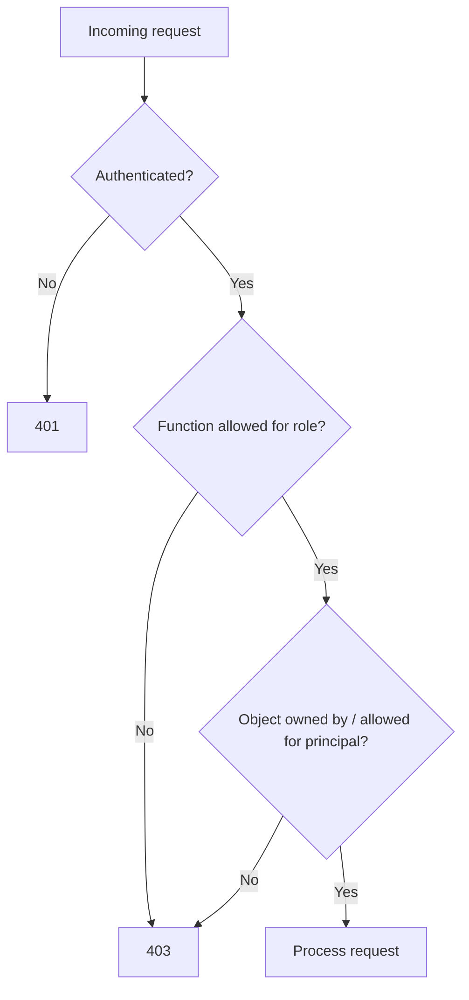

# Track 1 · Stage 1.5 — Access Control and IDOR

## Why this stage matters

Broken access control is consistently ranked among the most critical web application risks. It occurs when the application fails to enforce who is allowed to do what. Classic manifestations include:

- Viewing or modifying another user’s data by changing an identifier (Insecure Direct Object Reference — IDOR)
- Reaching administrative functions while authenticated only as a normal user (vertical privilege escalation)
- Accessing pages or API endpoints that should be reachable only after authentication (forced browsing)

Unlike injection or XSS, access-control flaws often require no special payload—only a change of identifier or a direct request to a restricted URL. They are therefore easy to miss during casual testing and equally easy to introduce during development when authorization checks are incomplete or performed only on the client.

Laboratory applications intentionally expose these issues so you can practice systematic testing and clear documentation.

---

## Learning objectives

By the end of this stage you will be able to:

- Explain the difference between vertical and horizontal privilege issues
- Test object-level and function-level authorization **inside a laboratory application only**
- Identify Insecure Direct Object References (IDOR) by changing identifiers while authenticated as a low-privilege laboratory user
- Document authorization gaps with request/response evidence and a clear remediation recommendation
- Articulate why authorization must be enforced server-side on every request

---

## Prerequisites

- Stages 1.1–1.4 completed
- Laboratory application that supports at least two distinct user accounts (or a user and an admin account)
- Ability to capture and modify requests (browser DevTools or intercepting proxy)

---

## Safety checkpoint

1. Use only laboratory accounts created on the intentional training application.
2. Do not attempt access-control tests against third-party SaaS, employer systems, or any production environment.
3. Prefer non-destructive proofs (viewing another user’s data) over deletion or privilege-granting actions unless the challenge explicitly requires them and you have a snapshot.
4. Record the exact accounts and object identifiers used so results remain reproducible.
5. Restore any modified laboratory data after the exercise.

---

## Core concepts

### 1. Vertical versus horizontal access control

| Type | Description | Laboratory example |
|------|-------------|--------------------|
| **Vertical** | A lower-privilege user reaches a higher-privilege function | Normal user can open `/admin` or call an admin-only API |
| **Horizontal** | A user accesses another user’s resources at the same privilege level | User A views User B’s order by changing `orderId` |

Both are failures of authorization. Vertical issues often indicate missing role checks; horizontal issues often indicate missing ownership checks.

### 2. Insecure Direct Object Reference (IDOR)

An IDOR exists when an application uses a user-supplied identifier (numeric ID, UUID, filename, etc.) to locate an object but fails to verify that the current principal is allowed to access that object. Changing the identifier in the request is frequently sufficient to demonstrate the flaw inside a training application.

### 3. Function-level versus object-level authorization

- **Function-level** — “Is this user allowed to call this endpoint at all?”
- **Object-level** — “Is this user allowed to act on *this particular* object?”

Modern API-heavy applications frequently implement the first and forget the second, producing IDOR-style issues.

### 4. Why client-side checks are insufficient

Hiding an “Edit” button in JavaScript or relying on a front-end router guard does not constitute access control. Any request can be replayed or modified outside the browser. Authorization decisions must be made on the server for every request, using the authenticated identity established by the session or token.

---

## Illustrative map: authorization decision points



A complete access-control design answers both the function and the object questions on every request.

---

## Detailed laboratory walkthrough

### Horizontal IDOR (typical pattern)

1. Create or use two laboratory user accounts (User A and User B).
2. Log in as User A and locate a resource that belongs to A (profile, order, message, document).
3. Note the object identifier in the URL, form, or JSON body.
4. Log out (or use a second browser / private window) and log in as User B.
5. Replay or craft a request that substitutes User A’s object identifier while authenticated as User B.
6. Observe whether the application returns User A’s data or correctly denies access.
7. Document the request, the expected versus actual response, and the remediation: “Before returning or modifying the object, verify that the authenticated user is the owner or has an explicit grant.”

### Vertical privilege check

1. Log in as a normal laboratory user.
2. From the site map (Stage 1.2) attempt direct requests to administrative paths or API endpoints that should be restricted.
3. Note status codes (200 vs 403 vs 404) and any data returned.
4. If the application exposes a role or `isAdmin` parameter, test whether changing it client-side affects server behavior (it should not).

### Juice Shop and similar

Many modern training applications include explicit IDOR and privilege-escalation challenges. Use the score board or challenge descriptions to locate them, then apply the same disciplined request/response documentation.

---

## Practical example — notebook entry

```markdown
### Finding: Horizontal IDOR on Order Details (Lab only)

- Target: http://192.168.56.101:3000/rest/order-history/...
- Date: YYYY-MM-DD
- Accounts: userA@lab, userB@lab
- Action: Authenticated as userB, requested order ID belonging to userA
- Result: 200 OK with userA’s order data
- Remediation: Server must verify that the order’s owner matches the authenticated principal (or that an explicit sharing relationship exists) before returning the resource.
- Evidence: request/response pair (tokens redacted)
```

---

## Common mistakes

- Testing access control on real multi-tenant SaaS platforms without authorization.
- Assuming that a 404 response means the resource is protected (sometimes the application returns 404 for unauthorized objects; sometimes it returns 403; consistency matters).
- Changing an ID in the browser address bar but forgetting to replay the corresponding API call that actually fetches the data.
- Documenting only “it worked” without stating the missing server-side check.
- Using the same laboratory account for both sides of a horizontal test, which cannot demonstrate IDOR.

---

## Best practices (defensive)

- Enforce authorization on the server for every request that accesses or modifies a protected object.
- Prefer opaque, unpredictable identifiers (UUIDs) *in addition to* ownership checks—not as a substitute for them.
- Centralize authorization logic (policy engine, middleware, or dedicated service) rather than scattering ad-hoc checks.
- Deny by default; grant explicitly.
- Log authorization failures for detection (Track 2) and forensics.
- Include both positive and negative authorization tests in any laboratory or professional assessment.

---

## Hands-on exercise

1. Obtain or create two distinct laboratory user accounts.
2. Demonstrate at least one horizontal IDOR (or confirm that the application correctly blocks it) and record the evidence.
3. Attempt access to at least one administrative or higher-privilege function while authenticated as a normal user; record the result.
4. For each finding or non-finding, write a short remediation or confirmation statement.
5. Update your site map from Stage 1.2 with any newly discovered restricted paths.

---

## Review questions

1. Why must authorization be enforced server-side even when the user interface hides restricted features?
2. What is the difference between function-level and object-level access control?
3. How can an API expose an IDOR differently from a classic server-rendered HTML form?
4. Why are sequential numeric identifiers a common contributor to IDOR issues (even though the root cause is missing authorization)?
5. How would you turn a laboratory IDOR finding into a detection idea for Track 2?

---

## Summary

- Broken access control lets users act outside their intended permissions.
- IDOR is the horizontal form that appears when object ownership is not checked.
- Vertical issues appear when role or function checks are missing.
- Every protected request must answer both “Is this function allowed?” and “Is this object allowed for this principal?”
- Laboratory practice with two accounts and careful request modification builds the habit of systematic authorization testing.

---

## Sources and further reading

- OWASP Broken Access Control
- OWASP Insecure Direct Object Reference Prevention
- OWASP API Security Top 10 (API1 Broken Object Level Authorization)
- Phase-2 Stage 7

All practical work remains restricted to authorized laboratory environments.
