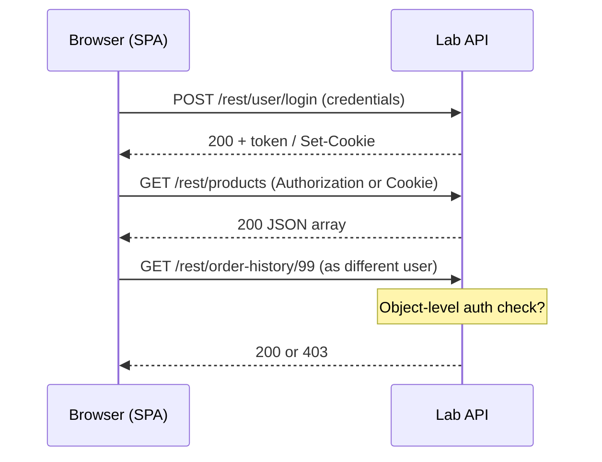

# Track 1 · Stage 1.6 — APIs and Modern Apps

## Why this stage matters

Contemporary web applications are frequently built as a JavaScript front end that consumes JSON APIs. The same security principles that apply to classic form-driven applications—authentication, authorization, input handling, and session management—still apply, but the surface looks different. Identifiers travel in JSON bodies or path segments, authentication often uses bearer tokens or JWTs, and the browser’s same-origin policy interacts with CORS configuration.

Laboratory applications such as OWASP Juice Shop expose rich REST APIs that let you observe these patterns safely. Mastering API observation and basic testing in the lab prepares you for both AppSec work and the detection of API abuse in a SOC context (Track 2).

---

## Learning objectives

By the end of this stage you will be able to:

- Describe common REST verbs, JSON request/response bodies, and security-relevant status codes
- Capture and interpret API traffic from a laboratory single-page application using browser DevTools or an intercepting proxy
- Explain token / JWT concepts at a high level and the risks of broken object-level authorization in APIs
- Identify mass-assignment and excessive-data-exposure patterns when they appear in laboratory responses
- Write a small Python `requests` script that interacts only with a laboratory API endpoint

---

## Prerequisites

- Stages 1.1–1.5 completed
- Laboratory application that exposes a REST or JSON API (Juice Shop is ideal)
- Browser DevTools; proxy recommended
- Python 3 environment with the `requests` library for optional scripting

---

## Safety checkpoint

1. All API interaction must target laboratory hosts only.
2. Do not point scripts or tools at public APIs, employer systems, or any third-party service.
3. Use laboratory tokens and accounts exclusively.
4. Rate-limit any scripted requests so you do not overwhelm a shared lab instance.
5. Redact tokens and personal data from any exported traffic before placing it in a portfolio.

---

## Core concepts

### 1. REST-style APIs in security context

| Verb | Typical use | Security notes |
|-------|--------------|-----------------|
| GET | Retrieve resource(s) | Should be free of side effects; watch for IDOR in path or query |
| POST | Create resource | Body validation, mass-assignment, authentication required |
| PUT / PATCH | Replace or update | Object-level authorization critical |
| DELETE | Remove resource | Object-level authorization + confirmation patterns |

Status codes that matter for security testing:

- 401 Unauthorized — authentication missing or invalid
- 403 Forbidden — authenticated but not authorized
- 404 Not Found — sometimes used to hide existence of unauthorized objects
- 200 / 201 with excessive data — possible data-exposure issue

### 2. Authentication patterns in APIs

- **Session cookie** — classic; browser sends automatically
- **Bearer token** — `Authorization: Bearer <token>` header; common with SPAs
- **JWT (JSON Web Token)** — self-contained signed token; concepts only at this stage (header, payload, signature). Risks include weak signing keys, missing expiration, and acceptance of `none` algorithm
- **API keys** — often long-lived; must be protected and rotated

### 3. Broken Object Level Authorization (BOLA / IDOR in APIs)

The API equivalent of the IDOR issues studied in Stage 1.5. The endpoint may correctly require authentication yet fail to verify that the authenticated principal is allowed to access the specific object identified in the path or body. Changing an ID in a `/api/orders/123` request while authenticated as another user is the classic laboratory demonstration.

### 4. Mass assignment and excessive data exposure

- **Mass assignment** — the API binds request fields directly to internal objects, allowing an attacker to set privileged properties (`isAdmin`, `role`, `balance`) that the UI never exposes.
- **Excessive data exposure** — the API returns more fields than the client needs (password hashes, internal IDs, other users’ data). The front end may ignore them, but the data has already left the server.

### 5. CORS (conceptual)

Cross-Origin Resource Sharing controls which origins may read responses from the API. Misconfigured CORS (`Access-Control-Allow-Origin: *` combined with credentials) can allow malicious sites to read authenticated API responses. Laboratory observation of CORS headers is useful; exploitation is out of scope for this stage.

---

## Illustrative map: SPA ↔ API traffic



---

## Detailed laboratory walkthrough

### Observing Juice Shop API traffic

1. Open DevTools → Network, filter by Fetch/XHR.
2. Browse the application; note the `/rest/` and `/api/` calls.
3. Log in and observe the authentication response (token or cookie).
4. Locate an endpoint that returns an object belonging to the current user (basket, orders, profile).
5. Using the proxy or by editing the request, change an identifier and resend while still authenticated as the original user or a second laboratory user.
6. Record whether object-level authorization is enforced.

### Optional Python laboratory client

A minimal pattern (replace with your actual laboratory URL and token):

```python
import requests

LAB_BASE = "http://192.168.56.101:3000"  # lab only
session = requests.Session()

# Example: login (adjust to the real lab endpoint)
r = session.post(f"{LAB_BASE}/rest/user/login",
                 json={"email": "labuser@example.com", "password": "labpass"})
print(r.status_code, r.json())

# Example: authenticated request
r2 = session.get(f"{LAB_BASE}/rest/products")
print(r2.status_code, len(r2.json()))
```

Never hard-code real credentials or point the script outside the lab.

---

## Practical example — notebook entry

```markdown
### Observation: API Order Endpoint (Lab only)

- Target: http://192.168.56.101:3000/rest/order-history/{id}
- Date: YYYY-MM-DD
- Auth: laboratory Bearer token / session
- Test: Requested another user’s order ID
- Result: 200 with foreign order data → BOLA / IDOR
- Remediation: Server must compare order.owner with authenticated subject before returning the resource.
- Notes: Response also contained fields not shown in the UI (excessive data exposure candidate)
```

---

## Common mistakes

- Treating an API as “internal” and therefore exempt from the same authorization rules as the UI.
- Storing long-lived tokens in localStorage (XSS can steal them) without understanding the trade-off.
- Running unthrottled scripts against a shared laboratory instance.
- Exporting traffic that still contains live laboratory tokens into shared notes.

---

## Best practices (defensive)

- Enforce object-level authorization on every API endpoint that accepts an identifier.
- Return only the fields the client actually needs.
- Prefer short-lived access tokens plus refresh tokens; store tokens carefully.
- Validate and allow-list request fields to prevent mass assignment.
- Configure CORS tightly; avoid `*` with credentials.
- Log authentication and authorization failures for later detection work.

---

## Hands-on exercise

1. Capture API traffic from your laboratory SPA during normal browsing and after login.
2. Identify at least three distinct API endpoints and note their verbs, parameters, and authentication requirements.
3. Perform one object-identifier change test (IDOR/BOLA style) and document the result.
4. Optionally write and run a small `requests` script against one laboratory endpoint; include the script and its output in your notebook (redact secrets).
5. Update your site map / parameter inventory with the API surfaces discovered.

---

## Review questions

1. How can an API expose an IDOR (BOLA) differently from a classic HTML form?
2. What is the security implication of an API returning fields that the front-end never displays?
3. Why is storing a JWT in localStorage riskier than storing it in an HttpOnly cookie (when the application design allows cookies)?
4. What status code should an API return when the caller is authenticated but not authorized for the requested object?
5. How does the mapping work from Stage 1.2 change when the application is a single-page app that loads data via API?

---

## Summary

- Modern applications shift many security decisions into JSON APIs.
- The same authorization, authentication, and input-handling principles still apply.
- Laboratory observation of API traffic and controlled identifier tests build practical AppSec skill.
- Clear documentation of API findings feeds both the capstone report and future detection engineering.

---

## Sources and further reading

- OWASP API Security Top 10
- OWASP Testing Guide — API Testing
- JWT.io introduction (conceptual)
- Phase-2 Stage 7 and Track 1 Stages 1.1–1.5

All practical work remains restricted to authorized laboratory environments.
