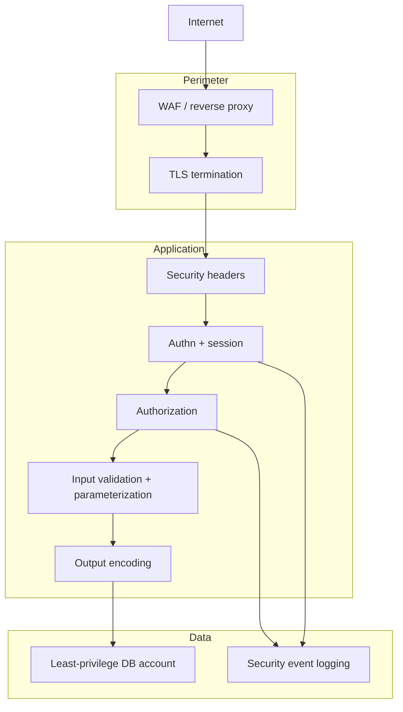

# Track 1 · Stage 1.7 — Hardening and Defense

## Why this stage matters

Finding issues is only half of application security. The other half is knowing which practical controls reduce risk and how to verify that those controls are present. Hardening turns the lessons of Stages 1.1–1.6 into concrete, measurable improvements: security headers, correct cookie flags, TLS expectations, session lifetime, least-privilege database accounts, and logging of security-relevant events.

A web application firewall (WAF) can add a useful layer, but it is never a substitute for fixing the underlying code or configuration. This stage teaches you to evaluate a laboratory application against a concise hardening checklist and to recommend or implement improvements that survive beyond the next scan.

---

## Learning objectives

By the end of this stage you will be able to:

- Apply a practical security-header checklist (CSP, HSTS, X-Content-Type-Options, X-Frame-Options / frame-ancestors, Referrer-Policy, Permissions-Policy, etc.)
- Review session-cookie attributes and TLS configuration expectations for a laboratory application
- Explain the role and limitations of a WAF as one layer in a defense-in-depth strategy
- Produce a short hardening report for one laboratory application that includes both positive findings and prioritized recommendations
- Link hardening controls back to the issues studied in earlier stages (injection, XSS, session theft, clickjacking, etc.)

---

## Prerequisites

- Stages 1.1–1.6 completed
- Laboratory application still running
- Ability to inspect response headers (browser DevTools, proxy, or a simple Python script)
- Optional: access to the laboratory application’s configuration or reverse-proxy settings so you can actually enable a header

---

## Safety checkpoint

1. Make configuration changes only on laboratory instances you control.
2. Snapshot before altering TLS, header, or session settings.
3. Do not apply experimental hardening to production or shared non-lab systems.
4. When testing a WAF rule, use only laboratory traffic and payloads.

---

## Core concepts

### 1. Security headers that matter

| Header | Purpose | Typical strong value (illustrative) |
|---------|----------|--------------------------------------|
| `Content-Security-Policy` | Restrict sources of script, style, frames, etc. | `default-src 'self'; script-src 'self'; object-src 'none'; base-uri 'self'` (tune per app) |
| `Strict-Transport-Security` | Force HTTPS, enable preload eligibility | `max-age=31536000; includeSubDomains` |
| `X-Content-Type-Options` | Prevent MIME sniffing | `nosniff` |
| `X-Frame-Options` or CSP `frame-ancestors` | Mitigate clickjacking | `DENY` or `frame-ancestors 'none'` |
| `Referrer-Policy` | Control referrer information leakage | `strict-origin-when-cross-origin` or stricter |
| `Permissions-Policy` | Disable unneeded browser features | `geolocation=(), camera=(), microphone=()` |
| `Cache-Control` (for sensitive pages) | Prevent caching of authenticated content | `no-store` |

Absence of these headers does not automatically mean the application is exploitable, but their presence measurably raises the bar for several attack classes.

### 2. Session and cookie hardening (recap + depth)

From Stage 1.1, confirm:

- `Secure`
- `HttpOnly`
- `SameSite=Lax` or `Strict`
- Reasonable lifetime / idle timeout
- Session ID regeneration after login
- Server-side invalidation on logout

### 3. TLS expectations

- TLS 1.2+ only; disable legacy protocols and weak ciphers
- Valid certificate chain
- Prefer modern cipher suites and forward secrecy
- HSTS as the header-level reinforcement

Exact cipher configuration is environment-specific; the laboratory goal is to verify that cleartext HTTP is not accepted for authenticated traffic and that HSTS is present when HTTPS is used.

### 4. Least privilege and logging

- Application database account should hold only the privileges required (SELECT/INSERT/UPDATE on specific tables, not DBA rights).
- Authentication failures, authorization failures, and input-validation failures should be logged with sufficient context for later detection (Track 2).

### 5. WAF as a layer, not a silver bullet

A web application firewall can block common exploit patterns and virtual-patch known issues. It does not fix insecure code, does not replace authorization logic, and can be bypassed by novel payloads. Treat it as one control among many; measure its coverage and false-positive rate in the laboratory if you have access to one.

---

## Illustrative map: defense-in-depth layers for a web app



---

## Detailed laboratory walkthrough

1. Choose one laboratory application you have already mapped.
2. Collect the response headers for the home page, the login page, and at least one authenticated page. Note which security headers are present and which are missing.
3. Re-examine the session cookie attributes (Stage 1.1) and any logout behavior.
4. If the application is reachable over both HTTP and HTTPS, test whether authenticated cookies can be forced over cleartext.
5. Draft a short checklist result:

   | Control | Present? | Notes / recommendation |
   |----------|-----------|-------------------------|
   | CSP | Partial / Missing | … |
   | HSTS | … | … |
   | Cookie flags | … | … |
   | … | … | … |

6. Implement or recommend two concrete improvements (for example, adding `X-Content-Type-Options: nosniff` at the reverse-proxy level, or tightening the session timeout). If you can apply the change in the lab, re-test and record the new header.

---

## Companion code

A simple laboratory header checker (concept):

```python
# Codes/Python/Track-1-Web/check_security_headers.py (lab URL only)
import requests
import sys

url = sys.argv[1]  # must be lab
r = requests.get(url, timeout=10, allow_redirects=True)
interesting = [
    "content-security-policy", "strict-transport-security",
    "x-content-type-options", "x-frame-options",
    "referrer-policy", "permissions-policy",
    "set-cookie"
]
for k, v in r.headers.items():
    if k.lower() in interesting or k.lower().startswith("x-"):
        print(f"{k}: {v}")
```

Point it only at laboratory URLs.

---

## Common mistakes

- Treating a green “A” grade from an online header scanner as proof the application is secure.
- Enabling a restrictive CSP without testing the application’s own scripts and styles, thereby breaking the lab app.
- Relying on a WAF while leaving SQL injection or IDOR unfixed in the code.
- Changing production TLS settings without a rollback plan (never do this in the curriculum; lab only).

---

## Best practices

- Adopt security headers early; tune CSP iteratively.
- Make cookie attributes part of the default session configuration, not an afterthought.
- Enforce HTTPS and HSTS for any application that handles authentication.
- Keep the database account least-privileged and review its grants periodically.
- Log security events in a format that a SIEM can consume (Track 2).
- Review hardening status after every significant code or infrastructure change.

---

## Hands-on exercise

1. Run a header and cookie review against your primary laboratory application.
2. Complete a one-page hardening checklist (positive findings + prioritized gaps).
3. Implement or document two concrete improvements and re-verify them.
4. Write a short paragraph linking at least one hardening control to an issue class from earlier stages (e.g., “CSP reduces impact of XSS findings from Stage 1.4”).
5. Save the checklist; it will feed the capstone report.

---

## Review questions

1. Which security header primarily mitigates clickjacking, and what modern alternative exists inside CSP?
2. Why is a WAF insufficient as the sole defense against injection or broken access control?
3. What combination of cookie attributes most effectively reduces the risk of session theft via XSS and network sniffing?
4. How does least privilege on the database account limit the impact of a successful SQL-injection finding?
5. Why should security-relevant events (failed logins, authorization failures) be logged in a consistent, machine-readable way?

---

## Summary

- Hardening converts theoretical controls into observable configuration.
- Security headers, cookie flags, TLS, least privilege, and logging form a practical baseline.
- A WAF is a useful additional layer, never a replacement for secure design and coding.
- The laboratory checklist produced here becomes evidence of defensive thinking in the capstone.

---

## Sources and further reading

- OWASP Secure Headers Project
- Mozilla Observatory / securityheaders.com (use only against lab hosts)
- OWASP Session Management Cheat Sheet
- CIS Benchmarks (selected web-server sections, conceptual)
- Phase-2 Stage 7 and Track 1 Stages 1.1–1.6

All practical work remains restricted to authorized laboratory environments.
