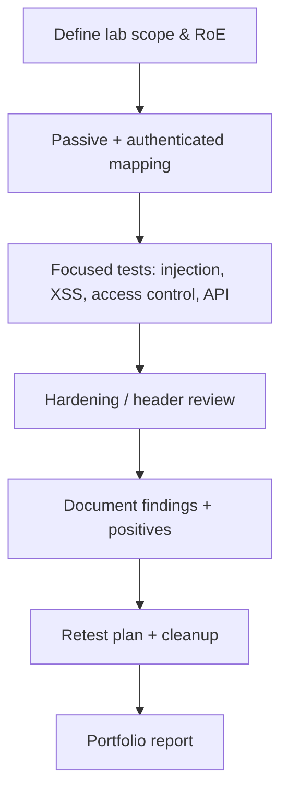

# Track 1 · Stage 1.8 — Capstone Assessment Report

## Why this stage matters

Professional application-security work is judged by the quality of the report as much as by the quality of the technical findings. A clear, reproducible, evidence-based report lets a developer or system owner understand risk, prioritize fixes, and verify remediation. This capstone consolidates every skill practiced in Stages 1.1–1.7 into a single portfolio-ready artifact produced against **one** intentional laboratory application.

The report is not a list of exploits. It is a structured narrative of scope, methodology, findings, risk rationale, and remediation advice, written so that another practitioner could repeat your steps on the same laboratory target and reach comparable conclusions.

---

## Learning objectives

By the end of this stage you will be able to:

- Define a precise laboratory scope and rules of engagement
- Conduct a methodical assessment that reuses the site map, parameter inventory, and techniques from earlier stages
- Produce a findings table that includes title, severity rationale, evidence, and remediation
- Record positive security observations (what the application does well)
- Write a retest plan and document laboratory cleanup (snapshots restored)
- Deliver a report that meets a professional quality bar for portfolio use

---

## Prerequisites

- Stages 1.1–1.7 completed
- One laboratory application fully under your control (Juice Shop recommended for richness; DVWA acceptable)
- Notebook entries, site map, and evidence from prior stages
- Ability to restore the target to a clean snapshot after the assessment

---

## Safety checkpoint

1. The entire assessment remains inside the laboratory boundary defined at the start of the track.
2. No traffic, payloads, or scripts leave the lab or target systems outside your written agreement.
3. Destructive testing (if any) is performed only after a fresh snapshot and is fully documented.
4. All credentials, tokens, and session identifiers are redacted from the final report and from any shared portfolio copy.
5. After the assessment, restore the laboratory application to a known-good state.

---

## Required report structure

Use the following outline. Expand each section with the concrete detail you gathered.

### 1. Title page / header

- Assessment title (e.g., “Laboratory Assessment of OWASP Juice Shop”)
- Date range of testing
- Assessor name / handle
- Laboratory target identifier (hostname/IP, version if known)
- Classification: “Authorized laboratory exercise only — not a production assessment”

### 2. Scope and rules of engagement

- Exact target URL(s) and IP(s)
- Accounts used (laboratory roles only)
- In-scope techniques (mapping, authenticated testing, injection challenges, XSS challenges, access-control tests, header review, etc.)
- Explicitly out-of-scope items (other lab hosts, the public Internet, denial-of-service, social engineering, etc.)
- Statement that all testing was performed under the curriculum safety rules

### 3. Methodology

- Tools used (browser DevTools, ZAP/Burp, any Track-1 scripts)
- High-level process: passive mapping → authenticated mapping → focused tests per issue class → hardening review
- Reference to the site map and parameter inventory produced in Stage 1.2
- Any limitations (time, fragile application, missing role accounts)

### 4. Findings

Present findings in a table or consistently formatted subsections. For each finding include:

| Field | Content |
|-------|---------|
| Title | Short descriptive name |
| Severity rationale | Why you rated it Critical / High / Medium / Low / Informational (impact + likelihood in the *lab* context) |
| Description | What was observed, which stage technique was used |
| Evidence | Request/response excerpts, screenshots, or proxy history (redacted) |
| Affected endpoint / parameter | Precise location |
| Remediation | Concrete, actionable advice (parameterization, authorization check, header addition, etc.) |
| References | OWASP category or cheat-sheet link if helpful |

Aim for at least three substantive findings drawn from different stages (e.g., one injection, one access-control, one hardening gap). Informational notes about missing headers or weak cookie flags are also valuable.

### 5. Positive observations

Record what the application does well. Examples:

- Session cookies correctly set with HttpOnly and Secure
- Authorization correctly enforced on a particular object
- Presence of a useful Content-Security-Policy
- Clear logout that invalidates the server-side session

Positive notes demonstrate balanced judgment and help the reader trust the rest of the report.

### 6. Hardening summary

Reuse or attach the checklist from Stage 1.7. Highlight the two improvements you recommended or implemented.

### 7. Retest plan

For each finding (or for the highest-severity ones) state:

- What change would constitute successful remediation
- How you would retest (exact request or check)
- Suggested verification window

### 8. Cleanup and laboratory hygiene

- Snapshot(s) restored
- Stored XSS or other persistent laboratory data removed
- Temporary accounts or tokens revoked if applicable
- Proxy projects and exported traffic sanitized

### 9. Appendix (optional)

- Full site map
- Parameter inventory
- Raw header dumps
- Script listings (lab-only)

---

## Quality bar

A reader who has access to the same laboratory application should be able to:

- Reproduce each finding from the evidence and description
- Understand the risk without marketing language or hype
- Act on the remediation advice without needing to reverse-engineer your steps
- See that you respected the laboratory boundary throughout

Avoid:

- Unredacted secrets
- Claims about systems you did not test
- Severity inflation
- Payload lists without context or remediation

---

## Illustrative map: assessment workflow

---

## Practical guidance for writing

- Write in clear, neutral technical language.
- Prefer “the application returned another user’s order data when the orderId parameter was changed” over “critical IDOR allows full account takeover.”
- Severity rationale should be explicit: impact on confidentiality / integrity / availability inside the lab context, plus how easy the issue was to demonstrate.
- Keep evidence close to the description; do not force the reader to hunt through an appendix for the single screenshot that proves the finding.
- If a challenge was completed inside DVWA or Juice Shop, say so; the educational context is part of the honesty of the report.

---

## Hands-on deliverable

1. Select one laboratory application as the sole target of the capstone.
2. Re-confirm scope and take a fresh snapshot.
3. Reuse prior notebook entries, site map, and evidence; fill any gaps with additional laboratory tests.
4. Write the full report following the structure above.
5. Redact all secrets.
6. Restore the laboratory application.
7. Save the report in your portfolio folder with a clear filename (e.g., `Track1_Capstone_JuiceShop_YYYYMMDD.md` or PDF).

---

## Review / self-check before submission

- [ ] Scope statement limits testing to the laboratory target
- [ ] At least three findings with evidence and remediation
- [ ] At least one positive observation
- [ ] Hardening checklist included or summarized
- [ ] Retest plan present
- [ ] Cleanup documented
- [ ] No live credentials or session tokens in the final document
- [ ] Language is professional and reproducible

---

## Summary

- The capstone report is the tangible proof of Track 1 competence.
- Structure, evidence, balanced severity, and actionable remediation matter more than the number of findings.
- Laboratory discipline (scope, snapshots, redaction, cleanup) is part of the assessed skill.
- A well-written laboratory report transfers directly to professional assessment practice under proper authorization.

---

## Sources and further reading

- OWASP Testing Guide — Reporting
- PTES Technical Guidelines (reporting sections, conceptual)
- Earlier Track 1 stages and Phase-2 Stage 7

All practical work remains restricted to authorized laboratory environments. Completion of this track does not authorize testing of any system outside your laboratory agreement.
