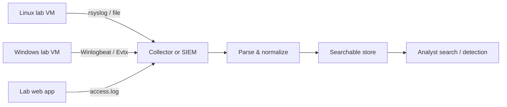

# Track 2 · Stage 2.1 — Log Sources and Pipelines

## Why this stage matters

Detection engineering begins with visibility. If the right events are not generated, collected, parsed, and stored in a searchable form, no amount of clever correlation logic will surface an intrusion. This stage focuses on the foundational pipeline that turns raw host and application activity into data a SOC can use: what to log, where the logs live in a laboratory environment, how they move, and why time synchronization is non-negotiable.

Without a clear inventory of log sources and a basic understanding of the ship → parse → store path, later stages (search, detection design, triage) rest on incomplete evidence.

---

## Learning objectives

By the end of this stage you will be able to:

- Inventory the primary authentication, process, and web-related log sources on laboratory Linux and Windows systems
- Explain the high-level stages of a logging pipeline (generation → shipping → parsing/normalization → storage/indexing → retention)
- Confirm that timestamps across laboratory hosts are synchronized and understand the consequences when they are not
- Locate and sample key log files or event channels in the lab
- Relate laboratory log sources to the kinds of detections you will later write

---

## Prerequisites

- Phase-2 Stages 2, 3, and 9 completed (Linux, Windows, and logging/detection foundations)
- Laboratory VMs (Linux and, ideally, Windows) under your control
- Ability to read files with `sudo` / administrative rights on those VMs
- Optional: a simple log shipper or centralized collector already present in the lab

---

## Safety checkpoint

1. All log inspection and collection stays inside laboratory hosts you own or administer.
2. Do not enable verbose logging or shippers on production systems as part of this curriculum.
3. Avoid collecting or exporting logs that contain real user credentials or personal data from non-lab systems.
4. When experimenting with log rotation or shipping, snapshot first.

---

## Core concepts

### 1. What should be logged (laboratory priority list)

| Category | Linux examples | Windows examples | Why it matters for detection |
|-----------|-----------------|-------------------|-------------------------------|
| Authentication | `/var/log/auth.log`, `secure`, journal `sshd` | Security log (4624, 4625, 4648, …) | Failed/successful logons, brute force, lateral movement |
| Process creation | `auditd` execve, optional Sysmon-like | Security 4688, Sysmon 1 | Suspicious binaries, living-off-the-land |
| Web / application | Access and error logs (nginx, Apache, app-specific) | IIS logs, application event logs | Web attacks, recon, injection probes |
| Network / firewall | `ufw`, `firewalld`, iptables logs | Windows Filtering Platform, firewall logs | Port scans, blocked connections |
| Privilege / account changes | `auth.log`, `sudo` logs | 4720, 4732, 4672, … | Persistence, privilege escalation |

You do not need every possible source on day one. Start with authentication and web logs; expand as the laboratory detections require.

### 2. The pipeline at a high level

```
Generation → Shipping → Parsing / Normalization → Indexing / Storage → Retention & Access
```

- **Generation** — the OS or application writes the event (syslog, Windows Event Log, application file).
- **Shipping** — an agent or forwarder (rsyslog, Fluent Bit, Winlogbeat, etc.) moves the event to a collector or SIEM.
- **Parsing / Normalization** — fields are extracted and mapped to a common schema (source IP, user, action, outcome, …).
- **Indexing / Storage** — events become searchable.
- **Retention** — how long data is kept online versus archived; driven by investigation needs and laboratory disk constraints.

In a minimal laboratory you may simply read files directly. The conceptual pipeline still applies when you later introduce a lightweight SIEM or even a set of parsed JSON files.

### 3. Time synchronization

Correlation depends on ordering. If Host A’s clock is five minutes ahead of Host B’s, a “failed logon followed by success” sequence can appear reversed or impossible to reconstruct. Laboratory best practice:

- Run NTP or chrony on every VM.
- Confirm offsets with `timedatectl` / `w32tm`.
- Prefer UTC for stored timestamps when possible.

### 4. Laboratory log locations (quick reference)

**Linux (common):**

- `/var/log/auth.log` or `/var/log/secure`
- `/var/log/syslog` or journalctl
- Web: `/var/log/nginx/access.log`, `/var/log/apache2/access.log`
- Audit: `/var/log/audit/audit.log` (if auditd enabled)

**Windows:**

- Event Viewer → Windows Logs → Security, System, Application
- Sysmon logs (if installed in the lab)
- IIS: `%SystemDrive%\inetpub\logs\LogFiles`

---

## Illustrative map: simple lab logging pipeline



---

## Detailed laboratory walkthrough

1. On a Linux laboratory VM, list the contents of `/var/log` and identify authentication and web logs.
2. Generate a few failed SSH logons (from another lab host or the attacker VM) and confirm new lines appear with timestamps.
3. On a Windows laboratory VM (if available), open Event Viewer and filter the Security log for logon events (4624/4625).
4. Check time synchronization on both hosts; record any offset.
5. Optionally configure a simple shipper or just copy a sample of the logs to a central laboratory analysis host.
6. Document the inventory: host, log path or channel, approximate volume, and whether timestamps look trustworthy.

---

## Companion code

- `Codes/Bash/09_logging_detection/` — helpers for tailing and basic filtering
- `Codes/Python/02_linux_security/parse_auth_failures.py` — example parser for laboratory auth logs
- Additional Track-2 scripts under `Codes/Python/Track-2-SOC/` as they are published

Use these only against laboratory log files.

---

## Common mistakes

- Assuming “logs exist” without verifying they contain the fields needed for detection (source IP, username, outcome).
- Ignoring clock skew until a correlation exercise fails.
- Shipping entire raw logs without any filtering, then running out of laboratory disk.
- Treating Windows Event Log and Linux syslog as interchangeable without normalizing field names.

---

## Best practices

- Start with a short priority list of sources and expand deliberately.
- Normalize early (common field names) even in a simple laboratory parser.
- Keep laboratory retention modest but sufficient for the scenarios you will run (days to a couple of weeks is usually enough).
- Protect log integrity; laboratory attackers should not be able to erase evidence without detection.
- Document the inventory so later detection design can reference exact source names.

---

## Hands-on exercise

1. Produce a one-page laboratory log-source inventory covering at least authentication and one web or process source on each available OS.
2. Generate a small number of failed and successful authentication events; confirm they appear with consistent timestamps.
3. Note any gaps (missing source IP, missing username, clock skew) that would hinder later detections.
4. Save the inventory; it becomes the foundation for Stages 2.2–2.8.

---

## Review questions

1. Why does time synchronization matter for correlating a failed logon on one host with a successful logon on another?
2. Name three laboratory log sources that are especially useful for detecting brute-force authentication attempts.
3. What are the main stages of a logging pipeline, and which stage turns raw text into searchable fields?
4. How can excessive logging without retention planning harm a laboratory environment?
5. What is the difference between a log *source* and a log *pipeline*?

---

## Summary

- Detection starts with the right events being generated and collected.
- A clear inventory of laboratory log sources and a basic pipeline understanding are prerequisites for search and detection design.
- Time synchronization is a silent requirement for any multi-host correlation.
- The inventory produced here feeds every subsequent Track-2 stage.

---

## Sources and further reading

- NIST SP 800-92 (Guide to Computer Security Log Management) — conceptual
- Phase-2 Stage 9 (Logging, Detection, and Blue Team)
- Linux `man` pages for rsyslog, journalctl, auditd
- Microsoft documentation on Windows Security auditing (selected events)

All practical work remains restricted to authorized laboratory environments.
