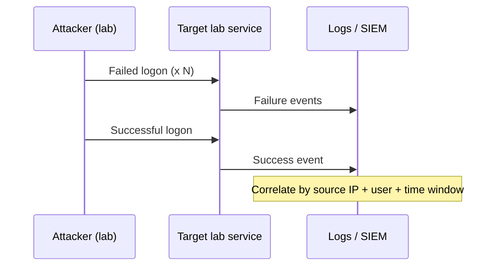

# Track 2 · Stage 2.2 — SIEM Search and Correlation

## Why this stage matters

Raw logs become useful only when an analyst can ask precise questions and combine related events into a coherent story. Search skills let you answer “who failed to log on from where?” Correlation skills let you answer “did those failures precede a successful logon from the same source?” Both are foundational for triage and for validating the detections you will design later.

In a laboratory setting you can generate the exact events you need, search them, and practice building simple timelines without the noise of a production environment.

---

## Learning objectives

By the end of this stage you will be able to:

- Formulate clear search questions for authentication and related laboratory events
- Locate failed and successful logon events in laboratory logs or a simple SIEM
- Correlate two or more event types into a short timeline (e.g., failures followed by success)
- Document search logic so it can be turned into a detection in the next stage
- Recognize the difference between a one-off investigative search and a reusable detection query

---

## Prerequisites

- Stage 2.1 completed (log inventory and time synchronization confirmed)
- Ability to generate failed and successful authentication events in the lab (SSH, RDP, or web login)
- Access to the laboratory logs or a lightweight search interface (grep, journalctl, simple SIEM, or even a spreadsheet of parsed events)

---

## Safety checkpoint

1. Generate authentication noise only against laboratory services you control.
2. Do not run password-guessing tools against any non-lab system.
3. Keep laboratory accounts and passwords out of shared search histories or screenshots.

---

## Core concepts

### 1. From question to search

Good investigative searches start with a plain-language question:

- “Show me all failed SSH logons in the last hour.”
- “Which source IPs produced both failures and a later success against the same account?”
- “Did any web-application login failures precede a successful session from the same client?”

Translate the question into the fields available in your laboratory logs (timestamp, source IP, username, outcome, service).

### 2. Correlation patterns useful in the lab

| Pattern | Description | Laboratory example |
|---------|-------------|--------------------|
| Sequence | Event A then Event B within a time window | ≥5 failures followed by a success from the same IP |
| Aggregation | Count of events exceeding a threshold | 20 failed logons from one IP in 5 minutes |
| Join across sources | Same key appears in two log types | Web 401s and subsequent process creation on the app server |

### 3. Timelines

A timeline is simply ordered events with a common key (IP, user, host). Even a manually constructed table is valuable practice before you move to automated correlation rules.

---

## Illustrative map: failure-then-success correlation

---

## Detailed laboratory walkthrough

1. From an attacker or analysis VM, generate a handful of failed logons against a laboratory SSH, RDP, or web login.
2. Follow with one successful logon using a known laboratory account.
3. Search the authentication logs for the source IP or username.
4. Build a short timeline: failure timestamps, success timestamp, any subsequent interesting activity.
5. Write the search logic in plain language and, if your tool supports it, in the tool’s query syntax.
6. Note any missing fields that forced you to approximate (e.g., no source port, no clear outcome field).

---

## Companion code and tools

- `grep`, `journalctl`, `Get-WinEvent` / Event Viewer
- Simple parsers from Stage 2.1
- Any laboratory SIEM search interface already configured
- Future Track-2 query examples under `Codes/Python/Track-2-SOC/`

---

## Common mistakes

- Searching only for failures and never confirming whether a success followed.
- Ignoring time zones or clock skew when ordering events.
- Copy-pasting production SIEM queries that reference fields your laboratory logs do not contain.
- Treating a one-off successful search as a finished detection (detection design comes next).

---

## Best practices

- Always start with a clear question.
- Prefer field-based filters over free-text greps when the logs are structured.
- Record the exact search (or query) that produced the timeline so it can be reused or turned into a rule.
- Validate correlation logic with both true-positive laboratory scenarios and clean baseline traffic.

---

## Hands-on exercise

1. Generate a laboratory “failed-then-successful” authentication sequence.
2. Search and produce a timeline of at least the failure cluster and the success.
3. Write the plain-language search question and the concrete filter or query you used.
4. Note one improvement to the log source or parsing that would make the search easier next time.

---

## Review questions

1. What is the difference between an investigative search and a reusable detection query?
2. Why is a shared key (source IP, username, host) essential for correlation?
3. How can clock skew between two laboratory hosts break a “failures then success” timeline?
4. Give an example of an aggregation-style search useful for detecting brute force in the lab.
5. Why should you still examine successful logons even when your primary interest is failures?

---

## Summary

- Precise search questions turn logs into answers.
- Correlation links related events into timelines that reveal attacker behavior.
- Laboratory-generated sequences let you practice both skills safely and reproducibly.
- The search logic you document here becomes the raw material for detection design in Stage 2.3.

---

## Sources and further reading

- Phase-2 Stage 9
- Vendor or open-source SIEM search documentation (laboratory instance only)
- MITRE ATT&CK — Initial Access / Credential Access tactics (for labeling later)

All practical work remains restricted to authorized laboratory environments.
