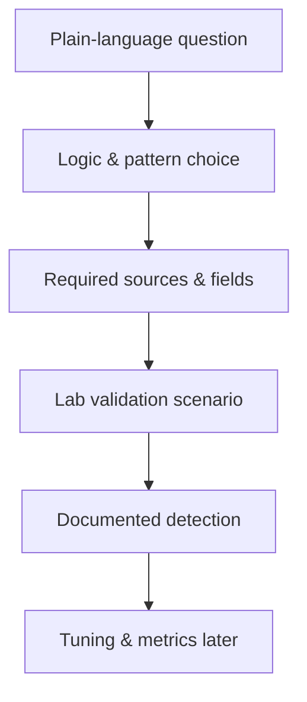

# Track 2 · Stage 2.3 — Detection Design

## Why this stage matters

A detection is a reusable, testable expression of “this pattern of events is worth an analyst’s attention.” Moving from a one-off search to a designed detection forces clarity: what exactly are we looking for, over what time window, with what threshold, and what context should the alert carry? Poorly designed detections generate noise; well-designed ones surface genuine laboratory (and later production) issues with acceptable false-positive rates.

This stage teaches you to write detections first in plain language, then as concrete logic, and to choose appropriate patterns (threshold, sequence, presence/absence) for the laboratory behaviors you can generate.

---

## Learning objectives

By the end of this stage you will be able to:

- Write a detection idea in plain language that includes the relevant entities, time window, and intended action
- Translate that idea into concrete logic (threshold, sequence, or other pattern)
- Choose between simple threshold rules and multi-event sequence rules for laboratory scenarios
- Identify the log sources and fields required by each detection
- Draft at least three laboratory detections that you can later validate and tune

---

## Prerequisites

- Stages 2.1 and 2.2 completed
- Ability to generate the laboratory noise each detection is intended to catch
- Log inventory and sample search queries from prior stages

---

## Safety checkpoint

1. Design and test detections only against laboratory-generated events.
2. Do not deploy experimental rules that could affect production alerting.
3. Keep any test payloads or account names clearly marked as laboratory-only.

---

## Core concepts

### 1. Plain-language detection statement

A good starting template:

> “Alert when [entity] produces [N] [event type] within [time window] [optional: followed by another event], and include [context fields] in the alert.”

Example:

> “Alert when any source IP produces 10 or more failed SSH logons against a laboratory host within 5 minutes, and include the targeted username(s) and the first/last timestamps.”

### 2. Pattern types

| Pattern | When to use | Laboratory example |
|---------|-------------|--------------------|
| **Threshold / aggregation** | Volume of similar events | ≥15 failed logons from one IP in 5 min |
| **Sequence** | Ordered events | Failures followed by success from same IP within 10 min |
| **Presence** | Rare or forbidden event | Use of a laboratory “canary” account |
| **Absence** | Expected heartbeat missing | Laboratory agent stops reporting |
| **Statistical / baseline** | Deviation from normal (advanced) | Unusual process from a web server user |

Start with threshold and sequence; they cover most early laboratory detections.

### 3. Required elements of a detection design

- Name and plain-language description
- ATT&CK tactic/technique labels (high-level, for communication — Stage 2.5)
- Log source(s) and critical fields
- Logic (threshold, window, sequence)
- Alert context (what the analyst should see)
- Expected true-positive scenario in the lab
- Known false-positive risks and initial tuning ideas

### 4. From search to detection

The searches you wrote in Stage 2.2 are the prototypes. A detection adds:

- Persistence (it runs continuously or on a schedule)
- Alerting action
- Ownership and documentation
- A plan for validation and tuning

---

## Illustrative map: detection design flow

---

## Detailed laboratory walkthrough

1. Review the authentication and web noise you can generate.
2. Draft three plain-language detection statements (e.g., brute-force threshold, failure-then-success sequence, web 404/401 burst).
3. For each, list the exact log source and fields required.
4. Implement or simulate the logic (SIEM rule, simple script, or even a scheduled grep + count).
5. Generate the true-positive laboratory scenario and confirm the detection fires.
6. Record one likely false-positive situation for each rule.

---

## Companion code

- `Codes/Python/09_logging_detection/simple_detection_demo.py`
- `Codes/Python/Track-2-SOC/` (as published)
- Shell one-liners for threshold counting on laboratory log files

---

## Common mistakes

- Writing detections that require fields your laboratory logs do not contain.
- Setting thresholds so low that normal laboratory activity constantly alerts.
- Forgetting to document the true-positive scenario, making later validation impossible.
- Treating a detection as finished after the first true positive without considering false positives.

---

## Best practices

- Start with high-signal, low-complexity rules.
- Always pair a detection with a laboratory validation procedure.
- Include enough context in the alert so an analyst can triage without immediate extra searches.
- Version and comment detection logic the same way you would production code.
- Plan for tuning (Stage 2.7) from the first draft.

---

## Hands-on exercise

1. Write three laboratory detection designs using the elements above.
2. Validate each with a true-positive scenario you generate.
3. Note at least one false-positive risk per detection.
4. Save the designs; they will be refined in later stages and included in the capstone pack.

---

## Review questions

1. What is the difference between a search and a detection?
2. When would you choose a sequence pattern over a simple threshold?
3. Why must every detection design include a laboratory true-positive scenario?
4. Name three pieces of context that are useful to include in an authentication-related alert.
5. How does the log inventory from Stage 2.1 constrain the detections you can write?

---

## Summary

- Detection design turns investigative questions into reusable, testable logic.
- Plain language first, concrete pattern second, validation third.
- Threshold and sequence patterns cover most early laboratory needs.
- The three designs produced here become the core of the Track-2 capstone.

---

## Sources and further reading

- Phase-2 Stage 9
- Sigma rule specification (conceptual — laboratory use)
- MITRE ATT&CK for labeling (Stage 2.5)
- Vendor detection-engineering guides (laboratory context)

All practical work remains restricted to authorized laboratory environments.
