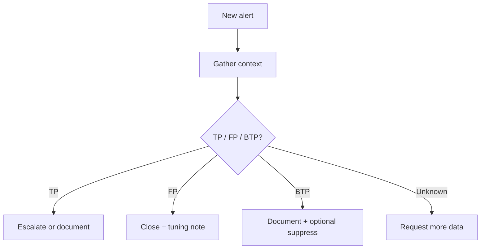

# Track 2 · Stage 2.4 — Alert Triage and False Positives

## Why this stage matters

Even well-designed detections produce alerts that must be triaged. An analyst’s first job is to decide whether an alert represents a true positive worth escalating, a false positive that can be closed, or a true positive of low impact that needs only documentation. Confusing severity (how bad the activity would be if real) with confidence (how sure we are that the activity is real) leads to either alert fatigue or missed incidents.

Laboratory environments let you generate both true-positive and false-positive conditions deliberately, practice structured triage, and document safe suppressions or tuning recommendations.

---

## Learning objectives

By the end of this stage you will be able to:

- Separate the concepts of severity and confidence when evaluating an alert
- Apply a simple triage process to laboratory alerts (initial classification, evidence review, decision, documentation)
- Identify common causes of false positives in laboratory authentication and web detections
- Document a safe suppression or tuning recommendation without disabling useful signal
- Produce a short triage table that will later appear in the capstone

---

## Prerequisites

- Stages 2.1–2.3 completed
- At least a few laboratory detections that can fire
- Ability to generate both malicious-looking and benign laboratory activity

---

## Safety checkpoint

1. Triage only laboratory alerts.
2. Do not suppress or disable rules on any non-lab system.
3. Document every decision so the laboratory history remains understandable.

---

## Core concepts

### 1. Severity versus confidence

| Concept | Meaning | Laboratory illustration |
|---------|---------|-------------------------|
| **Severity** | Potential impact if the activity is genuine | Successful admin logon after brute force = high severity |
| **Confidence** | How sure we are that the detection correctly identified the activity | Many failures from a known scanner IP may be low confidence until context is checked |

An alert can be high-severity / low-confidence (needs more evidence) or low-severity / high-confidence (still worth recording).

### 2. Simple triage process

1. **Acknowledge** — claim the alert so others know it is being handled.
2. **Contextualize** — pull the raw events, source IP reputation (lab-internal), user, host role, recent related alerts.
3. **Classify** — True Positive (TP), False Positive (FP), Benign True Positive (BTP), or Needs More Info.
4. **Act** — escalate, close with reason, or request tuning.
5. **Document** — short note that future analysts can understand.

### 3. Common laboratory false-positive causes

- Thresholds set too low for normal laboratory scanning or testing activity
- Shared laboratory accounts used by multiple learners
- Clock skew producing apparent sequence violations
- Incomplete parsing (wrong field extracted)
- Legitimate administrative scripts that look like living-off-the-land binaries

### 4. Safe suppression versus retuning

- **Suppression** — temporary or conditional ignore (e.g., “ignore this rule for the known vulnerability-scanner IP during the weekly lab window”).
- **Retuning** — change the logic (raise threshold, add exclusion for a known good process, tighten the time window).

Prefer retuning when the rule is fundamentally noisy; use narrow suppressions when the exception is temporary or highly specific.

---

## Illustrative map: triage decision flow

---

## Detailed laboratory walkthrough

1. Generate a mix of true-positive (intentional brute force or scan) and benign activity that may also fire your detections.
2. For each resulting alert, walk through the triage process above.
3. Record classification, evidence summary, and decision in a simple table.
4. For at least one false positive, propose either a suppression condition or a retune of the detection logic.
5. Confirm that the true-positive scenario still fires after any change.

---

## Companion materials

- Triage table template (markdown or spreadsheet)
- Detection designs from Stage 2.3
- Laboratory log samples

---

## Common mistakes

- Closing alerts as FP without recording the reason, so the same noise reappears.
- Suppressing an entire rule instead of a narrow exception.
- Escalating every high-severity alert without checking confidence.
- Changing detection logic without re-validating the true-positive path.

---

## Best practices

- Always document the classification and a one-line reason.
- Keep suppressions as narrow as possible and time-bound when feasible.
- Re-validate detections after any tuning.
- Treat laboratory triage practice as preparation for production shift work.

---

## Hands-on exercise

1. Generate or collect at least five laboratory alerts (mix of TP and FP if possible).
2. Triage each and complete a table with columns: Alert ID / rule, Classification, Key evidence, Decision, Tuning note (if any).
3. Apply one safe tuning or suppression and confirm the true-positive path still works.
4. Save the table for the capstone.

---

## Review questions

1. What is the difference between severity and confidence?
2. Why is “Needs More Info” a useful triage category?
3. When is a narrow suppression preferable to changing the detection logic?
4. How can shared laboratory accounts increase false-positive rates?
5. Why must a true-positive scenario be re-tested after tuning?

---

## Summary

- Triage turns alerts into decisions.
- Separating severity from confidence prevents both over-reaction and under-reaction.
- Documented false-positive analysis drives better detection design and tuning.
- The triage table produced here is a required component of the Track-2 capstone.

---

## Sources and further reading

- Phase-2 Stage 9
- SOC triage playbooks (conceptual)
- Detection engineering literature on false-positive management

All practical work remains restricted to authorized laboratory environments.
