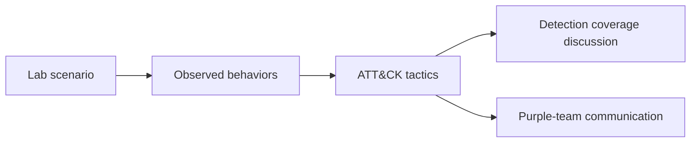

# Track 2 · Stage 2.5 — Attack Mapping in the Lab

## Why this stage matters

MITRE ATT&CK provides a common language for describing adversary behavior. In a laboratory (and later in a real SOC) it is far more useful to say “this activity maps to Credential Access and Discovery” than to describe every log line in isolation. Mapping laboratory scenarios to ATT&CK tactics improves communication with other analysts, purple-team partners (Track 5), and report readers. It also helps prioritize which detections to build next.

This stage is deliberately lightweight: you label laboratory activity with tactic names (and optionally technique IDs) for communication, not as a full threat-intelligence exercise.

---

## Learning objectives

By the end of this stage you will be able to:

- Select appropriate ATT&CK tactics for laboratory scenarios you have already run or observed
- Explain why tactic-level labels are useful even when technique-level detail is incomplete
- Produce a short mapping table that links a laboratory activity to 2–3 tactics
- Use the mapping to inform detection coverage discussions

---

## Prerequisites

- Stages 2.1–2.4 completed
- Familiarity with at least one laboratory scenario (recon, web testing, authentication brute force, etc.) from Phase-2 or earlier Track-2 stages
- Access to the ATT&CK matrix (enterprise) for reference — online or offline copy

---

## Safety checkpoint

1. Mapping is a documentation and communication activity only.
2. Do not use ATT&CK labels to justify any testing outside the laboratory.
3. Keep the focus on laboratory scenarios you control.

---

## Core concepts

### 1. Tactics versus techniques

- **Tactic** — the adversary’s tactical goal (e.g., Initial Access, Execution, Persistence, Credential Access, Discovery, Lateral Movement, Collection, Exfiltration, Impact).
- **Technique** — the specific method used to achieve that goal.

For early laboratory work, tactic-level labels are usually sufficient and more stable.

### 2. Why map laboratory activity

- Shared vocabulary with other tracks (especially Track 5 purple-team exercises)
- Coverage analysis: “Which tactics do our current detections address?”
- Report clarity: findings and alerts become easier to group and prioritize

### 3. Practical laboratory mapping examples

| Laboratory activity | Possible ATT&CK tactics |
|---------------------|-------------------------|
| Port scan or service enumeration against lab hosts | Discovery, Reconnaissance (if external) |
| Failed then successful SSH/RDP | Credential Access, Initial Access |
| Web injection or XSS on a training app | Initial Access (if it leads to further access), Execution (in some interpretations) |
| Creation of a new laboratory user or scheduled task | Persistence, Privilege Escalation |
| Reading sensitive files after access | Collection, Discovery |

Exact technique IDs are optional; the tactic names are the priority for this stage.

---

## Illustrative map: from lab activity to tactics



---

## Detailed laboratory walkthrough

1. Choose one laboratory scenario you have already performed (e.g., the authentication sequence from Stage 2.2 or a web test from Track 1).
2. List the observable behaviors (failed logons, successful logon, process start, web 404 burst, etc.).
3. Consult the ATT&CK matrix and assign 2–3 tactics that best describe the adversary goal illustrated by those behaviors.
4. Write a short mapping entry:

   ```
   Scenario: Laboratory SSH brute-force followed by success
   Behaviors: multiple  failed logons, one success, subsequent command
   Tactics: Credential Access, Initial Access, (optional) Execution
   Notes: Used for detection validation in Stage 2.3
   ```

5. Optionally note which of your existing detections cover each tactic.

---

## Common mistakes

- Forcing every laboratory action into an ATT&CK technique when the fit is poor.
- Using ATT&CK labels as a substitute for clear technical descriptions of what was observed.
- Mapping production incidents with laboratory-only evidence (keep contexts separate).

---

## Best practices

- Prefer tactics over techniques when the evidence is limited.
- Keep mappings short and linked to concrete laboratory evidence.
- Revisit mappings when you add new detections or run new scenarios.
- Use the same labels when communicating with Track 5 (adversary simulation) partners.

---

## Hands-on exercise

1. Map at least one Phase-2 or Track-2 laboratory scenario to 2–3 ATT&CK tactics.
2. Produce a one-paragraph or table entry as shown above.
3. Note any tactic for which you currently have no detection coverage.
4. Save the mapping for the capstone and for any purple-team exercises.

---

## Review questions

1. What is the difference between an ATT&CK tactic and a technique?
2. Why are tactic-level labels often sufficient for laboratory detection work?
3. How can attack mapping improve communication between a SOC track and an adversary-simulation track?
4. Give an example of a laboratory activity that maps naturally to Credential Access.
5. Why should mapping remain tied to concrete observed behaviors rather than assumed intent?

---

## Summary

- ATT&CK tactics provide a shared language for laboratory and SOC communication.
- Mapping is a lightweight documentation activity that improves detection coverage discussions.
- The mapping produced here feeds both the Track-2 capstone and collaboration with Track 5.

---

## Sources and further reading

- MITRE ATT&CK Enterprise matrix
- Phase-2 reconnaissance and web stages
- Track 5 overview (purple-team loop)

All practical work remains restricted to authorized laboratory environments.
