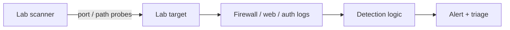

# Track 2 · Stage 2.6 — Detecting Web and Recon

## Why this stage matters

Reconnaissance and web-application probing are among the earliest activities an adversary (or an authorized laboratory tester) performs. Detecting them in a laboratory setting builds the same skills needed to notice external scanning, directory brute-forcing, or injection probing against production web assets. Because you control both the scanner and the target, you can generate clean true-positive data, write detections, and measure their effectiveness without collateral impact.

This stage links the recon and web work from Phase-2 and Track 1 with the detection-engineering practices of Track 2.

---

## Learning objectives

By the end of this stage you will be able to:

- Generate laboratory port-scan and web-probe traffic against authorized targets only
- Identify the log sources that capture that traffic (firewall, web access logs, authentication logs)
- Design or refine detections for scan noise and web authentication or error bursts
- Validate the detections with true-positive laboratory scenarios
- Document the detections in the same style used in Stages 2.3–2.4

---

## Prerequisites

- Stages 2.1–2.5 completed
- Laboratory network with at least one target host and one web application
- Safe scanning tools limited to the laboratory (e.g., `safe_lab_nmap.sh` or equivalent)
- Web access logs and authentication logs available

---

## Safety checkpoint

1. All scanning and probing must target only laboratory hosts and applications you control.
2. Use rate-limited or “safe” wrappers; never point general-purpose scanners at non-lab networks.
3. Snapshot targets if the probing might affect application state.
4. Do not use the laboratory detections as justification for scanning any external system.

---

## Core concepts

### 1. Observable signals of laboratory recon

| Activity | Typical laboratory signals |
|----------|----------------------------|
| Port scan | Multiple connection attempts to closed or filtered ports from one source; firewall denies; `nmap`-style timing |
| Service enumeration | Connection then quick disconnect, or protocol-specific probes |
| Web path discovery | High volume of 404 responses, sequential or wordlist-like paths |
| Web authentication probing | Bursts of 401/403 responses, failed logons in application or web-server logs |
| Injection probing | Unusual characters or SQL/script fragments in parameters (visible in access logs or WAF logs if present) |

### 2. Log sources that matter

- Host or network firewall logs
- Web-server access and error logs
- Application authentication logs
- Optionally IDS/IPS alerts if a laboratory sensor is present (Track 3)

### 3. Detection ideas (starting points)

- Threshold of connection attempts to closed ports from a single source IP within a short window
- Burst of 404 responses for distinct paths from one client
- Burst of failed web logons or 401s from one client
- Sequence: scan-like activity followed by a successful connection or login from the same source

---

## Illustrative map: lab recon detection

---

## Detailed laboratory walkthrough

1. From an authorized laboratory scanner host, run a controlled, low-rate port scan or web path discovery against a laboratory target (use the safe wrapper if provided).
2. Confirm the activity appears in the relevant logs.
3. Design or adjust a detection that would fire on that pattern.
4. Re-run the laboratory activity and verify the detection.
5. Generate a small amount of benign traffic and check for false positives.
6. Document the detection using the Stage 2.3 template and triage any alerts per Stage 2.4.

---

## Companion code

- `Codes/Bash/05_reconnaissance/safe_lab_nmap.sh` (or equivalent laboratory-safe scanner)
- Web-log parsers and detection demos under `Codes/Python/Track-2-SOC/` and `Codes/Python/09_logging_detection/`

---

## Common mistakes

- Running unrestricted scanners that overwhelm laboratory services or disk.
- Writing detections that only work for one tool’s exact signature instead of the general behavior.
- Ignoring web logs when the interesting signal is in the application layer rather than the network layer.

---

## Best practices

- Prefer behavioral thresholds over brittle signatures.
- Always validate with both true-positive and benign laboratory traffic.
- Rate-limit laboratory scanning so logs remain readable and services stay up.
- Link detections back to ATT&CK tactics (Discovery, Reconnaissance, Credential Access, etc.).

---

## Hands-on exercise

1. Execute one controlled laboratory port scan or web-probe scenario.
2. Write or refine at least one detection for the resulting noise.
3. Validate it, triage the alert, and record any tuning needed.
4. Add the detection to your growing pack for the capstone.

---

## Review questions

1. Which log sources are most useful for detecting a laboratory port scan?
2. Why might a burst of 404 responses be a useful web-recon signal?
3. How does rate-limiting laboratory scans improve both safety and detection quality?
4. Give an example of a sequence detection that links recon to a later successful action.
5. Why should laboratory recon detections still be documented with ATT&CK tactics?

---

## Summary

- Laboratory recon and web probing generate clean, controllable signals for detection practice.
- Firewall, web, and authentication logs are the primary sources.
- Behavioral detections validated in the lab transfer well to later operational use under proper authorization.
- The detections written here strengthen the Track-2 capstone pack.

---

## Sources and further reading

- Phase-2 Stages 5 and 7
- Track 1 (web findings become detection use cases)
- Safe laboratory scanning practices

All practical work remains restricted to authorized laboratory environments.
