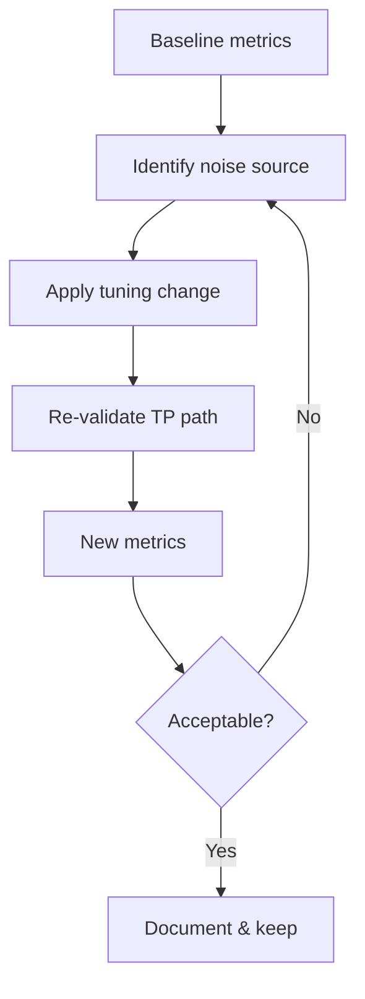

# Track 2 · Stage 2.7 — Tuning and Metrics

## Why this stage matters

A detection that fires constantly on benign laboratory activity is worse than no detection: it trains analysts to ignore alerts. Tuning is the disciplined process of adjusting logic, thresholds, or exceptions so that true positives still surface while false positives fall to an acceptable level. Metrics—alert volume before and after a change, true-positive rate in laboratory scenarios, time-to-triage—turn tuning from guesswork into evidence-based improvement.

This stage closes the loop on the detections designed earlier: measure, change, re-measure, document.

---

## Learning objectives

By the end of this stage you will be able to:

- Measure alert volume for a laboratory detection before and after a tuning change
- Decide whether to retune logic, add a narrow suppression, or disable a rule
- Record simple metrics that demonstrate improvement
- Re-validate the true-positive path after every change
- Document tuning decisions for the capstone pack

---

## Prerequisites

- Stages 2.1–2.6 completed
- At least one laboratory detection that produces both true positives and some noise
- Ability to generate controlled laboratory traffic and count alerts

---

## Safety checkpoint

1. Tune only laboratory detections.
2. Never disable or weaken rules on non-lab systems as part of this curriculum.
3. Keep a record of every change so the laboratory history is recoverable.

---

## Core concepts

### 1. Why measure

Without before/after numbers it is impossible to know whether a change helped. Even in a small laboratory, counting alerts over a fixed generation scenario is enough.

### 2. Tuning levers

| Lever | Example laboratory use |
|--------|-------------------------|
| Threshold | Raise from 5 to 15 failures in 5 minutes |
| Time window | Shorten or lengthen the correlation window |
| Inclusion / exclusion | Ignore a known laboratory scanner IP or account |
| Field precision | Require a specific service name or outcome code |
| Suppression (narrow) | Temporary exception during a scheduled lab exercise |

### 3. Decision guidance

- **Retune** when the rule is fundamentally noisy for normal laboratory activity.
- **Narrow suppression** when the exception is temporary or highly specific.
- **Disable** only when the detection has no remaining true-positive value in the laboratory (rare; prefer fixing).

### 4. Simple metrics

- Alert count for a standardized laboratory scenario (before / after)
- True-positive catch rate (did the intentional attack still alert?)
- Approximate false-positive rate under benign laboratory load
- Analyst notes on triage effort

---

## Illustrative map: tuning cycle

---

## Detailed laboratory walkthrough

1. Choose one noisy laboratory detection.
2. Generate a standardized true-positive scenario and a period of benign activity; record alert counts.
3. Apply one tuning change (threshold, exclusion, or window).
4. Re-run the same true-positive and benign scenarios; record new counts.
5. Confirm the intentional attack still produces an alert.
6. Document the change, the metrics, and the residual risk (if any).

---

## Common mistakes

- Changing multiple levers at once so the effect of each is unclear.
- Tuning away the true-positive path.
- Failing to record baseline numbers.
- Treating “zero alerts” as success when the detection is now blind.

---

## Best practices

- Change one variable at a time when possible.
- Always re-validate true positives.
- Prefer durable logic improvements over permanent broad suppressions.
- Keep tuning notes next to the detection design so the history is visible.

---

## Hands-on exercise

1. Select one laboratory detection that produces noise.
2. Capture baseline alert volume for a fixed scenario.
3. Apply and document one tuning change.
4. Capture post-change volume and confirm true-positive detection still works.
5. Add the before/after metrics and decision to your capstone materials.

---

## Review questions

1. Why is a baseline measurement necessary before tuning?
2. When is a narrow suppression preferable to raising a threshold?
3. What is the risk of tuning without re-validating the true-positive path?
4. Name two simple metrics that are practical in a laboratory setting.
5. How does documented tuning history help future analysts or purple-team exercises?

---

## Summary

- Tuning converts noisy detections into reliable ones.
- Metrics turn opinions into evidence.
- The laboratory is the ideal place to practice the measure–change–re-measure loop.
- Tuned detections and their metrics are required elements of the Track-2 capstone.

---

## Sources and further reading

- Detection engineering literature on alert fatigue and tuning
- Phase-2 Stage 9
- Earlier Track-2 stages

All practical work remains restricted to authorized laboratory environments.
