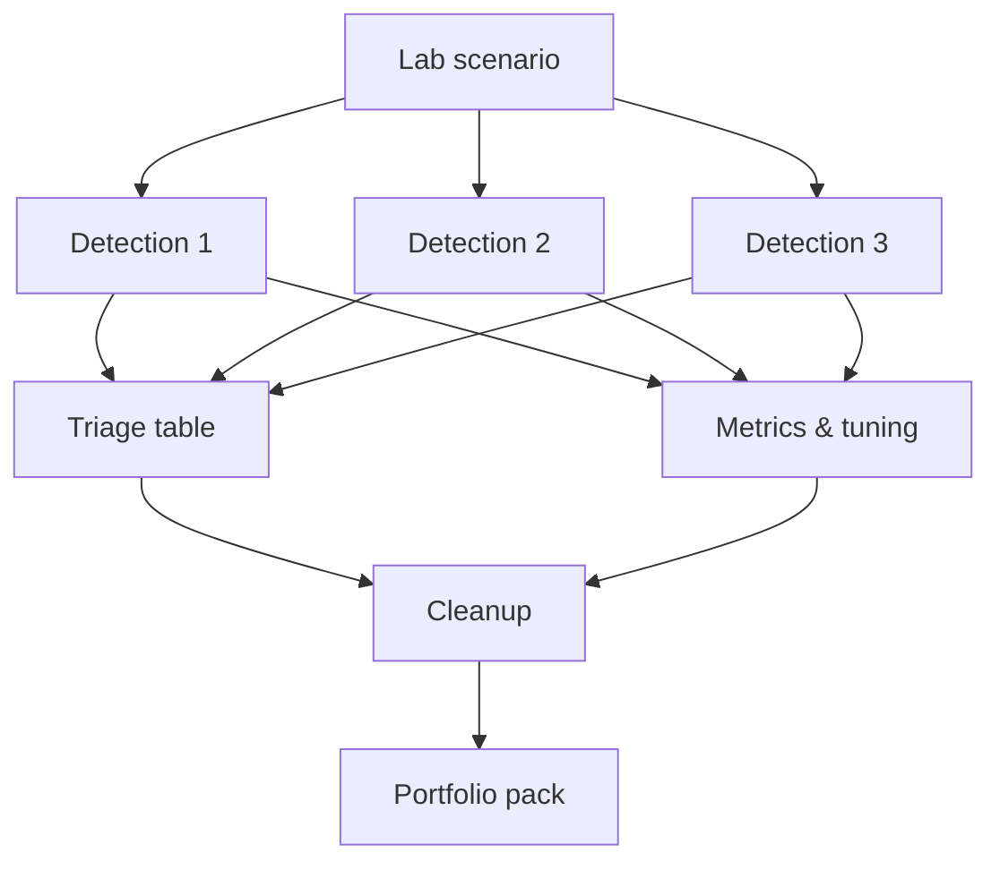

# Track 2 · Stage 2.8 — Capstone Detection Pack

## Why this stage matters

A detection pack is the tangible output of a detection-engineering effort: a coherent set of rules, the laboratory scenario that validates them, the triage discipline applied to their alerts, and the tuning history that keeps them healthy. Producing one in a controlled laboratory environment demonstrates that you can move from log inventory through design, validation, triage, and improvement—exactly the lifecycle expected in a SOC or detection team.

This capstone consolidates Stages 2.1–2.7 into a single portfolio artifact.

---

## Learning objectives

By the end of this stage you will be able to:

- Assemble a laboratory scenario that exercises multiple detections
- Deliver at least three documented detections with validation evidence
- Include a triage table and tuning notes
- Confirm laboratory cleanup and snapshot restoration
- Present the pack so that another practitioner could understand coverage, limitations, and next steps

---

## Prerequisites

- All prior Track-2 stages completed
- Laboratory environment still isolated and under your control
- Notebook entries, detection designs, triage tables, and metrics from earlier stages

---

## Safety checkpoint

1. The entire pack is generated and validated only inside the laboratory.
2. No rules, scripts, or traffic leave the lab boundary.
3. After validation, restore snapshots and remove any temporary laboratory accounts or test data.
4. Redact any laboratory credentials or tokens from the final pack.

---

## Required deliverable structure

### 1. Title and scope

- Pack name and date
- Laboratory targets and log sources used
- Explicit statement that all activity was authorized laboratory work only

### 2. Laboratory scenario

Describe the end-to-end scenario you will (or did) run to validate the pack. Example outline:

- Generate recon / scan noise against a laboratory host
- Generate authentication failures then a success
- Generate web-probe or error bursts against a laboratory application
- Optional: a simple post-access action that maps to an additional tactic

Include the ATT&CK tactics you expect the scenario to exercise (from Stage 2.5).

### 3. Detections (≥3)

For each detection provide:

- Name and plain-language description
- Logic / pattern (threshold, sequence, etc.)
- Log source(s) and key fields
- ATT&CK tactic label(s)
- True-positive validation result (did it fire on the laboratory scenario?)
- Known residual false-positive risks
- Tuning history summary (from Stage 2.7)

### 4. Triage table

A table of alerts generated during the validation run:

| Alert / Rule | Classification (TP/FP/BTP) | Key evidence | Decision / note |
|--------------|----------------------------|--------------|-----------------|

### 5. Metrics and tuning summary

- Before/after alert volumes for at least one tuned rule
- Confirmation that true-positive paths still work
- Any remaining gaps in coverage

### 6. Cleanup confirmation

- Snapshots restored
- Temporary accounts or files removed
- Laboratory services returned to baseline

### 7. Reflections / next steps (short)

- What the pack covers well
- What you would add with more time or additional log sources
- How the pack could support a purple-team exercise with Track 5

---

## Quality bar

A reader should be able to:

- Understand exactly which laboratory behaviors are covered
- Reproduce the validation scenario
- See that triage and tuning were performed deliberately
- Trust that the laboratory was left in a clean state

Avoid:

- Undocumented rules
- Claims of coverage for tactics you never exercised
- Unredacted secrets
- Missing true-positive confirmation

---

## Illustrative map: capstone assembly

---

## Hands-on deliverable

1. Finalize the laboratory scenario and run it.
2. Collect or re-validate at least three detections.
3. Complete the triage table and tuning notes.
4. Restore the laboratory environment.
5. Assemble the pack into a single markdown (or PDF-style) document and save it to your portfolio folder.

---

## Self-check before submission

- [ ] Scope limited to laboratory targets
- [ ] ≥3 detections with validation evidence
- [ ] Triage table present
- [ ] Tuning / metrics notes present
- [ ] Cleanup confirmed
- [ ] ATT&CK tactic labels used where appropriate
- [ ] No live credentials in the document

---

## Summary

- The detection pack is the portfolio proof of Track-2 competence.
- Scenario, detections, triage, tuning, and cleanup together demonstrate a complete detection-engineering cycle.
- Laboratory discipline remains non-negotiable.
- A well-structured pack transfers directly to professional detection work under proper authorization and change control.

---

## Sources and further reading

- All prior Track-2 stages
- Phase-2 Stage 9
- Detection-engineering community practices (conceptual)

All practical work remains restricted to authorized laboratory environments. Completion of this track does not authorize monitoring or detection engineering against any system outside your laboratory agreement.
