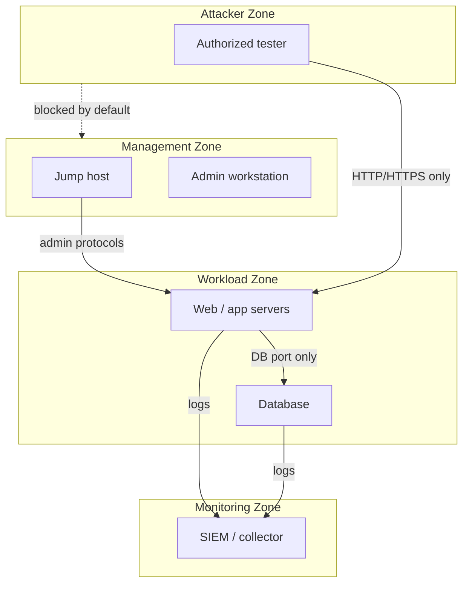

# Track 3 · Stage 3.1 — Segmentation and Policy

## Why this stage matters

Network segmentation is one of the highest-leverage defensive controls. By dividing a laboratory (or production) environment into zones with different trust levels and enforcing policy at the boundaries, you limit the blast radius of a compromised host, make lateral movement harder, and create natural monitoring points. Without clear zones and a default-deny mindset, every host can talk to every other host—exactly the condition that turns a single laboratory foothold into a full-environment compromise.

This stage teaches you to draw trust zones for your own laboratory, express simple policy intent, and prepare the ground for host hardening, vulnerability management, and monitoring in later stages.

---

## Learning objectives

By the end of this stage you will be able to:

- Identify and draw logical trust zones for a laboratory environment (e.g., management, workload, DMZ-like, attacker, monitoring)
- Express default-deny intent in plain policy language
- Map which laboratory services and hosts belong in which zone
- Explain how segmentation supports detection and incident response
- Produce an updated laboratory diagram that reflects the chosen zones

---

## Prerequisites

- Phase-2 laboratory still operational and isolated
- Basic familiarity with the laboratory network topology (from Phase-2 Stage 1 and Stage 4)
- Ability to take and restore snapshots of laboratory VMs or containers

---

## Safety checkpoint

1. All segmentation experiments stay inside the laboratory network you control.
2. Snapshot before changing firewall rules or virtual-network configuration.
3. Do not apply laboratory segmentation ideas directly to production networks without proper change control and testing.
4. Keep a documented path back to full laboratory connectivity so you can recover if a rule is too restrictive.

---

## Core concepts

### 1. Trust zones

A trust zone is a group of systems that share a similar security posture and are allowed to communicate more freely with each other than with systems outside the zone. Common laboratory zones include:

| Zone | Typical contents | Trust level |
|-------|-------------------|--------------|
| Management | Jump hosts, admin workstations, configuration servers | Higher (tightly controlled) |
| Workload / Application | Web apps, databases, lab services under test | Medium |
| Monitoring / SOC | Log collectors, SIEM, sensors | High (read-mostly from other zones) |
| Attacker / Red | Authorized testing VMs | Isolated; outbound only as needed |
| External / Untrusted | Simulated Internet or restricted uplink | Lowest |

### 2. Default-deny intent

Policy should start from “deny all” and then explicitly allow the flows required for the laboratory to function. This is the opposite of a flat network where everything is permitted unless blocked.

Plain-language examples:

- “Workload zone may initiate connections to the database port on the data-store host; no other zone may.”
- “Attacker zone may reach workload HTTP/HTTPS ports only; no management protocols.”
- “Monitoring zone may receive syslog and Windows event traffic from all zones; it initiates almost nothing.”

### 3. Policy enforcement points

In a laboratory these are typically:

- Hypervisor or virtual-switch firewall rules
- Host-based firewalls (nftables, firewalld, Windows Firewall)
- Optional laboratory router or filtering appliance

The exact technology matters less than the clarity of the zone boundaries and the default-deny posture.

### 4. Why segmentation helps detection

- Lateral movement must cross a boundary that can be logged and alerted.
- Anomalous flows between zones stand out more clearly than noise inside a flat network.
- Containment becomes a policy change rather than a hunt for every compromised host.

---

## Illustrative map: laboratory trust zones

---

## Detailed laboratory walkthrough

1. Inventory the current laboratory hosts and the services they offer.
2. Assign each host (or group of hosts) to a logical zone.
3. Draw or update a diagram showing the zones and the intended allowed flows.
4. Express the policy in a short list of allow statements; everything else is denied.
5. (Optional) Implement a subset of the policy on host firewalls or the virtual network and test that required laboratory workflows still succeed.
6. Document the zone diagram and the policy list; they become the baseline for later Track-3 stages.

---

## Common mistakes

- Creating zones on paper but leaving the laboratory network completely flat.
- Allowing the attacker zone unrestricted access “for convenience.”
- Forgetting that monitoring systems themselves need protection and controlled access.
- Changing rules without a snapshot or a documented rollback path.

---

## Best practices

- Start simple: three or four zones are enough for most laboratories.
- Prefer explicit allow lists over complex exception stacks.
- Revisit the diagram whenever you add a new laboratory service.
- Use the same zone names in detection rules and incident notes so communication stays consistent.
- Treat the management zone as high-value; protect it accordingly.

---

## Hands-on exercise

1. Produce an updated laboratory network diagram that shows at least three trust zones.
2. Write a short default-deny policy list (5–10 allow statements) in plain language.
3. Identify one flow that currently exists but should be blocked or restricted according to the new policy.
4. Save the diagram and policy; they feed Stages 3.2–3.7 and the Track-3 capstone.

---

## Review questions

1. What is the practical difference between a flat laboratory network and a segmented one?
2. Why does default-deny make lateral movement harder for an adversary?
3. Name three laboratory zones that are commonly useful and the primary purpose of each.
4. How does segmentation improve the signal-to-noise ratio for network detections?
5. What should you do before implementing a restrictive firewall rule in the laboratory?

---

## Summary

- Segmentation divides the laboratory into trust zones with controlled boundaries.
- Default-deny policy forces intentional communication paths.
- Clear zones support monitoring, detection, and containment.
- The diagram and policy list produced here are foundational for the rest of Track 3.

---

## Sources and further reading

- NIST SP 800-215 (Guide to a Secure Enterprise Network Landscape) — conceptual
- Zero-trust architecture literature (high-level principles)
- Phase-2 laboratory setup and network analysis stages
- Track 2 (detections that benefit from zone-crossing signals)

All practical work remains restricted to authorized laboratory environments.
