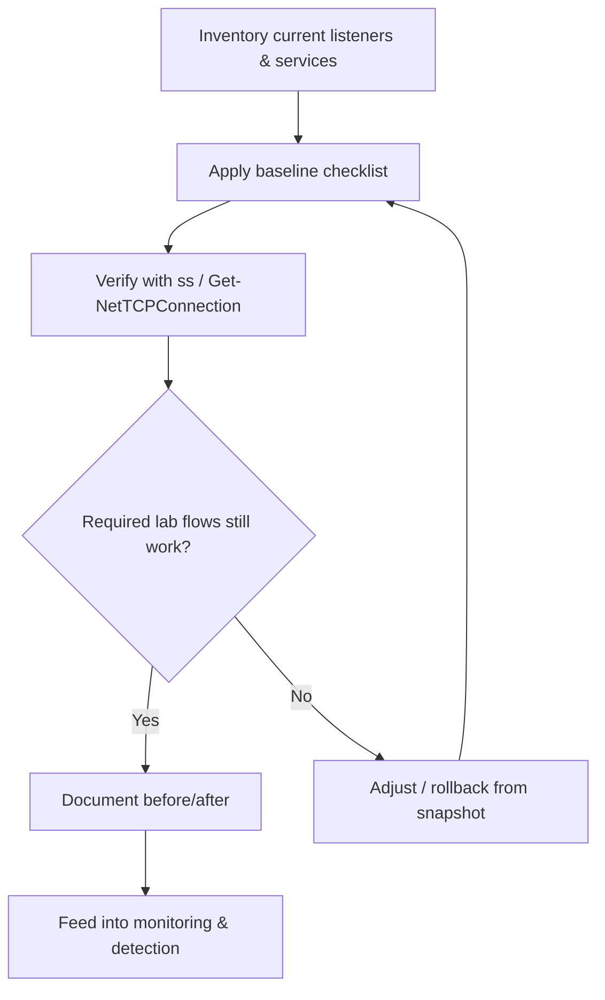

# Track 3 · Stage 3.2 — Host Hardening Baselines

## Why this stage matters

Segmentation (Stage 3.1) reduces the blast radius of a compromise; host hardening reduces the probability that a compromise succeeds in the first place. A hardened laboratory host exposes fewer services, runs with least privilege, has unnecessary software removed, and presents a smaller attack surface to any authorized tester or simulated adversary.

Baselines turn ad-hoc hardening into a repeatable, auditable practice. In a laboratory they also create cleaner signals for detection work (Track 2) because normal noise is lower and unexpected listeners stand out.

---

## Learning objectives

By the end of this stage you will be able to:

- Apply a concise hardening baseline checklist to a laboratory Linux and/or Windows host
- Identify and reduce unnecessary listening services and open ports
- Verify the result with standard tooling (`ss`, `Get-NetTCPConnection`, etc.)
- Document the before/after state so the change is reproducible and reversible
- Relate host hardening to the trust zones defined in Stage 3.1

---

## Prerequisites

- Stage 3.1 completed (zones and default-deny intent defined)
- At least one laboratory Linux VM and, ideally, one Windows VM under your control
- Snapshot capability before any change
- Familiarity with basic package and service management from Phase-2

---

## Safety checkpoint

1. Snapshot every laboratory host before applying hardening changes.
2. Work only on hosts that belong to your isolated laboratory.
3. Prefer reversible changes (disable service, tighten firewall rule) over irreversible ones.
4. Keep a documented path back to a functional laboratory state.
5. Do not apply these laboratory baselines to production systems without proper testing and change control.

---

## Core concepts

### 1. What a baseline covers (laboratory focus)

| Area | Linux examples | Windows examples |
|-------|-----------------|-------------------|
| Listening services | Disable unused daemons; confirm with `ss -tulpn` | Stop/disable unnecessary services; `Get-NetTCPConnection` |
| Local firewall | nftables / firewalld / ufw default-deny + explicit allows | Windows Firewall with advanced security |
| Accounts & privileges | No passwordless sudo for routine work; remove unused accounts | Local admin limited; LAPS-style ideas conceptual only |
| Patch & package state | Only required packages; timely updates inside lab | Only required features; Windows Update in lab |
| Logging | auth, process, firewall logs retained | Security + Sysmon if present |
| Unnecessary software | Remove compilers, old interpreters, sample apps if not needed | Remove optional features not required for the lab role |

### 2. Principle of least functionality

A host should run only the services required for its laboratory role. A pure database host does not need a web server; a jump host does not need a full desktop application stack. Reducing functionality reduces both attack surface and the volume of normal log noise.

### 3. Verification is part of the baseline

Hardening without verification is incomplete. After each change:

- Re-list listening ports
- Confirm required laboratory workflows still succeed
- Confirm the host still appears in the correct trust zone and can reach (or be reached by) the intended peers

### 4. Relation to zones

Hosts in the Management zone typically tolerate fewer listening services and stricter local firewall rules than hosts in a Workload zone that must accept application traffic. The baseline should be role-aware.

---

## Illustrative map: host hardening feedback loop



---

## Detailed laboratory walkthrough

### Linux laboratory host

1. Snapshot the VM.
2. Run an inventory:
```bash
   ss -tulpn
   systemctl list-units --type=service --state=running
```
3. Identify services that are not required for the host’s laboratory role.
4. Disable or mask them (`systemctl disable --now …` or equivalent).
5. Tighten the local firewall to match the zone policy from Stage 3.1 (default-deny + explicit allows).
6. Re-run `ss -tulpn` and confirm only expected ports remain.
7. Test the laboratory workflows that depend on this host.
8. Record before/after listening ports and the services that were changed.

### Windows laboratory host (if available)

1. Snapshot.
2. Inventory:
```powershell
   Get-NetTCPConnection -State Listen
   Get-Service | Where-Object Status -eq 'Running'
```
3. Stop and disable services that are not required.
4. Review Windows Firewall rules; ensure they align with the zone policy.
5. Re-verify listeners and laboratory connectivity.
6. Document the changes.

Companion scripts such as `Codes/Bash/02_linux_security/host_inspect.sh` and `Codes/PowerShell/03_windows_security/Host-Inspect.ps1` can accelerate the inventory step; use them only on laboratory hosts.

---

## Common mistakes

- Disabling a service that a laboratory workflow silently depends on, then spending hours debugging connectivity.
- Hardening only the attacker or analysis VM while leaving the target hosts wide open.
- Applying a generic “CIS-style” checklist without adapting it to the laboratory role of the host.
- Forgetting to re-enable or re-configure logging after service changes.

---

## Best practices

- Snapshot first, change second, verify third, document fourth.
- Keep baselines short and role-specific rather than encyclopedic.
- Prefer disabling services over uninstalling packages when reversibility matters.
- Align every local firewall rule with the zone policy written in Stage 3.1.
- Re-run the inventory after any major laboratory change (new application, new zone, etc.).

---

## Hands-on exercise

1. Select one Linux and (if available) one Windows laboratory host.
2. Produce a short before/after report: listening ports, services disabled, firewall posture.
3. Confirm that the host still fulfills its laboratory role and respects the zone boundaries.
4. Save the report; it becomes evidence for the Track-3 capstone.

---

## Review questions

1. Why is verification an essential part of a hardening baseline?
2. How does host hardening interact with the trust zones defined in Stage 3.1?
3. What is the practical difference between disabling a service and removing the package that provides it?
4. Name three categories of listening services that are commonly unnecessary on a pure laboratory database host.
5. Why should laboratory hardening changes be documented with before/after evidence?

---

## Summary

- Host hardening reduces attack surface and normal noise.
- A short, role-aware baseline checklist is more useful in a laboratory than an exhaustive standard applied blindly.
- Verification and documentation turn hardening into a repeatable practice.
- The before/after evidence produced here supports later monitoring and the Track-3 capstone.

---

## Sources and further reading

- CIS Benchmarks (selected sections, conceptual use only in lab)
- Phase-2 Linux and Windows security stages
- NIST SP 800-123 (Guide to General Server Security) — high-level principles
- Companion scripts under `Codes/Bash/02_linux_security/` and `Codes/PowerShell/03_windows_security/`

All practical work remains restricted to authorized laboratory environments.
