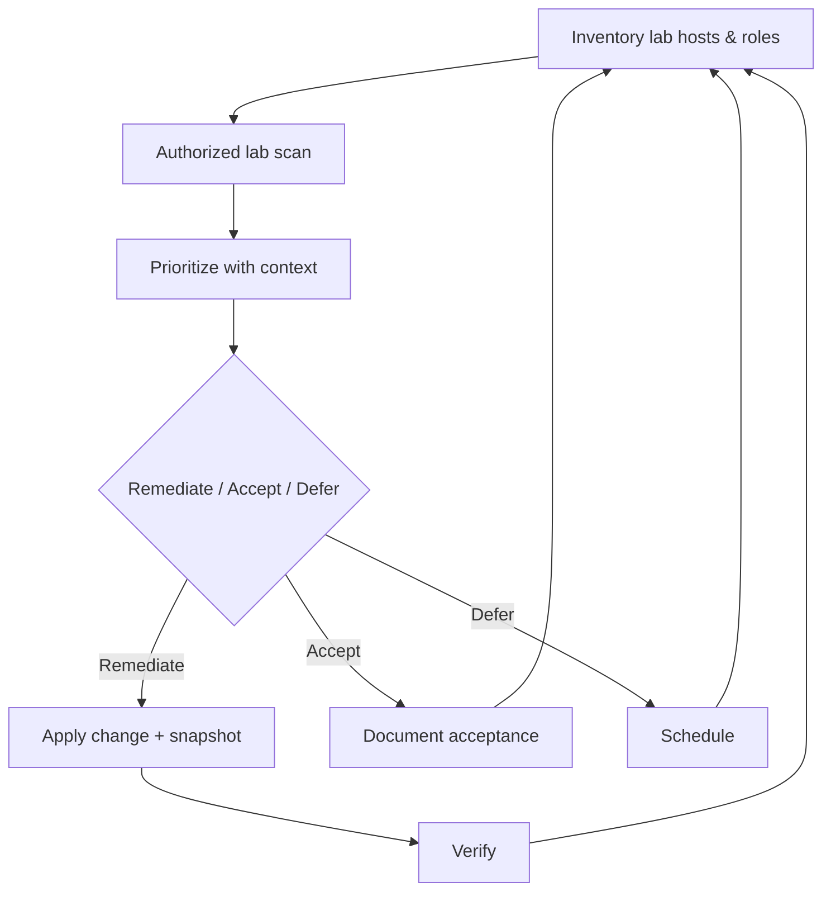

# Track 3 · Stage 3.3 — Vulnerability Management Cycle

## Why this stage matters

Vulnerability management is the continuous process of discovering, prioritizing, remediating, and verifying weaknesses in systems you are authorized to assess. In a laboratory it is the disciplined way to keep your own training targets intentionally vulnerable only where you want them to be, while hardening everything else. The same cycle—inventory, scan, prioritize, remediate, verify—transfers directly to operational environments under proper authorization and change control.

This stage focuses on a lightweight, laboratory-scale version of the cycle so you practice the thinking without the scale or risk of a production vulnerability-management program.

---

## Learning objectives

By the end of this stage you will be able to:

- Execute a complete laboratory vulnerability-management cycle: inventory → authorized scan → prioritization → remediation decision → verification
- Distinguish between “intentionally vulnerable for training” and “unintentionally exposed”
- Prioritize findings with laboratory context (exploitability in the lab, affected zone, compensating controls)
- Document top findings with clear evidence and a remediation or acceptance decision
- Verify that a remediation actually reduced the observed exposure

---

## Prerequisites

- Stages 3.1 and 3.2 completed (zones defined, hosts at least partially hardened)
- Laboratory hosts that you own and may scan
- Safe laboratory scanning tools (e.g., `safe_lab_nmap.sh` or equivalent)
- Snapshot capability

---

## Safety checkpoint

1. Scan only laboratory hosts that you control and that are explicitly in scope.
2. Use rate-limited or “safe” wrappers; never point general-purpose scanners at non-lab networks.
3. Snapshot before any remediation that changes configuration or packages.
4. Do not treat laboratory scan results as authorization to scan any other system.
5. Prefer non-destructive verification (re-scan, banner check, version check) over exploit attempts unless the finding is on an intentional training application.

---

## Core concepts

### 1. The laboratory cycle

```
Inventory → Authorized Scan → Prioritize → Decide (remediate / accept / defer) → Verify → Re-inventory
```

Each step is lightweight in a laboratory but still deliberate.

### 2. Inventory first

Know what you are scanning: hostnames/IPs, roles, zones, operating systems, and the services that should be present. An unexpected listener discovered during hardening (Stage 3.2) is already part of the inventory.

### 3. Authorized laboratory scanning

- Scope is the laboratory network or a single host.
- Tools are limited to those approved for the lab (safe nmap wrappers, OpenVAS/Greenbone in a lab container, etc.).
- Intensity is controlled so services remain usable for other laboratory work.

### 4. Prioritization with context

Severity scores (CVSS, etc.) are a starting point, not the final answer. Laboratory context includes:

- Is the service intentionally exposed for training (DVWA, Juice Shop, etc.)?
- Which trust zone contains the host?
- Are there compensating controls (segmentation, local firewall, least privilege)?
- Is the finding remotely exploitable inside the lab network?

A high-severity finding on an intentional training application may be accepted for educational purposes; the same finding on a management-zone jump host should be remediated promptly.

### 5. Remediation versus acceptance

- **Remediate** — patch, disable service, tighten configuration, apply compensating control.
- **Accept** — document why the risk is tolerated inside the laboratory (usually because the host is a deliberate training target).
- **Defer** — schedule for a later laboratory maintenance window; still document.

### 6. Verification

After remediation, re-scan or re-check the specific finding. Confirmation that the exposure is gone (or reduced) closes the loop.

---

## Illustrative map: laboratory vulnerability cycle



---

## Detailed laboratory walkthrough

1. Select one laboratory host (or a small group) and record its role and zone.
2. Run a controlled, laboratory-only scan (version detection, safe scripts, or a vulnerability scanner confined to the lab).
3. Review findings; separate intentional training exposures from unintentional ones.
4. Choose the top three findings that are not deliberate training vulnerabilities.
5. For each of the three:
   - Record evidence (port, service, version, scanner output excerpt)
   - Assign a laboratory priority
   - Decide remediate / accept / defer and write a one-sentence rationale
6. If remediating, snapshot, apply the change, and re-verify.
7. Update the inventory and the zone diagram if the host’s exposure profile changed.

Companion helpers such as `Codes/Bash/05_reconnaissance/safe_lab_nmap.sh` and conceptual severity demos under `Codes/Python/06_vulnerability/` may be used—only against laboratory targets.

---

## Common mistakes

- Scanning systems outside the laboratory boundary “to see what happens.”
- Treating every CVSS High as equally urgent without laboratory context.
- Remediating an intentional training vulnerability and thereby breaking later Track-1 or Track-5 exercises.
- Failing to verify after a change, leaving the finding open while believing it is closed.

---

## Best practices

- Keep the cycle short and frequent in a laboratory; small continuous improvement beats rare large scans.
- Always separate “training target” from “should be hardened.”
- Document acceptance decisions so future you (or another learner) understands why a finding remains.
- Align prioritization with the trust zones from Stage 3.1—management zone findings usually outrank workload-zone training findings.
- Feed residual findings into monitoring and detection (Track 2 / Stage 3.6).

---

## Hands-on exercise

1. Complete one full laboratory cycle on a single host or small set of hosts.
2. Produce a short report containing:
   - Inventory snapshot
   - Scan scope and tool
   - Top three non-training findings with evidence, priority, and decision
   - Verification result for any remediation performed
3. Save the report for the Track-3 capstone.

---

## Review questions

1. Why must inventory precede scanning in a vulnerability-management cycle?
2. How does laboratory context change the priority of a high-severity finding?
3. What is the difference between accepting a finding and simply ignoring it?
4. Why is verification a required step after remediation?
5. How can residual vulnerability findings improve network monitoring in Stage 3.6?

---

## Summary

- Vulnerability management is a continuous cycle, not a one-time scan.
- Laboratory practice focuses on clear scope, contextual prioritization, and verification.
- Intentional training exposures are managed deliberately; everything else is hardened or accepted with documentation.
- The cycle report produced here is a core artifact for the Track-3 capstone.

---

## Sources and further reading

- NIST SP 800-40 (Guide to Enterprise Patch Management Technologies) — conceptual
- Phase-2 Stage 6 (Vulnerability Assessment Concepts)
- CIS Controls (selected) — laboratory adaptation only
- Safe laboratory scanning practices

All practical work remains restricted to authorized laboratory environments.
