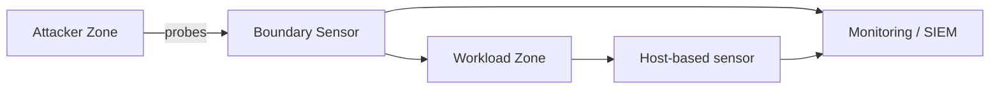

# Track 3 · Stage 3.4 — IDS/IPS Concepts

## Why this stage matters

Intrusion Detection Systems (IDS) and Intrusion Prevention Systems (IPS) sit on the network or host path and evaluate traffic or system activity against known patterns or behavioral baselines. In a laboratory they provide a concrete way to observe how reconnaissance, exploitation attempts, and policy violations can be turned into alerts. Understanding the difference between detection and prevention, signature versus anomaly approaches, and the importance of sensor placement prepares you both for defending the laboratory and for collaborating with detection engineers (Track 2).

This stage stays conceptual and laboratory-focused: you generate traffic you already understand and reason about what a sensor would see, without requiring a full production-grade IDS deployment.

---

## Learning objectives

By the end of this stage you will be able to:

- Explain the difference between IDS (detect and alert) and IPS (detect and block/react)
- Contrast signature-based and anomaly-based detection at a conceptual level
- Reason about sensor placement relative to the trust zones defined in Stage 3.1
- Generate laboratory traffic and describe the observable signals an IDS might raise
- Identify common limitations (evasion, false positives, encrypted traffic) that affect laboratory and operational sensors alike

---

## Prerequisites

- Stages 3.1–3.3 completed
- Ability to generate controlled laboratory traffic (scans, web probes, authentication noise)
- Optional: a lightweight laboratory IDS/IPS (Suricata, Snort in IDS mode, or a host-based sensor) already present in the lab

---

## Safety checkpoint

1. All traffic generation remains inside the laboratory.
2. If an IPS mode is available, use it only on laboratory segments and with a clear rollback path (snapshots).
3. Do not point laboratory sensors or rules at non-lab networks.
4. Prefer IDS (alert-only) mode while learning; enable blocking only after the alert behavior is understood.

---

## Core concepts

### 1. IDS versus IPS

| Mode | Action on match | Typical laboratory use |
|------|-----------------|------------------------|
| **IDS** | Generate alert / log | Learning, tuning, validation of detections |
| **IPS** | Alert and drop / reject / reset | Demonstrating prevention; requires careful testing so laboratory workflows are not broken |

Many modern engines can operate in either mode; the distinction is policy, not pure technology.

### 2. Signature versus anomaly

- **Signature-based** — matches known patterns (rule for a specific exploit, port-scan threshold, known bad user-agent, etc.). High precision for known threats; blind to novel ones.
- **Anomaly-based** — models “normal” and alerts on deviation. Can surface unknown activity; prone to false positives when the laboratory baseline is still changing.

Most practical laboratory sensors start with signature / threshold rules and later add simple statistical or behavioral checks.

### 3. Sensor placement and zones

Placement determines what the sensor can see:

- **Inline / on the boundary** between zones — sees traffic that crosses trust boundaries (ideal for policy-violation and lateral-movement signals).
- **Span / tap on a workload segment** — sees east-west traffic inside a zone.
- **Host-based** — sees activity on a single laboratory host (process, file, local network).

Align sensor placement with the zone diagram from Stage 3.1. A sensor that never sees the attacker-to-workload path will never alert on the laboratory scan you just ran.

### 4. Limitations you will observe in the lab

- Encrypted traffic (HTTPS, SSH) hides payload; metadata and certificates remain visible.
- Fragmentation, encoding, and protocol tricks can evade simple signatures.
- Noisy laboratory activity (your own scans, updates, other learners) generates false positives until tuned.
- A sensor without context (zone, asset role, expected services) produces low-value alerts.

---

## Illustrative map: sensor relative to zones

---

## Detailed laboratory walkthrough

1. Review the zone diagram and choose one boundary or host where a sensor would be valuable.
2. Generate controlled laboratory traffic that should be visible at that point (port scan, web 404 burst, failed authentication, etc.).
3. If a laboratory IDS is available, observe whether it alerts and on which rule or threshold.
4. If no sensor is present, write a short “what an IDS would see” note: source, destination, volume, distinctive patterns, and a suggested rule or threshold.
5. Discuss (or document) one limitation—e.g., the traffic was encrypted, or the scan was slow enough to stay under a threshold.
6. Optionally add or tighten a laboratory rule and re-generate the traffic to confirm the alert.

---

## Common mistakes

- Expecting an IDS to “see everything” when it is placed only on one segment.
- Enabling IPS blocking before understanding the alert volume, thereby breaking laboratory workflows.
- Treating a signature match as proof of successful exploitation rather than proof of attempted or matching traffic.
- Ignoring encrypted traffic and assuming payload-based rules will always fire.

---

## Best practices

- Place sensors where zone-crossing or high-value traffic occurs.
- Start in IDS (alert-only) mode; move to IPS only after tuning.
- Combine network sensors with host-based and log-based detections (Track 2) for defense in depth.
- Document the laboratory traffic that each rule is intended to catch so future tuning is possible.
- Accept that some laboratory activity will always look anomalous until baselines mature.

---

## Hands-on exercise

1. Generate one laboratory traffic pattern (scan, web probe, or auth noise).
2. Write a short note describing:
   - Where a sensor should sit to observe it
   - What signature or threshold would catch it
   - One limitation that might reduce detection quality
3. If a laboratory sensor exists, capture the actual alert (or its absence) and explain it.
4. Save the note for the Track-3 capstone and for detection discussions with Track 2.

---

## Review questions

1. What is the operational difference between IDS and IPS mode?
2. Why does sensor placement relative to trust zones matter more than the brand of the sensor?
3. Give one advantage and one disadvantage of signature-based detection in a laboratory.
4. How can encrypted traffic limit what a network IDS can observe?
5. Why should laboratory IPS rules be introduced only after IDS behavior is understood?

---

## Summary

- IDS detects and alerts; IPS can also block—choose the mode deliberately in the laboratory.
- Signature and anomaly approaches complement each other; most lab work starts with signatures and thresholds.
- Placement on zone boundaries maximizes the value of the signals you already generate.
- Understanding limitations prevents over-confidence in any single sensor.

---

## Sources and further reading

- NIST SP 800-94 (Guide to Intrusion Detection and Prevention Systems) — conceptual
- Suricata / Snort documentation (laboratory instances)
- Phase-2 network analysis and logging stages
- Track 2 detection-engineering practices

All practical work remains restricted to authorized laboratory environments.
