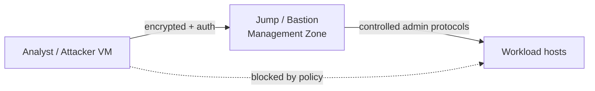

# Track 3 · Stage 3.5 — Remote Access and VPN Concepts

## Why this stage matters

Remote access is one of the most common ways laboratory (and production) environments are compromised. Administrative interfaces left reachable from untrusted networks, weak or missing multi-factor authentication, and poorly segmented VPN termination points turn a single stolen credential into full environment access. In a laboratory the same principles apply at smaller scale: how you reach your VMs, whether that path is encrypted and authenticated, and whether administrative services are exposed beyond the management zone.

This stage focuses on conceptual clarity and laboratory self-assessment rather than vendor-specific VPN configuration.

---

## Learning objectives

By the end of this stage you will be able to:

- Explain why administrative interfaces (SSH, RDP, management web UIs, hypervisor consoles) should not be exposed to untrusted networks
- Describe a VPN (or equivalent encrypted tunnel) as both a confidentiality control and a policy-enforcement point
- Assess the current remote-access path used to reach your laboratory VMs and identify exposure risks
- Propose a simple laboratory remote-access pattern that respects the trust zones from Stage 3.1
- Relate remote-access hardening to detection opportunities (Track 2) and host baselines (Stage 3.2)

---

## Prerequisites

- Stages 3.1–3.4 completed
- Working knowledge of how you currently connect to laboratory VMs (SSH, RDP, console, etc.)
- Snapshot capability before any access-path changes

---

## Safety checkpoint

1. Do not expose laboratory administrative ports to the public Internet as part of this curriculum.
2. Any VPN or tunnel experiments stay inside the laboratory or a controlled personal environment you own.
3. Snapshot before changing SSH/RDP configuration or firewall rules that affect remote access.
4. Keep a non-network console or hypervisor access path available so you can recover if you lock yourself out.

---

## Core concepts

### 1. Administrative interfaces as high-value targets

SSH, RDP, WinRM, hypervisor APIs, and management web interfaces grant privileged control. When they are reachable from an untrusted network:

- Credential-guessing and credential-stuffing become practical.
- Unpatched vulnerabilities in the service itself become remotely exploitable.
- Successful authentication often yields immediate high privilege.

The laboratory equivalent is an SSH or RDP port left open on a host that also sits in a workload or external-facing zone.

### 2. VPN (and equivalent tunnels) as dual-purpose controls

A VPN or encrypted tunnel provides:

- **Confidentiality and integrity** — traffic is protected in transit.
- **Authentication** — only authorized identities obtain a tunnel.
- **Policy enforcement point** — once the tunnel terminates, the client can be placed into a specific trust zone or subjected to additional checks (device posture, MFA, etc.).

In a laboratory the “VPN” may be as simple as an SSH jump host, a WireGuard or OpenVPN instance confined to the lab, or a cloud-provider bastion. The principle is the same: administrative traffic should arrive through a controlled, authenticated, encrypted path rather than direct exposure.

### 3. Laboratory remote-access patterns (conceptual)

Preferred laboratory pattern:

1. Attacker / analysis workstation reaches only a jump / bastion host (management zone).
2. From the bastion, further access to workload hosts is allowed according to the zone policy.
3. Direct administrative ports on workload hosts are blocked from the attacker zone and from any external interface.

Less preferred (but common in early labs):

- Direct SSH/RDP from the analysis VM to every host, with host firewalls still open.

The goal of this stage is to move deliberately from the less-preferred pattern toward the preferred one.

### 4. Detection and monitoring implications

- Failed and successful authentications to the bastion or VPN concentrator are high-value log sources (Track 2).
- Connections that bypass the intended path (direct hits on workload admin ports) should be visible to network sensors or host firewalls (Stages 3.4 and 3.2).
- Anomalous source locations or times for administrative logons become detectable once a baseline path is established.

---

## Illustrative map: preferred laboratory remote-access path

---

## Detailed laboratory walkthrough

1. Document the current method you use to reach each laboratory VM (protocol, source, destination port, whether encryption is used).
2. Identify any administrative port that is reachable from outside the management zone or from an untrusted interface.
3. Design a simple improvement: introduce or reinforce a jump host, tighten host firewall rules so that workload admin ports accept connections only from the management zone, or both.
4. (Optional) Implement the improvement on one laboratory host, verify connectivity via the intended path, and confirm that the direct path is now blocked.
5. Note the authentication and connection logs that the new path produces; these become useful for Track 2 detections.
6. Update the zone diagram and policy list from Stage 3.1 if the remote-access pattern changed.

---

## Common mistakes

- Leaving RDP or SSH open on every laboratory host “for convenience.”
- Assuming that a VPN alone solves access control without also placing the tunnel endpoint in the correct zone and enforcing further policy.
- Changing remote-access rules without a console fallback and then locking yourself out of the laboratory.
- Treating laboratory VPN experiments as authorization to expose real production management interfaces.

---

## Best practices

- Prefer a single (or small number of) hardened entry point(s) over many exposed admin ports.
- Require strong authentication (keys, MFA concepts) on the entry point.
- Align the entry point with the management zone and default-deny policy.
- Log all administrative authentications and treat anomalies as high-priority signals.
- Keep a non-network recovery path (hypervisor console, physical access, out-of-band) for laboratory recovery.

---

## Hands-on exercise

1. Produce a short inventory of current remote-access paths to your laboratory hosts.
2. Identify at least one exposure risk (direct admin port, missing encryption, overly broad source).
3. Propose or implement a concrete improvement that respects the trust zones.
4. Document the before/after access path and any new log sources created.
5. Save the notes for the Track-3 capstone.

---

## Review questions

1. Why are administrative interfaces especially attractive to adversaries?
2. In what two ways does a VPN (or equivalent tunnel) improve remote-access security?
3. How does placing a jump host in the management zone support the default-deny policy from Stage 3.1?
4. What laboratory log sources become more valuable once a controlled remote-access path is established?
5. Why should a non-network recovery path be retained when tightening laboratory remote access?

---

## Summary

- Administrative interfaces must not be left reachable from untrusted networks.
- Encrypted, authenticated tunnels serve both confidentiality and policy-enforcement roles.
- A laboratory that funnels remote access through a hardened management-zone entry point is easier to monitor and harder to compromise.
- The access-path assessment and improvement produced here strengthen both defense and detection.

---

## Sources and further reading

- NIST SP 800-46 (Guide to Enterprise Telework, Remote Access, and Bring Your Own Device Security) — conceptual
- Phase-2 Windows and Linux security stages
- Track 2 authentication-detection practices
- Vendor VPN documentation (laboratory instances only)

All practical work remains restricted to authorized laboratory environments.
