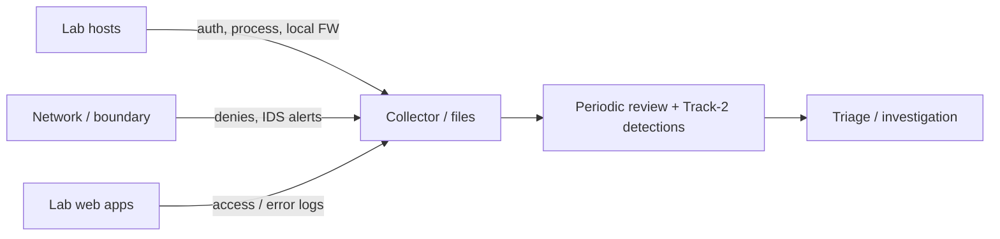

# Track 3 · Stage 3.6 — Monitoring the Lab Network

## Why this stage matters

Segmentation, hardening, vulnerability management, sensors, and controlled remote access only deliver value if someone is watching the resulting signals. Laboratory monitoring is the practice of deliberately collecting a small, high-value set of host and network observables so that anomalous activity—whether from an authorized tester, a misconfiguration, or a simulated adversary—can be noticed and investigated.

This stage defines a minimum viable monitoring set for a small laboratory and links it to the detections and triage skills developed in Track 2.

---

## Learning objectives

By the end of this stage you will be able to:

- Define a minimum monitoring set (host + network signals) appropriate for a small laboratory
- Map each signal to the trust zones, hardening baselines, and remote-access paths already established
- Decide what to retain, for how long, and where it will be reviewed
- Produce a short monitoring plan that can be sustained for at least two weeks of laboratory study
- Identify gaps that would be filled by additional sensors or log sources later

---

## Prerequisites

- Stages 3.1–3.5 completed
- Track 2 Stages 2.1–2.2 at least (log sources and search)
- Laboratory hosts still generating the logs and network traffic previously discussed

---

## Safety checkpoint

1. Monitoring stays inside the laboratory; do not forward laboratory logs to external commercial services unless you fully control the destination and the data is non-sensitive.
2. Retention periods should respect laboratory disk limits; do not fill disks and then lose other work.
3. Access to the monitoring data itself should follow the same zone and remote-access principles already defined.

---

## Core concepts

### 1. Minimum laboratory monitoring set

A practical starting set for a small lab:

| Signal category | Examples | Why it matters |
|-----------------|----------|----------------|
| Authentication | Failed/successful SSH, RDP, VPN, web logons | Brute force, credential use, remote-access abuse |
| Network policy | Firewall denies, unexpected zone-crossing attempts | Segmentation violations, lateral movement attempts |
| Host listeners & process | New listening ports, unusual process starts | Persistence, unauthorized services |
| Web / application | Access logs (status codes, unusual paths), auth failures | Recon, injection probes, Track-1 findings |
| Sensor / IDS | Alerts from laboratory IDS/IPS if present | Known bad patterns, threshold breaches |
| System health | Disk, critical service down | Availability and laboratory reliability |

You do not need every possible source on day one. Start with authentication + firewall/policy + one application log, then expand.

### 2. Collection and review cadence

- **Collection** — already covered in Track 2 Stage 2.1 (ship → parse → store). In a minimal lab this may be local files plus occasional central copy.
- **Review** — scheduled (e.g., daily or after each laboratory exercise) rather than purely real-time. Laboratory scale makes periodic review realistic.
- **Retention** — enough history to reconstruct a multi-day laboratory scenario (often 7–14 days is sufficient).

### 3. Linking monitoring to prior stages

- Zone diagram (3.1) tells you which boundaries are worth watching.
- Hardening baselines (3.2) reduce normal noise so anomalies stand out.
- Vulnerability findings (3.3) that were accepted or deferred become explicit watch items.
- IDS placement (3.4) and remote-access path (3.5) define high-value log sources.

### 4. From monitoring to detection

The signals you choose to keep are the raw material for the detections designed in Track 2. A monitoring plan that ignores authentication failures will make brute-force detections impossible; a plan that ignores zone-crossing denies will miss segmentation violations.

---

## Illustrative map: minimum lab monitoring flow

---

## Detailed laboratory walkthrough

1. List the hosts and zones currently in the laboratory.
2. For each zone or high-value host, select 2–4 concrete signals that will be collected.
3. Confirm that the signals are actually being generated and are reachable for review (file path, SIEM index, etc.).
4. Decide a simple retention period and review cadence (e.g., “review authentication and firewall denies after every laboratory exercise and at the end of each study day”).
5. Write a one-page monitoring plan that includes:
   - Signals and sources
   - Where they live
   - How long they are kept
   - Who reviews them and when
   - Known gaps
6. Optionally generate a small laboratory incident (failed logons, blocked scan, etc.) and confirm the signals appear and can be found.

---

## Common mistakes

- Collecting everything and then never looking at it.
- Monitoring only the attacker VM while ignoring the targets.
- Setting retention so short that a multi-day laboratory scenario cannot be reconstructed.
- Treating monitoring as a pure technology problem rather than a review-discipline problem.

---

## Best practices

- Prefer a small set of high-signal sources over exhaustive collection.
- Align monitoring with the zone and remote-access design already chosen.
- Make review a scheduled laboratory habit, not an afterthought.
- Feed monitoring gaps back into Stage 3.2 (hardening) and Track 2 (detection design).
- Protect the monitoring data itself with the same access controls used for the management zone.

---

## Hands-on exercise

1. Produce a one-page laboratory monitoring plan covering at least authentication, network policy, and one application or host signal.
2. Confirm that each listed signal is currently available and reviewable.
3. Run a short laboratory activity that should produce visible signals and verify they appear.
4. Note one gap you would close next and save the plan for the Track-3 capstone.

---

## Review questions

1. Why is a minimum monitoring set more useful in a laboratory than an attempt to collect every possible log?
2. How do the trust zones from Stage 3.1 influence which network signals are worth watching?
3. What is the relationship between laboratory monitoring and the detections written in Track 2?
4. Why does retention length matter even in a small laboratory?
5. Give one example of a monitoring gap that would hide a segmentation violation.

---

## Summary

- Monitoring turns defensive architecture into observable reality.
- A small, deliberate set of host and network signals is sufficient for laboratory learning and scales into operational practice.
- The monitoring plan produced here is both a Track-3 deliverable and a foundation for sustained detection work.

---

## Sources and further reading

- Phase-2 Stage 9 and Track 2 Stages 2.1–2.2
- NIST SP 800-92 (log management) — conceptual
- Earlier Track-3 stages (zones, hardening, sensors, remote access)

All practical work remains restricted to authorized laboratory environments.
