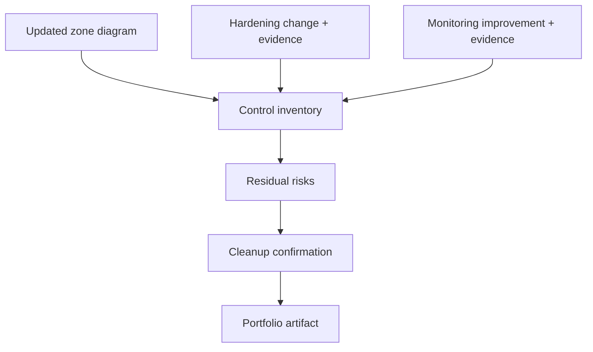

# Track 3 · Stage 3.7 — Capstone: Defended Lab

## Why this stage matters

A defended laboratory is the concrete demonstration that segmentation, host hardening, vulnerability management, sensor awareness, controlled remote access, and monitoring have been applied as a coherent system rather than as isolated exercises. The capstone asks you to document that system, prove at least one hardening improvement and one monitoring improvement with evidence, and leave the laboratory in a cleaner, more observable state than when you began the track.

The resulting artifact is suitable for a portfolio and serves as a living baseline for any later Track-5 (adversary simulation) or Track-2 (detection) exercises that reuse the same environment.

---

## Learning objectives

By the end of this stage you will be able to:

- Produce an up-to-date laboratory diagram that shows trust zones, key hosts, and intended remote-access paths
- Inventory the controls currently in place (segmentation, hardening, scanning, sensors, monitoring)
- Demonstrate and evidence at least one verified hardening change and one monitoring improvement
- Document residual risks and next steps honestly
- Confirm laboratory cleanup and snapshot hygiene

---

## Prerequisites

- Stages 3.1–3.6 completed
- Laboratory still under your control and isolated
- Notebook entries, diagrams, and evidence from prior stages

---

## Safety checkpoint

1. All changes and evidence remain inside the laboratory boundary.
2. Snapshots are taken before final hardening or monitoring changes and restored or retained as appropriate.
3. No laboratory administrative interfaces are left exposed to untrusted networks.
4. The final documentation contains no live credentials or sensitive tokens.

---

## Required deliverable structure

### 1. Title and scope

- Capstone title and date
- Laboratory environment identifier
- Explicit statement that all work was performed on authorized laboratory systems only

### 2. Current laboratory diagram

- Trust zones (from Stage 3.1, updated)
- Key hosts and their roles
- Remote-access / jump path (from Stage 3.5)
- Location of any laboratory sensors or collectors
- Intended allowed flows (high level)

### 3. Control inventory

A concise table or list covering:

| Control area | Status in this lab | Evidence / notes |
|--------------|--------------------|------------------|
| Segmentation / zones | … | diagram reference |
| Host hardening baselines | … | before/after ports or services |
| Vulnerability cycle | … | last scan + top decisions |
| IDS/IPS awareness | … | placement or “what an IDS would see” notes |
| Remote-access path | … | jump host / direct exposure assessment |
| Monitoring set | … | signals collected and review cadence |

### 4. Verified hardening change

- What was changed (service disabled, firewall rule, package removed, etc.)
- Before and after evidence (command output, screenshots, listener lists)
- Confirmation that required laboratory workflows still succeed
- Link to the zone or baseline that motivated the change

### 5. Monitoring improvement

- What signal or review practice was added or strengthened
- Evidence that the signal is being collected and is reviewable
- How it supports detection or investigation (link to Track 2 if applicable)

### 6. Residual risks and next steps

- Honest list of remaining gaps (e.g., no host-based sensor yet, accepted training vulnerabilities, short retention)
- Prioritized next actions if more laboratory time were available

### 7. Cleanup confirmation

- Snapshots retained or restored as appropriate
- Temporary accounts or test data removed
- Laboratory left in a known, documented state

---

## Quality bar

A reader should be able to:

- Understand the current defensive posture of the laboratory from the diagram and inventory alone
- Reproduce or verify the claimed hardening and monitoring improvements from the evidence
- See that residual risks are acknowledged rather than hidden
- Trust that the laboratory boundary and safety rules were respected

Avoid:

- Vague claims without evidence
- Diagrams that no longer match the running environment
- Unredacted secrets
- “Everything is perfect” statements

---

## Illustrative map: capstone evidence flow

---

## Hands-on deliverable

1. Update the laboratory diagram and control inventory from prior stage notes.
2. Implement (or re-verify) one hardening change and one monitoring improvement; capture evidence.
3. Write the residual-risks section honestly.
4. Confirm cleanup and snapshot state.
5. Assemble the full capstone document and save it to your portfolio folder.

---

## Self-check before submission

- [ ] Diagram shows current zones and remote-access path
- [ ] Control inventory covers all six areas
- [ ] At least one hardening change with before/after evidence
- [ ] At least one monitoring improvement with evidence
- [ ] Residual risks listed
- [ ] Cleanup confirmed
- [ ] No live credentials in the document

---

## Summary

- The defended-lab capstone proves that Track-3 controls have been applied as a system.
- Diagram, inventory, verified changes, and honest residual risks together form a professional laboratory baseline.
- The same baseline becomes the starting point for detection validation (Track 2) and authorized adversary simulation (Track 5).

---

## Sources and further reading

- All prior Track-3 stages
- Phase-2 laboratory safety and documentation practices
- Track 2 and Track 5 overviews for cross-track use of the defended lab

All practical work remains restricted to authorized laboratory environments. Completion of this track does not authorize defensive or monitoring operations against any system outside your laboratory agreement.
