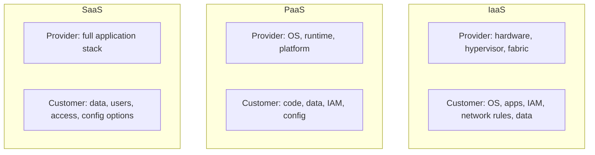

# Track 4 · Stage 4.1 — Shared Responsibility

## Why this stage matters

Cloud security is not “someone else’s problem.” Every major provider publishes a shared-responsibility model that divides security duties between the provider and the customer. Misunderstanding that division is one of the most common sources of cloud misconfigurations: customers assume the provider hardens guest operating systems, identity policies, or data encryption when those controls actually remain the customer’s duty.

This stage establishes a clear, service-model-aware view of who is responsible for what, so that later stages (identity, network exposure, storage, logging) can be applied in the correct layer.

---

## Learning objectives

By the end of this stage you will be able to:

- Explain the shared-responsibility model for IaaS, PaaS, and SaaS at a conceptual level
- Identify which security controls typically remain the customer’s duty in each model
- Produce a one-page responsibility split for a concrete laboratory or free-tier service you actually use
- Avoid the common mistake of assuming the provider secures everything above the hypervisor or control plane

---

## Prerequisites

- Phase-2 complete; basic familiarity with at least one cloud or virtualization environment (local lab hypervisor, free-tier account, or emulator)
- Track-3 concepts of zones and hardening useful but not strictly required
- Ability to read the provider’s official shared-responsibility documentation for the service under study

---

## Safety checkpoint

1. Use only laboratory, free-tier, or emulator environments you control.
2. Do not apply configuration changes to production cloud accounts as part of this curriculum.
3. Prefer read-only examination of responsibility matrices before making any changes.
4. Never place real production data or secrets into free-tier or laboratory cloud resources used for training.

---

## Core concepts

### 1. The three classic service models

| Model | Provider typically manages | Customer typically manages |
|-------|----------------------------|----------------------------|
| **IaaS** (Infrastructure as a Service) | Physical hosts, hypervisor, network fabric, storage infrastructure | Guest OS, applications, identity & access inside the guest, network controls you configure, data |
| **PaaS** (Platform as a Service) | OS, runtime, middleware, much of the platform patching | Application code, data, identity & access to the application, some configuration |
| **SaaS** (Software as a Service) | Almost the entire stack including the application | Data classification, user access, some configuration options, endpoint devices that consume the service |

Exact boundaries vary by provider and by specific service; always consult the provider’s current documentation.

### 2. Why the model matters for security

- In IaaS a customer who never hardens the guest OS or applies security groups leaves a fully functional but unprotected virtual machine on the Internet.
- In PaaS a customer who grants overly broad identity permissions or stores secrets in code still owns those risks even though the platform is patched by the provider.
- In SaaS a customer who fails to configure proper user provisioning, MFA, or data-loss-prevention settings still bears responsibility for the resulting exposure.

### 3. Common customer-owned controls (across models)

- Identity and access management (who can do what)
- Data classification, encryption keys (when customer-managed), and retention
- Network exposure decisions (security groups, firewall rules, public endpoints)
- Logging and monitoring configuration
- Secure configuration of the services the customer enables
- Incident response for the customer’s own applications and data

### 4. Laboratory / free-tier application

Even a free-tier virtual machine or object-storage bucket is subject to a shared-responsibility model. Treating it as “just a playground” without applying the customer-side controls is how laboratory (and real) cloud accounts become compromised.

---

## Illustrative map: shared responsibility by model

---

## Detailed laboratory walkthrough

1. Choose one concrete service you can use in a laboratory or free-tier context (e.g., a cloud VM, object storage, managed database, or even a local hypervisor treated as “IaaS-like”).
2. Locate the provider’s official shared-responsibility statement for that service (or the closest equivalent documentation).
3. Draft a one-page split:
   - Service name and model (IaaS / PaaS / SaaS / hybrid)
   - Controls the provider explicitly owns
   - Controls you (the customer) own
   - One example of a misconfiguration that would be your responsibility
4. Optionally map the same service onto the laboratory trust-zone thinking from Track 3: which “zone” does the cloud resource occupy, and which controls enforce that boundary?

---

## Common mistakes

- Assuming “the cloud is secure by default” and therefore skipping customer-side hardening.
- Applying IaaS thinking (guest OS patching) to a pure SaaS service, or vice versa.
- Ignoring identity and data controls because “the provider handles security.”
- Using free-tier resources with production credentials or real data.

---

## Best practices

- Always start from the provider’s current shared-responsibility documentation for the exact service.
- Treat identity, network exposure, and data protection as customer duties unless the documentation explicitly says otherwise.
- Document the split for every new laboratory or free-tier service you adopt.
- Revisit the split when the provider adds new features or changes the service model.

---

## Hands-on exercise

1. Select one laboratory or free-tier service.
2. Produce a one-page shared-responsibility summary (provider vs customer) with at least one concrete customer-side control you will examine in later stages.
3. Save the page; it becomes the reference for Stages 4.2–4.7 and the Track-4 capstone.

---

## Review questions

1. In an IaaS virtual machine, who is responsible for patching the guest operating system?
2. Why can a customer still cause a major security incident in a SaaS application?
3. Name three controls that almost always remain the customer’s responsibility regardless of service model.
4. How does misunderstanding shared responsibility lead to common cloud misconfigurations?
5. Why should a laboratory free-tier account still follow a clear responsibility split?

---

## Summary

- Shared responsibility divides security duties between provider and customer according to the service model.
- Customers retain critical controls—especially identity, network exposure, and data—even when the provider manages the underlying platform.
- A clear, service-specific split is the foundation for every later cloud-security practice in this track.

---

## Sources and further reading

- Official shared-responsibility documentation from major cloud providers (AWS, Azure, GCP, etc.)
- CSA guidance on cloud responsibility models (conceptual)
- Phase-2 and Track-3 foundations for zones and hardening thinking

All practical work remains restricted to authorized laboratory, free-tier, or emulator environments.
