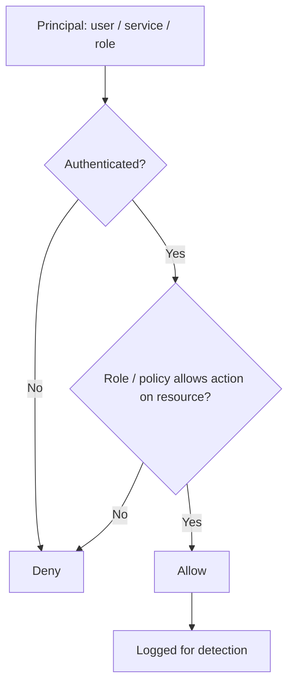

# Track 4 · Stage 4.2 — Identity and Least Privilege

## Why this stage matters

Identity is the primary security boundary in cloud environments. Almost every subsequent control—network rules, storage access, logging—ultimately depends on who (or what) is allowed to act. Standing administrative privileges, long-lived access keys, and overly broad roles are among the most frequently exploited cloud weaknesses. Least privilege and short-lived credentials convert identity from a permanent high-value target into a manageable, auditable control.

This stage applies the principle inside laboratory, free-tier, or emulator environments so the habits transfer to operational cloud accounts under proper authorization.

---

## Learning objectives

By the end of this stage you will be able to:

- Explain why identity is the foundational control in cloud security
- Prefer role-based, least-privilege access over standing administrative credentials
- Recognize the value of short-lived credentials and temporary elevation
- Review the identities present in a laboratory or free-tier environment and identify excess permissions
- Safely remove or reduce at least one unnecessary permission when it is safe to do so

---

## Prerequisites

- Stage 4.1 completed (shared-responsibility understanding)
- Access to a laboratory, free-tier, or emulator cloud identity system you control
- Ability to list users, roles, policies, or access keys without affecting production

---

## Safety checkpoint

1. Work only in laboratory, free-tier, or emulator accounts you own.
2. Never delete or alter identities in a production or shared organizational account as part of this curriculum.
3. Prefer read-only enumeration first; make changes only when the impact is understood and reversible.
4. Do not embed long-lived access keys in code or laboratory notes that will be shared.

---

## Core concepts

### 1. Identity as the new perimeter

In traditional data centers the network perimeter was the primary control. In cloud environments the network is often software-defined and permeable; the decisive question is “which principal is allowed to perform this action on this resource?” That principal may be a human user, a service account, an instance role, or a federated identity.

### 2. Standing privilege versus least privilege

| Approach | Description | Laboratory risk |
|-----------|--------------|------------------|
| Standing admin | Permanent administrator or root-equivalent credentials | Compromise of one key or password yields full control |
| Least privilege | Only the permissions required for a specific task or role | Compromise is limited to the granted scope |
| Just-in-time / short-lived | Temporary elevation or credentials that expire | Window of exposure is minimized |

### 3. Roles and policies

Modern cloud platforms encourage:

- Human users authenticate (ideally with MFA) and assume roles.
- Workloads (VMs, functions, containers) receive temporary credentials via instance or task roles rather than static keys.
- Policies express allow/deny in a least-privilege language.

### 4. Short-lived credentials as a goal

Long-lived access keys that never rotate are a common laboratory (and production) weakness. Prefer:

- Temporary session credentials
- Role assumption with short duration
- Automatic rotation where the platform supports it

Even in a free-tier account, deleting an unused access key or shortening a role session is valuable practice.

---

## Illustrative map: identity decision points

---

## Detailed laboratory walkthrough

1. In your laboratory or free-tier account, list the existing identities (users, roles, service accounts, access keys).
2. Identify any identity that holds broader permissions than its laboratory purpose requires (e.g., full administrator for a simple storage-test user).
3. Document the excess permission and the risk it creates inside the laboratory.
4. If safe and reversible, remove or narrow that permission (or delete an unused access key).
5. Confirm that required laboratory workflows still succeed.
6. Note any remaining standing administrative identities and a plan to reduce their use (role assumption, MFA, etc.).

---

## Common mistakes

- Creating a single “admin” user for all laboratory work and never revisiting its permissions.
- Embedding long-lived access keys in scripts or version-control repositories.
- Assuming that “the account is only a free tier” therefore identity hygiene does not matter.
- Removing a permission without first confirming what laboratory processes depend on it.

---

## Best practices

- Start every new laboratory identity with the minimum permissions required; add only as needed.
- Prefer roles and temporary credentials over permanent access keys.
- Enable MFA on any human identity that can affect laboratory resources.
- Regularly inventory and prune unused identities and keys.
- Log identity and access events; they become high-value detection sources (Stage 4.5).

---

## Hands-on exercise

1. Inventory identities in one laboratory or free-tier environment.
2. Identify and document at least one excess permission or unused long-lived credential.
3. Safely reduce or remove it and verify laboratory functionality.
4. Save the before/after notes for the Track-4 capstone.

---

## Review questions

1. Why is identity often described as the primary security boundary in cloud environments?
2. What is the practical difference between standing administrative access and least-privilege role assumption?
3. Why are long-lived access keys particularly risky even in a laboratory account?
4. How does short-lived credential use reduce the impact of a compromised identity?
5. Which identity events are especially useful for later cloud detection work?

---

## Summary

- Identity controls who can act; least privilege limits the damage when an identity is abused.
- Roles, temporary credentials, and regular inventory are the practical tools.
- Laboratory practice of reducing excess permissions builds the habits required for operational cloud security.

---

## Sources and further reading

- Provider IAM / identity documentation (laboratory accounts)
- CIS Cloud Benchmarks — identity sections (conceptual)
- Stage 4.1 shared-responsibility model
- Track 2 authentication-detection concepts

All practical work remains restricted to authorized laboratory, free-tier, or emulator environments.
