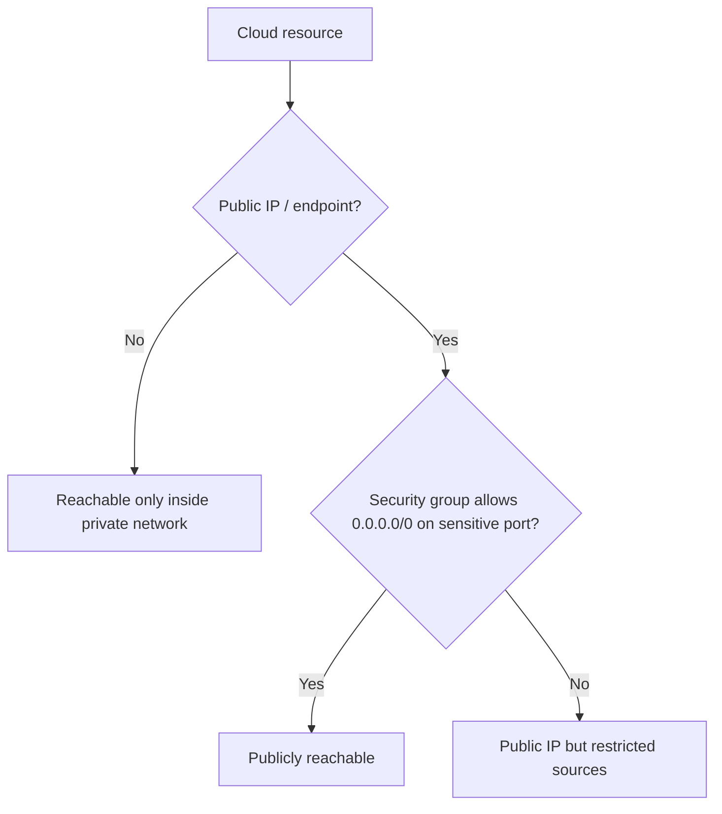

# Track 4 · Stage 4.3 — Network and Exposure

## Why this stage matters

Cloud resources are often created with default network settings that make them reachable from the public Internet. Publicly exposed administrative interfaces, databases, or storage endpoints are among the most common and most damaging cloud misconfigurations. Understanding how exposure is created (security groups, network ACLs, public IP assignment, service endpoints) and how to restrict it is a core cloud-security skill.

In a laboratory or free-tier environment you can safely inventory public listeners, close or restrict unnecessary ones, and observe the effect—exactly the practice that prevents real-world incidents.

---

## Learning objectives

By the end of this stage you will be able to:

- Identify public endpoints and common administrative-exposure anti-patterns in a laboratory or free-tier project
- Explain the role of security groups / network rules / public IP assignment in creating or preventing exposure
- Inventory the public listeners present in your laboratory cloud project
- Close or restrict at least one unnecessary public exposure when it is safe to do so
- Relate network exposure controls to the shared-responsibility model and identity controls already studied

---

## Prerequisites

- Stages 4.1 and 4.2 completed
- Access to a laboratory, free-tier, or emulator environment that contains network-configurable resources (VMs, load balancers, databases, storage, etc.)
- Ability to list security-group rules, public IPs, and service endpoints

---

## Safety checkpoint

1. Work only in laboratory, free-tier, or emulator accounts you control.
2. Do not alter network rules in production or shared organizational accounts.
3. Snapshot or note current rules before making changes so you can revert.
4. Confirm that required laboratory connectivity still works after any restriction.
5. Never expose real production data or administrative interfaces as part of training.

---

## Core concepts

### 1. How cloud resources become public

Typical mechanisms:

- Assignment of a public IP or public DNS name
- Security-group / firewall rule that allows 0.0.0.0/0 (or ::/0) on a sensitive port
- Service configuration that enables a public endpoint (storage, database, message queue, etc.)
- Load balancer or API gateway left open without authentication

### 2. Administrative-exposure anti-patterns

| Anti-pattern | Risk | Laboratory observation |
|--------------|------|------------------------|
| SSH/RDP open to the world | Credential attacks, unpatched service exploits | Port 22/3389 reachable from outside the lab |
| Database port public | Data exfiltration, ransomware | 3306/5432/1433 open to 0.0.0.0/0 |
| Storage bucket public | Data leakage | Object-storage ACL or policy grants public read/write |
| Management UI without additional controls | Account takeover | Cloud console or hypervisor UI reachable without MFA / bastion |

### 3. Controls that limit exposure

- Security groups / network security groups / firewall rules with least-privilege source ranges
- Private subnets and private endpoints
- Bastion / jump hosts or VPN for administrative access (aligns with Track 3 Stage 3.5)
- Service-specific settings that disable public access
- Network ACLs as an additional layer (stateless, coarser)

### 4. Relation to shared responsibility and identity

Even when the provider secures the underlying network fabric, the customer decides which resources receive public addresses and which rules allow inbound traffic. Identity controls (Stage 4.2) then determine who may use those exposed (or private) endpoints.

---

## Illustrative map: exposure decision points

---

## Detailed laboratory walkthrough

1. Inventory the resources in your laboratory or free-tier project that can have network exposure (VMs, load balancers, databases, storage, etc.).
2. For each, determine:
   - Whether it has a public IP or public endpoint
   - Which ports or protocols are allowed from 0.0.0.0/0 or other broad ranges
3. Identify at least one exposure that is unnecessary for the laboratory purpose (e.g., SSH open to the world when a bastion exists, or a storage bucket left public).
4. Restrict or close that exposure (tighten the security-group rule, disable public access, move to a private subnet, etc.).
5. Verify that required laboratory workflows still succeed and that the exposure is no longer present.
6. Document the before/after state.

---

## Common mistakes

- Leaving default “allow all” security-group rules in place “temporarily.”
- Assuming that a resource without a public IP is automatically safe (other misconfigurations can still expose it).
- Restricting a rule without first confirming the legitimate source ranges needed by the laboratory.
- Treating free-tier resources as exempt from exposure hygiene.

---

## Best practices

- Default to private; grant public exposure only when explicitly required and then constrain the source.
- Prefer bastion or VPN access for administrative protocols.
- Regularly inventory public endpoints and broad security-group rules.
- Align network exposure decisions with the trust-zone thinking from Track 3.
- Log and monitor changes to network rules and public endpoint configurations.

---

## Hands-on exercise

1. Produce an inventory of public listeners / endpoints in one laboratory cloud project.
2. Close or restrict at least one unnecessary exposure and capture before/after evidence.
3. Confirm laboratory functionality remains intact.
4. Save the inventory and change notes for the Track-4 capstone.

---

## Review questions

1. What combination of settings typically makes a cloud virtual machine reachable from the public Internet?
2. Why is an open database port on 0.0.0.0/0 considered a high-severity misconfiguration?
3. How does a bastion host reduce administrative exposure?
4. In the shared-responsibility model, who decides whether a storage bucket is public?
5. Why should laboratory free-tier resources still be inventoried for public exposure?

---

## Summary

- Public exposure is created by the combination of public addressing and permissive network rules.
- Administrative and data-store ports open to the world are classic, preventable anti-patterns.
- Inventory, least-privilege rules, and private defaults convert exposure from a default risk into a deliberate, controlled decision.

---

## Sources and further reading

- Provider documentation on security groups, network ACLs, and private endpoints
- CIS Cloud Benchmarks — networking sections (conceptual)
- Track 3 remote-access and segmentation concepts
- Stage 4.1 shared-responsibility model

All practical work remains restricted to authorized laboratory, free-tier, or emulator environments.
