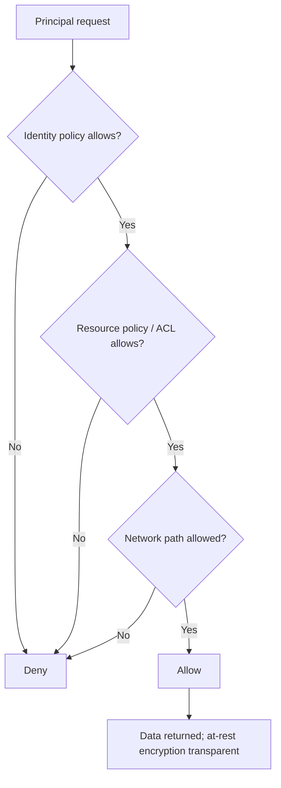

# Track 4 · Stage 4.4 — Storage and Data

## Why this stage matters

Cloud storage services (object storage, block volumes, file shares, managed databases) frequently hold the most sensitive laboratory and production data. Misconfigured public-read or public-write policies, missing encryption, and overly broad identity permissions have caused some of the largest documented data exposures. Treating storage as “just a place to put files” without deliberate access and encryption controls is a recurring failure mode.

This stage focuses on recognizing and preventing the most common storage misconfigurations inside laboratory, free-tier, or emulator environments.

---

## Learning objectives

By the end of this stage you will be able to:

- Recognize public-read and public-write storage anti-patterns
- Explain encryption-at-rest as a customer-configurable control (where the provider offers it)
- Inventory storage resources in a laboratory project and verify that none are unintentionally world-readable or world-writable
- Document the access policy applied to at least one laboratory storage resource
- Relate storage controls to identity (Stage 4.2) and network exposure (Stage 4.3)

---

## Prerequisites

- Stages 4.1–4.3 completed
- Access to a laboratory, free-tier, or emulator environment that includes at least one storage service (object storage, volume, or managed database)
- Ability to inspect bucket/container policies, ACLs, or encryption settings

---

## Safety checkpoint

1. Use only laboratory, free-tier, or emulator storage; never place real production or personal sensitive data into training resources.
2. Do not make any storage resource public as a “test” unless you fully control the contents and the exposure is intentional and temporary.
3. Prefer read-only inspection before changing policies.
4. Document and reverse any temporary public settings before ending the laboratory session.

---

## Core concepts

### 1. Public-read / public-write failures

Object-storage services often default to private, but a single policy or ACL change can make every object readable (or writable) by the entire Internet. Classic laboratory and real-world failures include:

- Bucket policy granting `Principal: *` with `s3:GetObject` or equivalent
- ACL set to public-read
- “Static website hosting” enabled with sensitive content
- Public access block settings left disabled

### 2. Encryption at rest

Most providers offer encryption at rest (provider-managed or customer-managed keys). Enabling it is usually a customer responsibility under the shared model. Encryption at rest protects against certain physical and storage-layer threats; it does **not** protect against access by a principal that has been granted permission to the data.

### 3. Access control layers for storage

- Identity & access policies (who may call the storage API)
- Resource policies / ACLs (what the storage resource itself allows)
- Network controls (private endpoints, security groups)
- Encryption and key policy (who may use the key)

All layers should align with least privilege.

### 4. Data classification (laboratory scale)

Even in a laboratory it is useful to label resources as “training only — no sensitive data” versus “contains laboratory secrets or credentials that must stay private.” The label drives the access and encryption decisions.

---

## Illustrative map: storage access decision

---

## Detailed laboratory walkthrough

1. Inventory the storage resources (buckets, containers, volumes, databases) in your laboratory project.
2. For each object-storage resource, inspect the public-access settings, ACLs, and policies.
3. Confirm that no resource is unintentionally world-readable or world-writable.
4. If any public setting is found that is not required, remove it and verify the change.
5. Check whether encryption at rest is enabled; enable it if the laboratory service supports it and the change is safe.
6. Document the final access policy for at least one resource (identity principals allowed, resource policy summary, encryption status).

---

## Common mistakes

- Creating a bucket for “temporary files” and leaving it public.
- Assuming encryption at rest replaces the need for access control.
- Granting broad identity permissions (“full storage access”) to laboratory users or roles that only need read of a single prefix.
- Storing laboratory credentials or API keys inside a bucket without additional protection.

---

## Best practices

- Default to private; grant public access only for deliberate, non-sensitive static content and only after review.
- Enable encryption at rest on every laboratory storage resource that supports it.
- Apply least-privilege identity policies and resource policies together.
- Block public access at the account or project level when the platform offers that control.
- Regularly re-inventory storage resources for unexpected public settings.

---

## Hands-on exercise

1. Inventory laboratory storage resources and confirm none are unintentionally public.
2. Document the access policy and encryption status of at least one resource.
3. If a public setting existed, remove it and record the before/after state.
4. Save the documentation for the Track-4 capstone.

---

## Review questions

1. Why is a publicly readable storage bucket a high-impact misconfiguration even when the data seems “non-sensitive”?
2. Does encryption at rest prevent an authorized principal from reading the data?
3. Name three layers that together control access to cloud storage objects.
4. How does the shared-responsibility model assign ownership of storage-access configuration?
5. Why should laboratory storage still be treated with the same private-by-default discipline as production storage?

---

## Summary

- Public-read and public-write storage configurations are classic, preventable causes of data exposure.
- Encryption at rest is a valuable control but does not replace access policy.
- Inventory, private defaults, least-privilege policies, and encryption together form a practical laboratory storage baseline.

---

## Sources and further reading

- Provider object-storage security documentation
- CIS Cloud Benchmarks — storage sections (conceptual)
- Stages 4.1–4.3 (responsibility, identity, network)
- OWASP guidance on sensitive data exposure (conceptual)

All practical work remains restricted to authorized laboratory, free-tier, or emulator environments.
