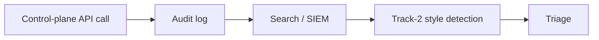

# Track 4 · Stage 4.5 — Logging and Detection in Cloud

## Why this stage matters

Cloud environments generate rich API and control-plane audit logs that record who did what, when, and from where. These logs are often the only reliable evidence of identity misuse, network-rule changes, storage-policy modifications, or other high-impact actions. Without them, detection and investigation of cloud-specific activity become nearly impossible. Enabling, protecting, and reviewing these logs is therefore a foundational customer responsibility under the shared model.

This stage connects cloud audit logging to the detection-engineering skills already practiced in Track 2, so laboratory cloud activity can be observed and alerted on with the same discipline used for host and network logs.

---

## Learning objectives

By the end of this stage you will be able to:

- Explain why API / control-plane audit logs are essential for cloud detection and investigation
- Locate or enable the primary audit-log source in a laboratory or free-tier project
- Save and interpret a sample audit event (identity, action, resource, source)
- Link cloud audit events to the detection patterns studied in Track 2 (threshold, sequence, presence)
- Identify basic retention and protection practices for laboratory audit logs

---

## Prerequisites

- Stages 4.1–4.4 completed
- Track 2 Stages 2.1–2.3 at least (log sources, search, detection design)
- Access to a laboratory, free-tier, or emulator environment that offers audit or activity logging

---

## Safety checkpoint

1. Enable or examine audit logs only in laboratory, free-tier, or emulator accounts you control.
2. Do not alter logging configuration in production or shared organizational accounts.
3. Treat audit-log contents as sensitive; redact account identifiers and keys before sharing samples.
4. Ensure laboratory log retention does not exhaust free-tier quotas unexpectedly.

---

## Core concepts

### 1. Why API audit logs matter

Cloud control-plane actions (creating users, changing security groups, modifying storage policies, assuming roles, etc.) rarely leave traditional host logs. The provider’s audit trail is often the sole record. Without it:

- Compromised credentials can be used undetected.
- Accidental or malicious exposure of storage or network resources cannot be reconstructed.
- Detection rules for “who changed what” cannot be written.

### 2. Typical laboratory audit-log sources

| Provider family | Common name / concept |
|-----------------|-----------------------|
| AWS-style | CloudTrail (management events) |
| Azure-style | Activity Log / Azure Monitor |
| GCP-style | Cloud Audit Logs |
| Generic / emulator | Activity or audit log export |

Exact names differ; the principle is the same: record of API calls and control-plane operations.

### 3. Fields that enable detection

A useful audit event usually contains:

- Timestamp
- Principal (user, role, service account)
- Action / API name
- Resource affected
- Source IP or user agent
- Success / failure outcome

These fields support the same detection patterns practiced in Track 2: thresholds (many failed AssumeRole attempts), sequences (policy change followed by data access), and presence (use of a root or break-glass identity).

### 4. Protection and retention

- Audit logs themselves must be protected against tampering or deletion by the same identities they record.
- Laboratory retention can be short (days to weeks) provided it covers the scenarios you run.
- Export to a separate, restricted location improves integrity.

---

## Illustrative map: cloud audit to detection

---

## Detailed laboratory walkthrough

1. Locate the audit or activity-log configuration in your laboratory project.
2. Confirm that management / control-plane events are being recorded (enable them if they are off and the change is safe).
3. Perform a simple laboratory action (e.g., list resources, create a temporary key, modify a security-group rule).
4. Retrieve the corresponding audit event and save a redacted sample.
5. Note the fields that would support a detection (principal, action, source, outcome).
6. Optionally draft one plain-language detection idea that uses the audit log (e.g., “alert on any security-group change that adds 0.0.0.0/0”).

---

## Common mistakes

- Assuming host or application logs are sufficient for cloud control-plane activity.
- Leaving audit logging disabled in a free-tier account “to save cost or complexity.”
- Storing audit logs in a location writable by the same broad roles that the logs are meant to monitor.
- Collecting logs but never searching or reviewing them.

---

## Best practices

- Enable control-plane audit logging early in any laboratory cloud project.
- Protect the log destination with stricter identity and network controls than the resources being monitored.
- Align cloud audit detections with the same design and triage discipline used in Track 2.
- Review a sample of audit events after every significant laboratory change.
- Redact sensitive identifiers before placing samples in shared notes or portfolios.

---

## Hands-on exercise

1. Enable or confirm audit logging in one laboratory project.
2. Capture and save one redacted sample event that records a control-plane action.
3. Write one detection idea that could use that log source.
4. Save the sample and idea for the Track-4 capstone and for possible Track-2 integration.

---

## Review questions

1. Why are API audit logs often more important than guest-OS logs for detecting cloud account misuse?
2. Name four fields commonly present in a useful cloud audit event.
3. How can Track-2 detection patterns (threshold, sequence) be applied to cloud audit data?
4. Why must the audit-log storage location itself be protected with strong identity controls?
5. What is a practical laboratory retention period for audit logs, and why does it matter?

---

## Summary

- Cloud audit logs record the control-plane actions that traditional host logs miss.
- Enabling, protecting, and reviewing them is a core customer responsibility.
- The same detection-engineering skills from Track 2 apply directly to these events.
- A laboratory sample event and detection idea become evidence of cloud visibility.

---

## Sources and further reading

- Provider audit-log / CloudTrail / Activity Log documentation
- Track 2 Stages 2.1–2.3
- CIS Cloud Benchmarks — logging sections (conceptual)
- Stages 4.1–4.4

All practical work remains restricted to authorized laboratory, free-tier, or emulator environments.
