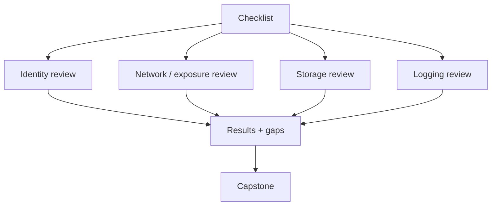

# Track 4 · Stage 4.6 — Secure Baseline Checklist

## Why this stage matters

A secure baseline turns the individual controls studied in Stages 4.1–4.5 into a single, repeatable checklist that can be applied whenever a new laboratory or free-tier project is created. Without a baseline, every new resource risks repeating the same identity, network, storage, and logging mistakes. With a baseline, the laboratory starts from a known-good posture and deviations become visible.

This stage produces a minimal, practical checklist tailored to the scale of laboratory and free-tier work, not a full enterprise cloud security standard.

---

## Learning objectives

By the end of this stage you will be able to:

- Assemble a minimal secure-starting checklist covering identity, network exposure, storage, and logging
- Apply the checklist to an existing laboratory or free-tier project and record the results
- Identify gaps that remain after the checklist is applied
- Use the checklist as the starting point for the Track-4 capstone

---

## Prerequisites

- Stages 4.1–4.5 completed
- At least one laboratory, free-tier, or emulator project that can be evaluated

---

## Safety checkpoint

1. Evaluate and modify only laboratory, free-tier, or emulator projects you control.
2. Do not apply the checklist as a change set against production accounts.
3. Prefer non-destructive verification first; make configuration changes only when reversible and necessary.

---

## Core concepts

### 1. Purpose of a laboratory baseline

- Establish a consistent starting posture for every new laboratory project
- Make deviations (new public endpoints, new admin keys, disabled logging) easy to notice
- Provide evidence for the capstone and for any later purple-team or detection exercises that reuse the environment

### 2. Minimal checklist categories

| Category | Key questions (laboratory scale) |
|----------|----------------------------------|
| **Identity** | Are standing admin credentials minimized? Are unused access keys removed? Is MFA enabled on human identities where supported? |
| **Network / Exposure** | Are administrative ports closed to the world? Are security-group rules least-privilege? Are public endpoints intentional and documented? |
| **Storage / Data** | Are buckets/containers private by default? Is public access blocked? Is encryption at rest enabled where available? |
| **Logging** | Are control-plane audit logs enabled? Are they retained long enough for laboratory scenarios? Is access to the logs restricted? |
| **Shared responsibility** | Has the provider vs customer split been documented for the services in use? |

### 3. How to use the checklist

1. Walk through each item against the live laboratory project.
2. Record Pass / Fail / Not Applicable and a short note.
3. Remediate Fail items that are safe to fix inside the laboratory.
4. Carry residual Fail or Not Applicable items into the residual-risk section of the capstone.

---

## Illustrative map: baseline application

---

## Detailed laboratory walkthrough

1. Open or create a short markdown or spreadsheet checklist using the categories above.
2. Evaluate each item against your primary laboratory cloud project.
3. For every Fail, decide whether to remediate now or document as residual risk.
4. Apply safe remediations and re-check the item.
5. Save the completed checklist with date, project identifier, and notes.

---

## Common mistakes

- Treating the checklist as a one-time paper exercise that is never compared to the live environment.
- Marking items “Pass” without actually verifying the current configuration.
- Creating an encyclopedic enterprise checklist that is too heavy for laboratory use and is therefore ignored.

---

## Best practices

- Keep the laboratory checklist short enough that it is actually used.
- Re-run it after any significant change to the laboratory project.
- Version or date each completed checklist so progress is visible.
- Align checklist items with the concrete controls already practiced in Stages 4.2–4.5.

---

## Hands-on exercise

1. Produce a filled secure-baseline checklist for one laboratory or free-tier project.
2. Remediate at least one Fail item if safe to do so.
3. Note remaining gaps.
4. Save the completed checklist; it is a required input to the Track-4 capstone.

---

## Review questions

1. Why is a short, laboratory-scale baseline more useful than an exhaustive enterprise standard for training environments?
2. Which four control categories form the core of the minimal checklist in this stage?
3. How should residual Fail items be handled?
4. When should the checklist be re-applied?
5. How does the checklist support the Track-4 capstone?

---

## Summary

- A secure baseline checklist converts individual cloud controls into a repeatable laboratory starting posture.
- Identity, network exposure, storage, and logging form the minimum viable set.
- A completed, dated checklist with residual gaps is the direct input to the Track-4 capstone.

---

## Sources and further reading

- Stages 4.1–4.5
- CIS Cloud Benchmarks (selected items, conceptual)
- Provider well-architected / security baseline guidance (laboratory adaptation)

All practical work remains restricted to authorized laboratory, free-tier, or emulator environments.
