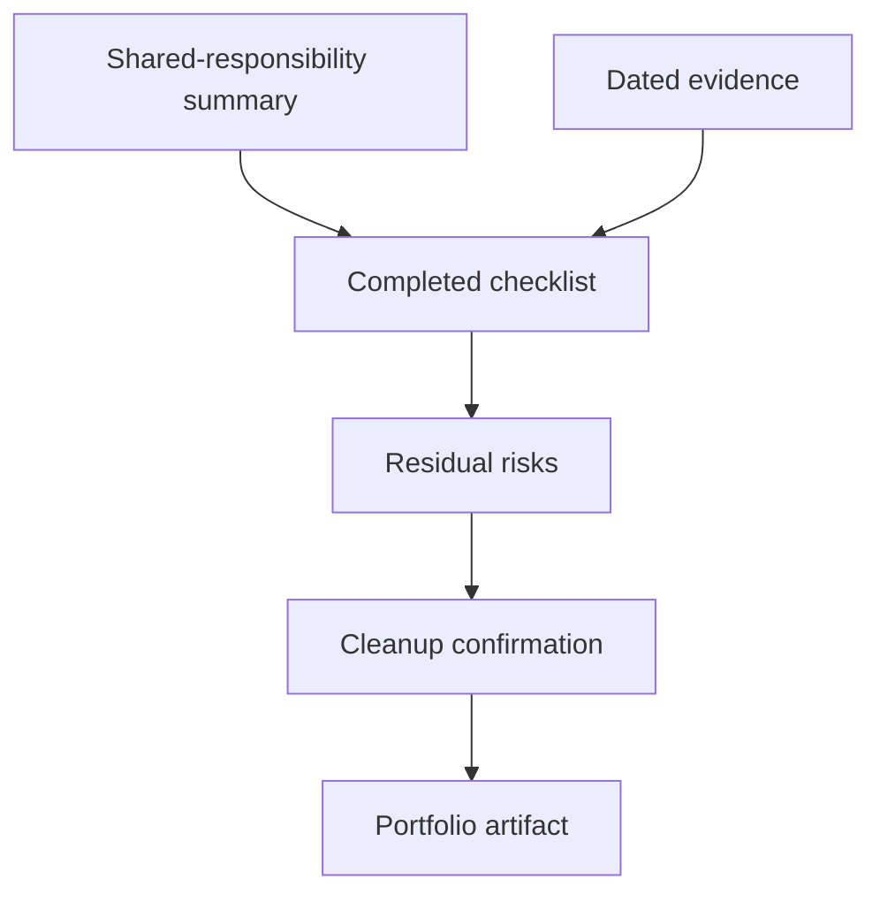

# Track 4 · Stage 4.7 — Capstone Cloud Checklist

## Why this stage matters

The Track-4 capstone consolidates shared-responsibility understanding, identity hygiene, network-exposure control, storage protection, audit logging, and the secure baseline into a single, evidence-based artifact. A completed checklist with dated verification, residual risks, and clear follow-ups demonstrates that the laboratory (or free-tier) environment has been brought under deliberate cloud-security discipline rather than left in a default or ad-hoc state.

The artifact is portfolio-ready and can serve as the starting baseline for any later detection or adversary-simulation work that reuses the same cloud laboratory resources.

---

## Learning objectives

By the end of this stage you will be able to:

- Deliver a completed secure-baseline checklist against a real laboratory or free-tier project
- Attach dated evidence for each major control area
- Document residual risks and prioritized follow-ups honestly
- Confirm that the laboratory cloud environment remains within authorized scope and is free of unintentional public exposure or standing excess privilege

---

## Prerequisites

- Stages 4.1–4.6 completed
- At least one laboratory, free-tier, or emulator project that has been evaluated with the baseline checklist
- Evidence collected during earlier stages (identity inventory, exposure notes, storage policy, audit-log sample, etc.)

---

## Safety checkpoint

1. The entire capstone remains limited to laboratory, free-tier, or emulator resources you control.
2. No production accounts, real customer data, or organizational cloud resources are in scope.
3. Evidence must be redacted of long-lived keys, passwords, and account identifiers before inclusion in any shared portfolio.
4. After the capstone, leave the environment in a known, documented state (no temporary public settings left enabled).

---

## Required deliverable structure

### 1. Title and scope

- Capstone title and date
- Laboratory / free-tier project identifier
- Explicit statement: “Authorized laboratory / free-tier exercise only — not a production assessment”

### 2. Shared-responsibility summary

- One-paragraph restatement of the provider vs customer split for the primary services used
- Reference to the Stage 4.1 page

### 3. Completed baseline checklist

- The filled checklist from Stage 4.6 (identity, network/exposure, storage, logging)
- Pass / Fail / N/A with short notes for each item
- Date of evaluation

### 4. Evidence appendix (or inline)

For each major area provide at least one piece of dated evidence:

- Identity: inventory excerpt or confirmation that an excess permission / key was removed
- Network: before/after of a restricted public exposure
- Storage: confirmation of private setting and encryption status
- Logging: redacted sample audit event and confirmation that logging is enabled

### 5. Residual risks and follow-ups

- Honest list of items still Fail or only partially addressed
- Prioritized next actions if more laboratory time were available
- Any accepted risks (e.g., intentional training exposure) with rationale

### 6. Cleanup confirmation

- Temporary public settings reverted
- Unused test keys or identities removed
- Environment left in the state described by the checklist

---

## Quality bar

A reader should be able to:

- Understand the current cloud-security posture of the laboratory project from the checklist and evidence alone
- See that residual risks are acknowledged
- Trust that no production resources or real sensitive data were involved
- Reproduce or verify the claimed improvements from the evidence provided

Avoid:

- Undocumented “Pass” marks
- Unredacted secrets
- Claims about environments outside the stated laboratory scope
- “Everything is perfect” statements

---

## Illustrative map: capstone assembly

---

## Hands-on deliverable

1. Assemble the completed checklist, evidence, residual-risk list, and cleanup confirmation.
2. Redact all secrets.
3. Save the full capstone document to your portfolio folder with a clear filename (e.g., `Track4_Capstone_CloudBaseline_YYYYMMDD.md`).

---

## Self-check before submission

- [ ] Scope limited to laboratory / free-tier / emulator
- [ ] Checklist filled and dated
- [ ] Evidence present for identity, network, storage, logging
- [ ] Residual risks listed
- [ ] Cleanup confirmed
- [ ] No live credentials or unredacted account identifiers

---

## Summary

- The cloud checklist capstone proves that Track-4 controls have been applied as a coherent baseline.
- Checklist, evidence, residual risks, and cleanup together form a professional laboratory cloud-security artifact.
- The same baseline becomes the starting point for detection work and for any authorized reuse of the laboratory cloud resources.

---

## Sources and further reading

- All prior Track-4 stages
- Track 2 (detection) and Track 3 (defensive architecture) for cross-track use
- Provider well-architected frameworks (laboratory adaptation)

All practical work remains restricted to authorized laboratory, free-tier, or emulator environments. Completion of this track does not authorize security assessment or configuration changes against any cloud account outside your laboratory agreement.
