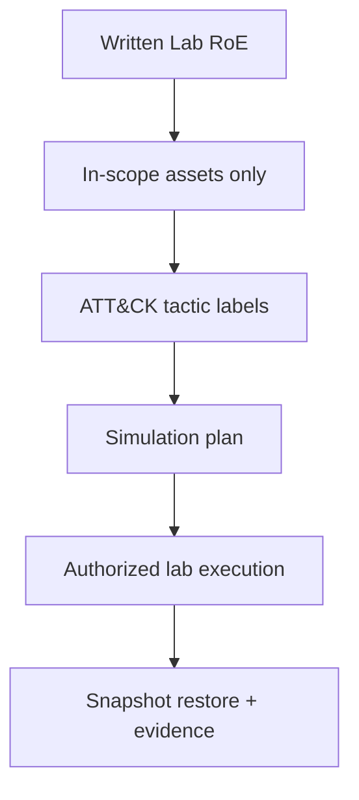

# Track 5 · Stage 5.1 — Attack Mapping and Scope

## Why this stage matters

Authorized adversary simulation (and any form of purple-team exercise) begins with a written boundary. Without a clear Rules of Engagement (RoE), even well-intentioned laboratory activity can drift into unsafe or unauthorized territory. Mapping the planned activity to ATT&CK tactics then provides a shared vocabulary with defenders (Track 2) and keeps the exercise focused on observable, discussable behaviors rather than open-ended “hacking.”

This stage produces the RoE and the high-level tactic map that govern every subsequent laboratory simulation in the track.

---

## Learning objectives

By the end of this stage you will be able to:

- Write a one-page laboratory Rules of Engagement that defines in-scope systems, allowed techniques, stop conditions, and explicit exclusions
- Use ATT&CK tactics as communication labels (not as a full threat-intelligence product)
- Confirm that the planned simulation stays inside the laboratory boundary and the safety rules of the curriculum
- Produce a short mapping of the intended laboratory scenario to 2–4 ATT&CK tactics

---

## Prerequisites

- Phase-2 and at least one other Phase-3 track recommended (especially Track 2 for detection collaboration)
- Laboratory environment still isolated and under your control
- Familiarity with the ATT&CK Enterprise matrix at the tactic level

---

## Safety checkpoint (non-negotiable)

1. **Only laboratory systems you own or have explicit written permission to test.**
2. No Internet-facing targets, no third-party systems, no production environments.
3. Stop conditions must be defined in advance (e.g., “stop if any non-lab host is contacted,” “stop if data leaves the lab network”).
4. Snapshots before any simulation that may alter laboratory state.
5. When in doubt about scope — stop and re-confirm in writing.

This track never authorizes real-world unauthorized operations.

---

## Core concepts

### 1. Laboratory Rules of Engagement (minimum content)

A practical one-page RoE includes:

- **In-scope assets** — exact VMs, containers, IP ranges, applications (e.g., “Juice Shop on 192.168.56.101, Windows lab host 192.168.56.102”)
- **Allowed activities** — high-level categories only (e.g., “authorized initial access against the listed lab apps,” “discovery inside the lab network,” “persistence categories on lab hosts”)
- **Explicitly out of scope** — Internet targets, other learners’ hosts, production, denial-of-service that would break shared lab resources, social engineering of real people
- **Stop conditions** — what immediately ends the exercise
- **Evidence & cleanup** — how snapshots and logs will be handled
- **Authorization statement** — “This exercise is limited to the laboratory systems listed above and is conducted under the Phase-3 curriculum safety rules.”

### 2. ATT&CK tactics as labels

Use tactic names for communication and coverage discussion:

- Initial Access
- Execution
- Persistence
- Privilege Escalation
- Defense Evasion
- Credential Access
- Discovery
- Lateral Movement
- Collection
- Command and Control
- Exfiltration
- Impact

Technique-level detail is optional at this stage; tactic-level labels are sufficient for laboratory planning and purple-team conversation.

### 3. Mapping the scenario

Before any practical step, write:

```
Intended laboratory scenario: …
Primary ATT&CK tactics: …
In-scope hosts: …
Stop conditions: …
```

This becomes the contract for the rest of the track.

---

## Illustrative map: from RoE to tactics



---

## Detailed laboratory walkthrough

1. List every host and application that will be touched.
2. Draft the one-page RoE using the minimum content above.
3. Choose a simple laboratory scenario (e.g., “web initial access against Juice Shop followed by discovery on the lab host”).
4. Label the scenario with 2–4 ATT&CK tactics.
5. Review the RoE and mapping with any Track-2 partner if a purple-team exercise is planned.
6. Save both documents; they govern Stages 5.2–5.6.

---

## Common mistakes

- Writing an RoE that still allows “any lab host” without naming them.
- Omitting stop conditions.
- Using ATT&CK technique IDs as a substitute for clear technical descriptions of what will actually be done in the lab.
- Beginning practical activity before the RoE is written and accepted.

---

## Best practices

- Keep the RoE short enough that it is actually read and followed.
- Name assets by IP or hostname; avoid vague language.
- Revisit the RoE if the laboratory topology changes.
- Share the tactic map with defenders so detection expectations are aligned.
- Treat the RoE as a living document for the duration of the track.

---

## Hands-on exercise

1. Write a one-page laboratory Rules of Engagement for your current lab.
2. Map one intended scenario to 2–4 ATT&CK tactics.
3. Confirm stop conditions and out-of-scope statements are explicit.
4. Save both artifacts; they are required for every later stage and for the capstone.

---

## Review questions

1. Why must a laboratory Rules of Engagement name specific assets rather than saying “the lab”?
2. What is the purpose of stop conditions in an authorized simulation?
3. How do ATT&CK tactic labels improve communication with a Track-2 detection partner?
4. Why does this track forbid Internet or third-party targets even when the techniques are “just for learning”?
5. What should you do if a planned action is not clearly covered by the written RoE?

---

## Summary

- Written scope and stop conditions are the foundation of safe adversary simulation.
- ATT&CK tactics provide a shared language without requiring full threat-intelligence tradecraft.
- The RoE and tactic map produced here bind every subsequent laboratory activity in Track 5.

---

## Sources and further reading

- MITRE ATT&CK Enterprise matrix (tactic level)
- Phase-0 / Phase-1 ethics and authorization principles
- Track 2 Stage 2.5 (attack mapping for detection)
- Curriculum-wide safety rules

All practical work remains restricted to authorized laboratory environments. No technique in this track authorizes activity against systems outside the written RoE.
