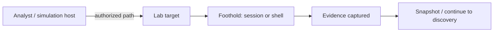

# Track 5 · Stage 5.2 — Lab Initial Access Patterns

## Why this stage matters

Initial access is the moment an authorized simulation moves from outside the target to a foothold inside it. In a laboratory the entry points are deliberate: intentionally vulnerable applications (DVWA, Juice Shop, Metasploitable-style hosts, etc.) and services that exist precisely so learners can practice controlled access. Documenting one clean, reproducible path into a laboratory target establishes the starting condition for later discovery, persistence, and purple-team loops—without ever touching a real-world system.

---

## Learning objectives

By the end of this stage you will be able to:

- Identify intentional laboratory entry points (vulnerable apps and services) that are already in scope under the RoE
- Document one reproducible initial-access path against a laboratory target you control
- Capture the evidence (request, response, session, or shell) needed for later stages and for the purple-team report
- Confirm that the path respects the written Rules of Engagement and stop conditions
- Restore or snapshot the target so the laboratory remains reusable

---

## Prerequisites

- Stage 5.1 completed (RoE and tactic map written)
- At least one intentional laboratory target (Juice Shop, DVWA, Metasploitable, or equivalent) reachable only inside the lab
- Snapshot capability

---

## Safety checkpoint

1. Only the assets listed in the Stage 5.1 RoE.
2. Snapshots before any access attempt that may change state.
3. No third-party systems, no Internet targets, no production.
4. Prefer non-destructive proofs (authenticated session, low-privilege shell) over high-impact actions unless the RoE and the training target explicitly support them.
5. Stop immediately if any traffic or effect leaves the laboratory boundary.

---

## Core concepts

### 1. Intentional laboratory entry points

| Target type | Typical laboratory use |
|-------------|------------------------|
| OWASP Juice Shop / DVWA / WebGoat | Web initial access (auth bypass, injection, etc.) already studied in Track 1 |
| Metasploitable or similar | Network-service initial access on an intentionally vulnerable host |
| Custom vulnerable app you control | Controlled, reproducible foothold |

The key is that the weakness is deliberate and the target is yours.

### 2. Documentation over novelty

The educational goal is a clean, evidence-backed path, not a novel zero-day. Re-using a path you already understand from Track 1 or Phase-2 is not only acceptable—it is preferred, because it keeps the focus on the simulation lifecycle rather than on exploit development.

### 3. Evidence that later stages need

- Exact target and timestamp
- Method of access (URL, service, credential, or laboratory payload class)
- Resulting principal / session / shell level
- Screenshot or log excerpt proving the foothold
- Confirmation that the RoE was respected

---

## Illustrative map: laboratory initial-access flow

---

## Detailed laboratory walkthrough

1. Confirm the target is listed in the RoE and that a current snapshot exists.
2. Choose one intentional entry path (e.g., a known Juice Shop challenge that yields an authenticated session, or a documented DVWA low-security path).
3. Execute the path only against the laboratory target.
4. Capture evidence of the resulting foothold.
5. Record the ATT&CK Initial Access tactic label (and any immediate Execution if applicable).
6. Leave the target in a known state (or restore the snapshot) according to the RoE cleanup rules.

---

## Common mistakes

- Attempting initial access against a host or application not named in the RoE.
- Treating a successful laboratory path as authorization to try the same technique outside the lab.
- Failing to capture evidence, leaving later stages and the capstone without a starting point.
- Skipping the snapshot and then discovering the laboratory target is in an unknown state.

---

## Best practices

- Prefer paths you already understand from earlier tracks.
- Capture evidence immediately; memory is not a substitute.
- Keep the foothold at the minimum privilege needed for the next planned stage.
- Align the documented path with the tactic map from Stage 5.1.
- Restore or re-snapshot so the laboratory remains available for detection and purple-team partners.

---

## Hands-on exercise

1. Document one reproducible initial-access path into a laboratory target listed in your RoE.
2. Capture evidence of the foothold.
3. Confirm the path and evidence against the RoE and stop conditions.
4. Save the documentation; it becomes the starting point for Stages 5.3–5.6 and the capstone.

---

## Review questions

1. Why must every initial-access attempt be limited to assets named in the written RoE?
2. What evidence should be captured at the moment a laboratory foothold is obtained?
3. Why is re-using a Track-1 or Phase-2 laboratory path preferred over inventing a new technique at this stage?
4. What should you do if the chosen path would affect a host not listed in the RoE?
5. How does a clean initial-access record support later purple-team collaboration with Track 2?

---

## Summary

- Laboratory initial access uses intentional, in-scope weaknesses only.
- Documentation and evidence matter more than novelty.
- The path recorded here is the foundation for discovery, persistence categories, and the purple-team loop.

---

## Sources and further reading

- Stage 5.1 RoE and tactic map
- Track 1 (web initial-access patterns)
- Phase-2 safe laboratory practices
- MITRE ATT&CK — Initial Access tactic (label only)

All practical work remains restricted to authorized laboratory environments under the written RoE.
