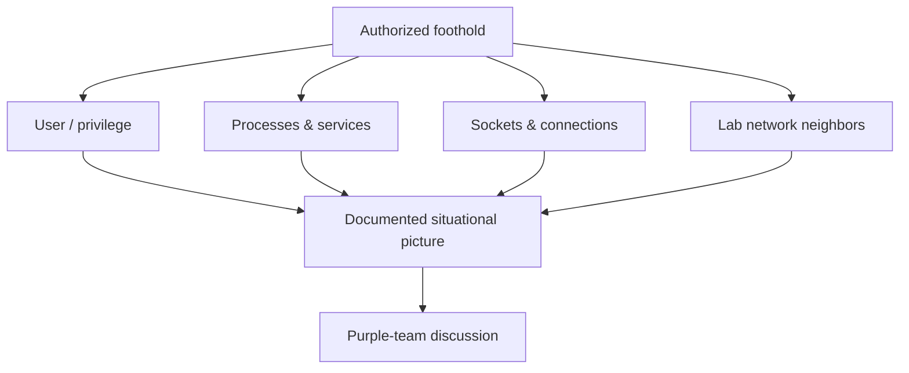

# Track 5 · Stage 5.3 — Discovery and Situational Awareness

## Why this stage matters

Once a laboratory foothold exists, the next authorized activity is understanding the host and its immediate surroundings: who is logged on, what processes are running, which ports are listening, what other hosts are visible, and what privileges the current principal holds. This situational awareness is the laboratory analogue of the Discovery tactic and supplies the information needed for any later persistence or lateral-movement discussion—while remaining strictly inside the RoE.

---

## Learning objectives

By the end of this stage you will be able to:

- Perform controlled discovery on a laboratory host you already have authorized access to
- Enumerate users, processes, listening sockets, and basic network neighbors using Phase-2 inspection techniques
- Record findings in a form usable by defenders (Track 2) and by the purple-team report
- Keep all discovery activity inside the written RoE and laboratory boundary
- Restore or snapshot the host after discovery if required by the RoE

---

## Prerequisites

- Stages 5.1 and 5.2 completed (RoE, tactic map, and a documented laboratory foothold)
- Phase-2 host-inspection skills and companion scripts available
- Snapshot of the target host recommended before any discovery that might be logged or monitored

---

## Safety checkpoint

1. Discovery only on hosts already in the RoE and already under authorized foothold.
2. No scanning or probing of hosts outside the laboratory boundary.
3. Prefer read-only inspection; avoid actions that create new persistence or high-volume noise unless the RoE explicitly allows them for the exercise.
4. Stop if discovery attempts contact any non-lab address.
5. Coordinate with any Track-2 partner so that expected discovery noise can be distinguished from unexpected activity.

---

## Core concepts

### 1. Laboratory discovery goals

- Current user and privilege level
- Local users and groups
- Running processes and services
- Listening ports and established connections
- Basic network information (interfaces, routes, visible lab neighbors)
- Presence of security tooling or logging agents (so purple-team discussion is informed)

### 2. Tools and techniques (laboratory)

Reuse Phase-2 inspection rather than introducing new offensive frameworks:

- Linux: `whoami`, `id`, `ps`, `ss` / `netstat`, `ip`, companion `host_inspect.sh`
- Windows: `whoami`, `Get-Process`, `Get-NetTCPConnection`, `Get-LocalUser`, companion Host-Inspect scripts
- Any additional laboratory-approved scripts that stay read-only

### 3. Evidence for the purple-team loop

Discovery output should be captured so that:

- Defenders can see what was visible from the foothold
- The capstone report can show the situational picture at the time of the exercise
- Later persistence or lateral ideas (if any) are grounded in observed reality rather than assumption

---

## Illustrative map: discovery from foothold

---

## Detailed laboratory walkthrough

1. Confirm the foothold from Stage 5.2 is still valid and in scope.
2. Run a controlled set of inspection commands or the Phase-2 host-inspect scripts.
3. Record the results (user, processes of interest, listening ports, visible lab hosts).
4. Note any security or logging agents observed (useful for Track-2 partners).
5. Label the activity with the Discovery tactic.
6. Preserve evidence and, if required by the RoE, restore a clean snapshot.

---

## Common mistakes

- Expanding discovery to hosts not listed in the RoE.
- Running noisy or destructive enumeration that was not pre-approved.
- Failing to capture output, leaving the purple-team report without a situational baseline.
- Assuming the foothold has more privilege than the inspection actually shows.

---

## Best practices

- Stay read-only unless the RoE and the exercise goal explicitly require more.
- Use the same inspection tooling that defenders already understand from Phase-2.
- Capture output with timestamps and host identifiers.
- Share a summary (not necessarily every raw line) with the Track-2 partner for detection validation.
- Keep the discovery phase short and purposeful so the overall simulation remains focused.

---

## Hands-on exercise

1. From the Stage 5.2 foothold, perform controlled discovery on the laboratory host.
2. Produce a short situational-awareness summary (user, key processes, listeners, lab neighbors).
3. Confirm all activity stayed inside the RoE.
4. Save the summary for the purple-team loop and the capstone.

---

## Review questions

1. Why is discovery limited to hosts already under authorized foothold and named in the RoE?
2. What categories of information form a useful laboratory situational picture?
3. How does capturing discovery output improve collaboration with a Track-2 detection partner?
4. Why prefer Phase-2 inspection scripts over introducing new offensive frameworks at this stage?
5. What should you do if a discovery command would contact an address outside the laboratory?

---

## Summary

- Laboratory discovery builds a situational picture from an authorized foothold.
- Read-only inspection and clear documentation keep the exercise safe and useful.
- The summary produced here feeds both the purple-team loop and the final report.

---

## Sources and further reading

- Phase-2 Linux and Windows security stages
- Codes/Bash and PowerShell host-inspect helpers
- MITRE ATT&CK — Discovery tactic (label only)
- Stage 5.1 RoE

All practical work remains restricted to authorized laboratory environments under the written RoE.
