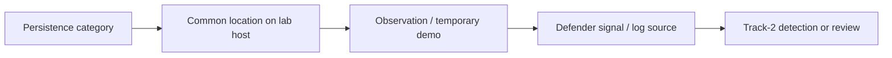

# Track 5 · Stage 5.4 — Persistence Categories

## Why this stage matters

Persistence is the set of techniques that allow an adversary (or an authorized simulation) to maintain access across reboots, credential changes, or session timeouts. In a laboratory the goal is not to implant durable backdoors for their own sake, but to understand the *categories* of persistence, observe where they appear on a disposable host, and discuss how defenders would detect them. This keeps the exercise educational, reversible, and firmly inside the RoE.

---

## Learning objectives

By the end of this stage you will be able to:

- Name the major categories of persistence relevant to laboratory Windows and Linux hosts
- Observe common startup, service, and scheduled-task locations on a disposable laboratory VM
- Describe, at a conceptual level, how defenders (Track 2) would look for each category
- Restore the laboratory host to a clean snapshot after any observation or temporary change
- Keep every action inside the written RoE and laboratory boundary

---

## Prerequisites

- Stages 5.1–5.3 completed
- A disposable laboratory VM (or a host you are willing to snapshot and restore) listed in the RoE
- Phase-2 familiarity with services, scheduled tasks, and startup locations

---

## Safety checkpoint

1. Use only disposable laboratory hosts that are explicitly in the RoE.
2. Snapshot before any change; restore after the exercise.
3. Prefer observation of existing locations over creating new persistent mechanisms unless the RoE and the learning objective explicitly require a temporary demonstration.
4. Never leave persistence mechanisms in place after the laboratory session.
5. No persistence activity on shared or non-lab systems.

---

## Core concepts

### 1. Persistence categories (laboratory view)

| Category | Linux examples | Windows examples | Defender visibility |
|----------|----------------|------------------|---------------------|
| Service / daemon | systemd unit, init script | Windows service | Service inventory, creation events |
| Scheduled task / cron | crontab, systemd timers | Task Scheduler | Task listing, creation logs |
| Startup / logon script | shell rc files, XDG autostart | Run keys, Startup folder | Registry / file monitoring |
| Account | new local user, SSH key | New local user, startup script | Account creation logs |
| Other (conceptual) | modified binaries, library preloads | WMI, bits jobs (advanced) | Integrity monitoring, specialized telemetry |

The educational focus is recognition of the category and the corresponding defensive signal, not mastery of every sub-technique.

### 2. Observation before implantation

On a clean laboratory host you can simply list the locations where persistence commonly appears. This already teaches the defensive side: “these are the places we watch.” If the RoE permits a temporary demonstration, a short-lived scheduled task or service can be created, observed, and then removed via snapshot restore.

### 3. Link to detection (Track 2)

Each category maps to concrete log sources and detections:

- Service creation → system logs / Windows System or Security events
- Scheduled task creation → task-scheduler operational logs
- New account → authentication and account-management events
- Unexpected startup entries → file or registry integrity monitoring

Purple-team value comes from exercising one category and confirming whether the laboratory detections (or manual review) notice it.

---

## Illustrative map: persistence category to defender signal

---

## Detailed laboratory walkthrough

1. Select a disposable laboratory host and confirm a current snapshot.
2. List the common persistence locations appropriate to the OS (services, scheduled tasks/cron, startup folders or rc files, local accounts).
3. Record what is present in the clean state.
4. (Optional, only if RoE allows) Create one temporary, low-impact persistence artifact (e.g., a scheduled task that simply writes a log line), observe it, then restore the snapshot.
5. Note the defensive signals that would (or did) surface.
6. Confirm the host is returned to the clean snapshot state.

---

## Common mistakes

- Creating persistence on a non-disposable or shared laboratory host.
- Leaving artifacts in place after the exercise.
- Focusing on exotic techniques instead of the common categories defenders actually monitor.
- Skipping the snapshot and then being unable to restore a clean baseline.

---

## Best practices

- Prefer observation of clean locations over creation when the learning goal is defensive awareness.
- Always restore the snapshot.
- Discuss each category with a Track-2 partner in terms of log sources and detection ideas.
- Keep any temporary demonstration minimal and fully reversible.
- Document the category, the location observed, and the defensive signal—not a how-to for durable implants.

---

## Hands-on exercise

1. On a disposable laboratory host, inventory the common persistence locations for that OS.
2. Record the clean-state findings and the corresponding defender signals.
3. Optionally perform one temporary, RoE-approved demonstration and then restore the snapshot.
4. Save the notes for the purple-team loop and the capstone.

---

## Review questions

1. Why must persistence exercises be limited to disposable laboratory hosts under the RoE?
2. Name three persistence categories and one defensive signal for each.
3. Why is observation of clean startup locations already valuable for purple-team learning?
4. What is the required final step after any temporary persistence demonstration?
5. How does documenting persistence categories improve collaboration with Track 2?

---

## Summary

- Persistence categories teach both the offensive concept and the defensive visibility points.
- Laboratory practice stays observational or temporarily demonstrative, always followed by snapshot restore.
- The notes produced here feed the purple-team loop and the final report.

---

## Sources and further reading

- MITRE ATT&CK — Persistence tactic (category level)
- Phase-2 host-security stages
- Track 2 detection sources for account, service, and task events
- Stage 5.1 RoE

All practical work remains restricted to authorized laboratory environments under the written RoE. No durable persistence is left in place.
