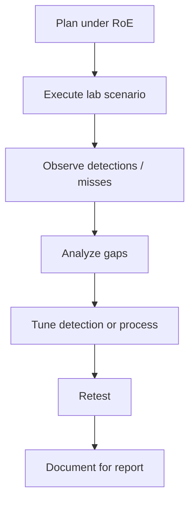

# Track 5 · Stage 5.5 — Purple-Team Loop

## Why this stage matters

Purple-team work is the deliberate collaboration between authorized simulation (red) and detection/response (blue). The loop—execute a laboratory scenario, observe what was detected, tune the detections or the scenario, and retest—turns isolated Track-2 rules and Track-5 actions into a joint learning exercise. The laboratory is the ideal environment for this loop because both sides control the data, the scope is written, and the cost of failure is only a snapshot restore.

---

## Learning objectives

By the end of this stage you will be able to:

- Execute a short laboratory scenario that exercises both simulation steps and existing detections
- Capture what was detected (and what was missed) from the defender’s perspective
- Propose and apply a simple tuning or coverage improvement
- Retest to confirm the change
- Document the loop so it can appear in the purple-team report (Stage 5.6)

---

## Prerequisites

- Stages 5.1–5.4 completed
- At least one detection from Track 2 (or an equivalent laboratory detection) that can fire on the planned scenario
- Written RoE still in force; snapshots available
- Ideally a partner or dual role covering both simulation and detection viewpoints

---

## Safety checkpoint

1. The entire loop stays inside the RoE and the laboratory boundary.
2. Snapshots before the simulation run and after any tuning that changes laboratory state.
3. No expansion of scope mid-loop; if new hosts or techniques are desired, update the RoE first.
4. Detection tuning is applied only to laboratory rules or laboratory SIEM instances.

---

## Core concepts

### 1. The purple-team loop

```
Plan (RoE + tactics) → Execute simulation → Observe detections → Analyze gaps → Tune → Retest → Document
```

Each iteration should be short and purposeful.

### 2. What “detect” means in the laboratory

- Did an existing Track-2 detection fire?
- Did manual review of the monitoring set (Track 3 / Track 2) notice the activity?
- Were the expected log sources present and timely?
- What was the time from action to alert (or to analyst notice)?

### 3. Tuning options (laboratory)

- Adjust detection threshold or logic (Track 2 Stage 2.7)
- Add a missing log source or improve parsing
- Refine the simulation so it better matches the detection hypothesis (or vice versa)
- Improve documentation so the next iteration starts from a clearer baseline

### 4. Success criteria for a laboratory loop

- Both sides understand what happened
- At least one concrete improvement (detection or process) is identified
- The laboratory is returned to a known state
- Evidence is preserved for the capstone report

---

## Illustrative map: purple-team loop



---

## Detailed laboratory walkthrough

1. Select a short scenario already covered by the RoE (e.g., initial access + discovery, or a persistence category demonstration).
2. Ensure the relevant Track-2 detections or monitoring sources are active.
3. Execute the simulation; capture timestamps and evidence.
4. Review alerts, logs, and any misses with the detection side.
5. Choose one improvement (raise/lower a threshold, add a field, fix a parsing gap, clarify the RoE, etc.).
6. Apply the improvement and retest the same scenario.
7. Record the before/after detection result and the lesson learned.
8. Restore snapshots as required by the RoE.

---

## Common mistakes

- Running a complex multi-day simulation before any detection feedback is obtained.
- Changing production or shared detection rules instead of laboratory ones.
- Failing to document the gap and the fix, so the learning is lost.
- Expanding scope during the loop without updating the RoE.

---

## Best practices

- Keep each loop iteration short and focused on one or two tactics.
- Capture timestamps so detection latency can be discussed.
- Treat misses as learning opportunities, not failures.
- Share the written outcome with both the simulation and detection participants.
- Feed durable improvements back into the Track-2 detection pack and the Track-3 monitoring plan.

---

## Hands-on exercise

1. Run one full purple-team loop on a laboratory scenario covered by your RoE.
2. Document: scenario, detections that fired, gaps, tuning applied, retest result.
3. Confirm laboratory cleanup.
4. Save the loop record for the Stage 5.6 capstone report.

---

## Review questions

1. What are the main steps of a laboratory purple-team loop?
2. Why is a written RoE still required even when both red and blue are the same person or team?
3. Give two examples of laboratory tuning that can improve detection coverage.
4. How does documenting a miss help future exercises?
5. What should happen to the laboratory environment at the end of each loop iteration?

---

## Summary

- The purple-team loop turns simulation and detection into a joint, iterative laboratory practice.
- Short cycles, clear evidence, and documented improvements produce lasting learning.
- The loop record is a required component of the Track-5 capstone.

---

## Sources and further reading

- Track 2 (detection design, triage, tuning)
- Stages 5.1–5.4
- Phase-2 blue-team and logging foundations
- Curriculum safety and RoE principles

All practical work remains restricted to authorized laboratory environments under the written RoE.
