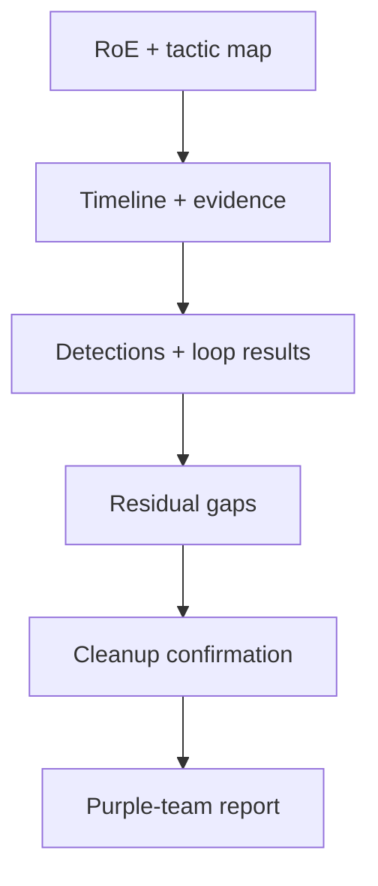

# Track 5 · Stage 5.6 — Capstone Purple Report

## Why this stage matters

The purple-team report is the formal record of an authorized laboratory simulation: what was planned under the RoE, what was executed, what was detected, what was improved, and how the laboratory was returned to a clean state. A clear, evidence-based report demonstrates both simulation discipline and detection collaboration. It is the portfolio artifact that proves Track-5 competence and the natural companion to a Track-2 detection pack that was exercised against the same scenario.

---

## Learning objectives

By the end of this stage you will be able to:

- Produce a structured purple-team report covering timeline, evidence, ATT&CK tactic labels, detections, improvements, and cleanup
- Show that every action stayed inside the written Rules of Engagement
- Confirm that laboratory snapshots were restored and no unauthorized persistence or exposure remains
- Present residual gaps and next steps honestly

---

## Prerequisites

- Stages 5.1–5.5 completed
- Written RoE, initial-access evidence, discovery summary, persistence notes, and at least one purple-team loop record
- Laboratory still under your control

---

## Safety checkpoint

1. The report describes only laboratory activity performed under the RoE.
2. No techniques, payloads, or infrastructure details are presented as authorization for real-world use.
3. All credentials, tokens, and sensitive laboratory identifiers are redacted.
4. Cleanup (snapshot restore, removal of temporary artifacts) is confirmed before the report is finalized.

**Explicit boundary:** Completion of this track and report does **not** authorize offensive operations against any system outside the laboratory agreement.

---

## Required report structure

### 1. Title and authorization

- Report title and date
- Laboratory environment identifier
- Reference to the Stage 5.1 RoE (or attach it)
- Statement: “Authorized laboratory purple-team exercise only. No real-world offensive operations were performed or authorized.”

### 2. Scope and scenario

- In-scope assets
- Intended scenario and primary ATT&CK tactics
- Stop conditions and how they were observed

### 3. Timeline of activity

A chronological table or list:

| Time | Action (simulation) | Host / target | Evidence reference | Detection result |
|------|---------------------|---------------|--------------------|------------------|

### 4. Evidence summary

- Initial-access path and proof of foothold
- Discovery / situational-awareness highlights
- Persistence category observation (and confirmation of cleanup)
- Any additional authorized actions

### 5. Detections and purple-team loop

- Which detections fired
- Which expected signals were missed
- Tuning or process improvements applied
- Retest outcome

### 6. Residual gaps and recommendations

- Detection or monitoring gaps that remain
- Suggested next laboratory exercises or control improvements
- Any accepted limitations of the current laboratory environment

### 7. Cleanup confirmation

- Snapshots restored
- Temporary accounts, tasks, or files removed
- Laboratory left in the state defined by the RoE and earlier Track-3 / Track-4 baselines

---

## Quality bar

A reader should be able to:

- Verify that every action was inside the stated RoE
- Reconstruct the sequence of simulation and detection events from the timeline and evidence
- See that cleanup was completed
- Understand residual gaps without exaggeration or concealment

Avoid:

- Unredacted secrets
- Claims of activity outside the laboratory
- Technique details presented as operational playbooks for unauthorized use
- Missing cleanup confirmation

---

## Illustrative map: report assembly

---

## Hands-on deliverable

1. Assemble the full report from the artifacts of Stages 5.1–5.5.
2. Redact all secrets and unnecessary identifiers.
3. Confirm laboratory cleanup.
4. Save the report to your portfolio folder (e.g., `Track5_Capstone_PurpleReport_YYYYMMDD.md`).

---

## Self-check before submission

- [ ] RoE referenced and scope respected
- [ ] Timeline with evidence present
- [ ] ATT&CK tactic labels used
- [ ] Detections and at least one loop iteration documented
- [ ] Residual gaps listed
- [ ] Cleanup confirmed (snapshots restored)
- [ ] No live credentials; clear boundary statement present

---

## Summary

- The purple-team report is the formal proof of disciplined, authorized laboratory simulation and detection collaboration.
- Timeline, evidence, detections, improvements, and cleanup together demonstrate the full Track-5 lifecycle.
- The report remains strictly a laboratory artifact; it confers no authorization for real-world offensive activity.

---

## Sources and further reading

- All prior Track-5 stages
- Track 2 detection pack and triage practices
- Curriculum-wide ethics and safety rules
- MITRE ATT&CK (tactic labels only)

All practical work remains restricted to authorized laboratory environments under a written Rules of Engagement. This track and report do not authorize any offensive operations outside that laboratory agreement.
